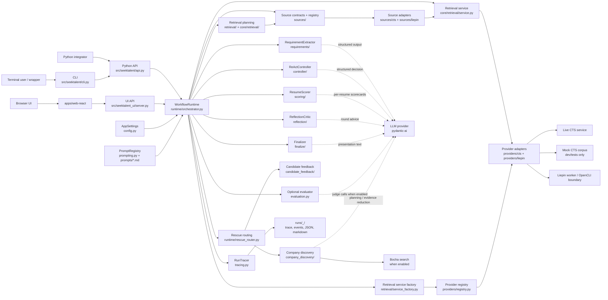
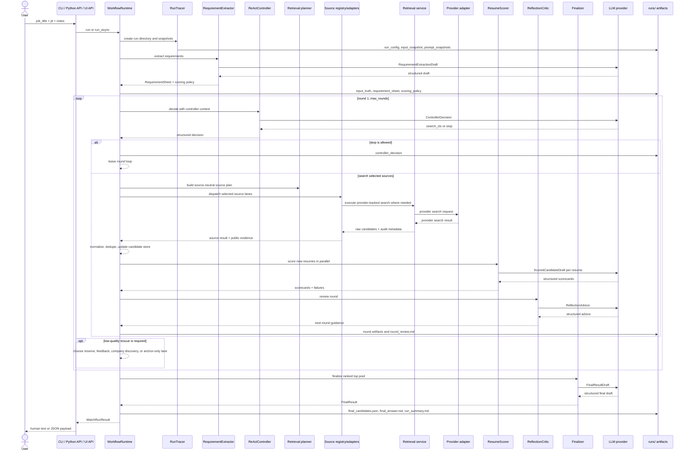

# Architecture

`SeekTalent` is a CLI-first, local-first resume matching engine. Public entrypoints collect a job title, JD, and optional notes, then hand them to one deterministic runtime rooted in `src/seektalent/runtime/orchestrator.py`. The runtime owns orchestration, budgets, provider selection, retrieval execution, deduplication, artifact writing, and final ranking. LLM calls are bounded stages that return structured outputs; they do not execute tools directly.

## Public entrypoints

| Entrypoint | Files | Role |
| --- | --- | --- |
| CLI | `src/seektalent/cli.py` | Primary user-facing `seektalent` command, env loading, argument parsing, human and JSON output. |
| Python API | `src/seektalent/api.py` | Stable wrapper functions: `run_match(...)` and `run_match_async(...)`. |
| Local UI API | `src/seektalent_ui/server.py` | Thin local HTTP API that runs the same runtime in a background thread. |
| Web UI | `apps/web-react/` | React Agent Workbench shell over the local UI BFF. |

All product surfaces converge on `WorkflowRuntime` in `src/seektalent/runtime/orchestrator.py`.

## Architecture diagram

## Runtime sequence

The local Workbench API stores runtime-owned session, source-lane, and final-top10 state in its SQLite store. UI endpoints project persisted Runtime fields directly; they do not run a second backend execution flow or translate final artifacts through a legacy UI DTO layer.

## Core modules

| Module | Responsibility |
| --- | --- |
| `src/seektalent/runtime/orchestrator.py` | Main control loop, round lifecycle, progress events, artifact writes, stop handling, rescue handoff, source dispatch, and finalization. |
| `src/seektalent/runtime/context_builder.py` | Builds slim context objects for controller, scoring, reflection, and finalization. |
| `src/seektalent/models.py` | Shared Pydantic contracts for requirements, retrieval plans, controller decisions, scorecards, final results, and run state. |
| `src/seektalent/requirements/` | Turns input truth into a normalized requirement sheet and scoring policy. |
| `src/seektalent/controller/` | Chooses each round's action and proposed query/filter plan. The controller does not execute CTS or other tools. |
| `src/seektalent/retrieval/` | Generic retrieval planning helpers: query-term compilation, query planning, and location execution planning. |
| `src/seektalent/core/retrieval/` | Source-agnostic retrieval contract and service used behind runtime/source adapter execution. |
| `src/seektalent/sources/` | Source-neutral contracts, registry, public event codes, shared source helpers, CTS source projection, and Liepin runtime/smoke bridge code. |
| `src/seektalent/providers/` | Provider registry plus provider-specific adapters, clients, transport models, and provider-local projection logic. Providers do not import runtime DTOs. |
| `src/seektalent/clients/` | Concrete CTS transport clients used behind the CTS provider adapter for live CTS requests or the development mock corpus. |
| `src/seektalent/scoring/` | Scores normalized resumes concurrently, one resume per LLM branch. |
| `src/seektalent/reflection/` | Reviews a completed round and produces advice for subsequent retrieval. |
| `src/seektalent/finalize/` | Preserves runtime ranking order while generating final shortlist presentation text. |
| `src/seektalent/tracing.py` | Writes trace events, JSON artifacts, prompt snapshots, hashes, and compact LLM call metadata. |

## Runtime state

The runtime keeps state explicit:

- `RunState` carries input truth, requirement sheet, scoring policy, retrieval state, candidates, normalized resumes, scorecards, top-pool ids, and round history.
- `RetrievalState` tracks the query-term pool, sent query history, plan version, projection result, and rescue attempts.
- `RoundState` records the controller decision, source/retrieval plan, source search observations, scored top candidates, dropped candidates, and reflection advice for one round.

The state objects live in `src/seektalent/models.py` and are written out as artifacts instead of being hidden behind a long-lived service object.

## Artifact model

Each run writes a directory under `runs/` by default. The important artifact groups are:

- run setup: `run_config.json`, `input_snapshot.json`, `input_truth.json`, `prompt_snapshots/`
- requirement setup: `requirement_extraction_draft.json`, `requirements_call.json`, `requirement_sheet.json`, `scoring_policy.json`
- round outputs: `controller_*`, source/retrieval plans and observations, provider-specific query snapshots where available, `scorecards.jsonl`, `reflection_*`, `round_review.md`
- final outputs: `finalizer_context.json`, `finalizer_call.json`, `final_candidates.json`, `final_answer.md`, `run_summary.md`
- diagnostics: `events.jsonl`, `trace.log`, `sent_query_history.json`, `search_diagnostics.json`, `term_surface_audit.json`

See [Outputs](outputs.md) for the full file reference.

## Boundaries

- CLI, Python API, and UI API are shells around `WorkflowRuntime`, with the CLI as the primary user entrypoint.
- UI depends on core runtime code; `src/seektalent` must not import `seektalent_ui` or `experiments`.
- The controller returns structured decisions only. Python runtime code executes CTS, scoring fan-out, artifact writes, and stop rules.
- Generic retrieval planning stays under `src/seektalent/retrieval/` and `src/seektalent/core/retrieval/`.
- Runtime depends on source-neutral contracts under `src/seektalent/sources/`; it must not import concrete `seektalent.providers.*` modules.
- Source adapters are the bridge between runtime/source contracts and provider-backed execution. CTS projection lives under `src/seektalent/sources/cts/`; Liepin runtime lane, smoke CLI, and safe reason-code mapping live under `src/seektalent/sources/liepin/`.
- Provider-specific request details stay under `src/seektalent/providers/`. Providers may depend on clients, core retrieval contracts, retrieval primitives, and source contracts, but not runtime DTOs.
- Provider registry construction is outside runtime in `src/seektalent/retrieval/service_factory.py`; runtime receives provider access through retrieval/source boundaries.
- CTS transport details stay inside `src/seektalent/clients/cts_client.py`, behind `src/seektalent/providers/cts/adapter.py`.
- Liepin transport, OpenCLI, worker contracts, browser automation, and provider safety details stay inside `src/seektalent/providers/liepin/` and `apps/liepin-worker/`, behind the Liepin source adapter.
- Mock CTS is for source-checkout development and tests; the published CLI rejects it.
- Optional rescue lanes are runtime decisions. They can broaden the term pool, inject candidate feedback, run company discovery, or try anchor-only retrieval when quality gates require more search.
- LLM structured output retries are local to Pydantic AI calls. The runtime does not add fallback model chains.

## Related docs

- [CLI](cli.md)
- [Configuration](configuration.md)
- [Outputs](outputs.md)
- [UI](ui.md)
- [Development](development.md)
- [Data flow](data-flow.md)
- [Source contracts](source-contracts.md)
- [Architecture dependency observations](architecture-dependencies.md)
- Historical design notes: `docs/v-0.1/`, `docs/v-0.2/`
