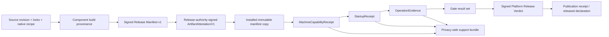

# External Execution Plane v1 — Release Artifact and Evidence Contract

状态：**Wayfinder #326 Draft decision contract；docs-only，未实现、未发布**

Tracks: [#326](https://github.com/FrankQDWang/SeekTalent/issues/326)

主线输入：

- [Reliability Contract](./external-execution-plane-v1-reliability-contract.md)：完整产品发布物、逐平台 clean-machine gate、A/B rollback 与真实站点 canary；
- [Runtime Topology](./external-execution-plane-v1-runtime-topology.md)：main/sidecar/WTSCLI/browser 唯一 lifecycle owner、现有 profile compatibility mode 与 dedicated-profile spike；
- [Task Semantics](./external-execution-plane-v1-task-semantics.md)：drain、safe boundary、terminal immutability、schema backup 与 authority；
- [Diagnostics and Fault Injection](./external-execution-plane-v1-diagnostics-fault-injection.md)：canonical receipt/evidence/support schema 与逐平台 fault/release gates；
- [Source Execution Port](./external-execution-plane-v1-source-execution-port.md)：exact main/sidecar pairing、installed executable hash、rollback-journal sidecar data 与 T1/T2/T3 hard cut；
- GitHub issue #326、Wayfinder #319，以及当前 `code/schema/tests/build/release scripts`。代码与本文的 current-state 描述冲突时，以代码为准；目标契约不因此自动变成已实现事实。

## 1. 决策摘要

External Execution Plane v1 的生产发布单元是一个**逐平台、不可变、可离线安装、带签名且包含完整 execution plane 依赖闭包的产品 artifact**，不是 Python wheel、源码 checkout、开发机环境或在线 bootstrap 的结果。

本文冻结以下决策：

1. 一个产品 artifact 只声明一个 target tuple：`Windows 11 x64`、`macOS x86_64` 或 `macOS arm64`。三个 tuple 独立构建、独立签名、独立取证和独立裁决；默认不承诺同步 release train。
2. v1 packaging boundary 是一个 product-owned、self-contained onedir release payload，加一个平台签名的 installer/updater wrapper。实现可选择平台原生 installer、app bundle 或受控 Domi host integration，但用户机不得用 pip/npm/git/uv 在线解析产品依赖，且 Domi 不能成为未锁定依赖源。
3. 每个 payload 必须包含 exact main、Liepin Execution Sidecar、Python/SQLite runtime、Node/WTSCLI、browser bridge、Workbench static assets、installer/updater helpers 与 licenses。Chrome Stable、用户现有 profile、CWS extension、Domi host 和用户数据是显式 external dependency，不得伪装成 payload 内组件。
4. `ReleaseManifestV1`是artifact内immutable signed contract；archive digest/build provenance/platform signature/notarization由external signed `ArtifactAttestationV1`闭合，final offline distribution再随附same-identity signed verdict authorization snapshot。Valid local snapshot足以离线安装；撤回只能通过bounded validity和取得higher revision收敛，不能追溯修改永不联网的旧介质。
5. 安装使用 inactive A/B slot、独立 data root、atomic active pointer 和 explicit previous pointer。Binary rollback 只切 release slot；不得静默回滚 SQLite、sidecar journal、result spool、diagnostics、Chrome profile 或 profile/account binding。
6. Schema migration 只能在完整 database-group backup、integrity、drain 和 activation write barrier 后进行。首次启动验证期间不接受用户 operation；失败时才允许无歧义地恢复 pre-migration backup 并切回 previous slot。
7. 生产 extension 通过 Chrome Web Store 或企业批准的同等生产渠道独立发布。默认 sequence 是先扩展 compatibility window、再发布 desktop artifact；CWS extension 不能随 desktop binary rollback 降级。
8. Exact artifact identity 必须从 native build provenance 贯穿 manifest、installer verification、installed copy、`MachineCapabilityReceipt`、`StartupReceipt`、`OperationEvidence`、support bundle、controlled real-site canary、opt-in real-user canary 和 platform release verdict。
9. `unsupported/not_shipped/supported/released/withdrawn`是唯一closed platform declaration enum；它与§6.3 closed verdict-status enum正交。没有final signed exact artifact和完整pre-canary evidence时只能`not_shipped`或explicitly decided `unsupported`，曾发布后撤回只能`withdrawn`。
10. 当前 `0.7.49` 的三个目标平台都没有满足本契约的 exact artifact evidence；当前裁决是 `INTERNAL_ONLY`，三平台均为 `not_shipped`。本文不执行发布、真实 canary、CWS 上传、证书采购或密钥操作。

明确不采用以下捷径：

- 不把 PyPI wheel 或 wheel + 用户机 Domi runtime 当作完整产品；
- 不把当前 macOS Intel 手工 workflow、load-unpacked extension 或旧 constraints 结果当作 0.7.49 PASS；
- 不因一个平台通过而声明另一个平台受支持；
- 不把 synthetic fixture、typed failure 或开发机成功称为 real-site canary PASS；
- 不在没有 ADR 与实现证据时强制 PyInstaller、Native Messaging、DBOS、WAL 或 dedicated profile；
- 不等待不可获得的五位历史用户日志，也不伪造 release evidence。

### 1.1 Contract vocabulary

| 术语 | 本文唯一含义 | 不得混称为 |
|---|---|---|
| Product Artifact | 一个 target tuple 的 immutable、self-contained、signed install payload 与其 platform delivery wrapper | Python wheel、source checkout、Domi bootstrap、跨平台产品包 |
| Product Release Unit | Product Artifact、兼容的 production extension publication、逐平台 evidence set 与 signed verdict 的组合 | 单个 archive、CWS extension bytes、release notes |
| Release Manifest | artifact 内签名且不可变的组件、文件、compatibility、storage 与 installer contract | build log、support bundle、动态 capability receipt |
| Artifact Attestation | 对最终 archive/delivery wrapper 身份及 build/signing provenance 的外部 immutable statement | Release Manifest 自身、checksum 文本、平台支持声明 |
| Machine Capability Receipt | #322 owner 在一台实际机器上对 manifest、OS、Chrome、extension、Domi、SQLite、slot 与 schema 组合的观测结果 | Release Manifest、release verdict、roadmap support claim |
| Platform Release Verdict | release authority 对一个 exact artifact、一个 target tuple 与完整 required evidence refs 签名后的发布裁决 | 单项测试 PASS、跨平台总裁决、issue/PR 状态 |
| Platform declaration | 一个exact platform artifact已经达到的对外生命周期里程碑；closed enum见§6.1 | 当前gate结果、发布授权、测试result |
| Verdict status | release authority对该artifact当前允许进入哪个分发阶段的裁决；closed enum见§6.3 | Platform declaration、ProductOutcome、自由文本结论 |
| Profile binding generation | `CONTEXT.md` 定义的 Chrome profile、production extension instance 与 provider account binding 版本 | release slot、runtime attempt、browser control scope |

本文复用 `CONTEXT.md` 的 browser control scope、browser control fence、source control lane、owned tab 与 profile binding generation；发布层只能记录这些权威的 actual identity，不能创建同义术语或重定义其 lifecycle。

## 2. Ownership 与 authority

| 对象或动作 | 唯一 owner | 其他组件可以做什么 | 禁止 |
|---|---|---|---|
| Release Manifest schema、artifact closure、platform declaration、release verdict | SeekTalent release engineering / #326 | build jobs 生成 facts；installer/main 验证并引用 | installer 或运行时自行修改 manifest/支持声明 |
| Source tree、dependency lock 与 native build provenance | build pipeline | release reviewer 验证 attestation | 从用户机 PATH/cache 补齐组件后仍称 exact artifact |
| Platform code signing/notarization trust | release signing authority + OS trust store | pipeline 请求签名；installer 验证 | 私钥进入 artifact、repo、log、support bundle 或 test fixture |
| Install root、A/B slot、active/previous pointer | SeekTalent installer/updater | Domi 请求 install/launch/stop | Domi、sidecar 或 UI 直接切 slot |
| Product data、schema migration backup/restore | main-owned migration coordinator | installer 提供 activation transaction 与空间 preflight | binary rollback 静默覆盖 data/schema |
| Run、drain、safe boundary、retry/outcome | main `runtime_control` / #324 | updater 请求 drain 并读取 durable drain result | release layer从 process exit 或 diagnostics推导 run outcome |
| Sidecar/WTSCLI/browser lifecycle | #323 sidecar ownership | installer安装 exact binaries；updater等待 drain | installer接管 unknown daemon/browser process |
| Sidecar wire/journal/result spool | #325 | manifest声明 schema/SQLite compatibility；updater只迁移已批准格式 | release layer修改 operation disposition/retry |
| Receipt、Failure Envelope、Operation Evidence、support bundle | main diagnostics service / #322 | manifest/verdict只引用；release aggregator校验 refs | #326 另造 receipt/evidence schema |
| Chrome profile/login | 用户/Chrome；产品只拥有 binding control lock | sidecar确定性绑定并控制 owned tabs | installer备份、复制、清空或回滚用户现有 profile |
| Production extension artifact/distribution | extension release owner + CWS/企业渠道 | desktop manifest声明 compatibility window；receipt记录 actual | load-unpacked 作为 production；desktop假设 extension 可降级 |
| Domi host | Domi product owner | 启动/协作停止 main，提供已声明 host capability | 读取 SeekTalent raw DB/journal/log或充当未验证 runtime dependency resolver |

Release authority 只回答“这个 artifact 能否在这个平台发布”。它不能重定义 #322 的 evidence、#323 的 lifecycle、#324 的 task semantics 或 #325 的 wire behavior。

## 3. Current code truth

以下表格记录本文起草时的 mainline 事实，不是对目标状态的实现声明。

| 区域 | 当前 code truth | 影响 |
|---|---|---|
| Product version | `pyproject.toml` 与 `src/seektalent/version.py` 都是 `0.7.49`；Domi shell/PowerShell installer 默认也写死 `0.7.49` | 版本面目前同步，但没有单一生成的 product build identity |
| PyPI release | `.github/workflows/publish-pypi.yml` 在 GitHub release published 后构建 Workbench 与 Python sdist/wheel，并只发布到 PyPI | wheel 是 component artifact，不是 product artifact 或逐平台 release evidence |
| Online Domi install | `install-seektalent-domi.sh/.ps1` 在用户机对 `seektalent==0.7.49` 执行 pip online install，复用可变 Domi Python/Node，再生成 shim | 没有 offline closure、component hashes、签名、bridge/extension install、A/B 或 exact runtime receipt |
| Intel builder | `build_offline_macos_intel.py` 只允许 native macOS x86_64 + Python 3.13；下载 pip.pyz/wheels，打包 pinned WTSCLI fork与extension tree，并生成 SHA-256 | hash/tree/native-wheel验证可保留，但 builder产物未签名/公证且只覆盖一个平台 |
| Intel reproducibility | builder必须读取 `constraints-<version>-macos-intel.txt`；仓库只有 0.7.46/0.7.47，没有 0.7.49 | 当前 main 无法从 checked-in inputs 构建 0.7.49 Intel bundle |
| Intel workflow | `.github/workflows/build-macos-intel-offline.yml` 是 manual `workflow_dispatch`，在 `macos-15-intel` 构建、校验、离线 smoke、上传 14 天 artifact | workflow存在不等于 release train；没有签名、公证、clean-machine、升级/回滚或真实 canary |
| Offline manifest | `bundle-manifest.json` 仅有 schema integer、platform、Python/SeekTalent/WTSCLI/extension version、extension hash与bridge refs | 它不是本文 Release Manifest：没有完整 file/component closure、signatures、schema/protocol/Chrome/installer/evidence contract |
| Offline installer | 安装 Python prefix，stage WTSCLI/extension/bridge 后以 rename 切换三者；失败时局部恢复 backup | staging/verify/rename可演进，但 Python prefix先被删除，组件不是一个原子 product slot，成功后立即删除 previous backup |
| Production extension | offline README/installer要求 Chrome developer mode + Load unpacked；extension source/manifest和CWS release workflow不在本 repo | 当前没有可审计的 production extension ID/package/CWS compatibility evidence |
| Bridge validation | `browser_bridge_manifest.py`、builder、installer、launcher和daemon transport验证 implementation/build/protocol/capabilities；builder验证extension完整文件树 | 保留并纳入 component/receipt gate，不推倒重来 |
| Runtime identity | `opencli_launcher.py`要求离线 WTSCLI目录与bridge manifest，验证 package/bridge identity；verification stamp使用 path/mtime/size | startup pairing基础可保留；Release Manifest verifier必须增加content digest/signature和installed-copy identity |
| Current daemon/profile | daemon仍使用固定 `127.0.0.1:19825` 与 `X-OpenCLI: 1`；site adapter写死 `local-chrome-profile` | #323/#325 T3前不能称 production exact topology；release preflight必须识别并拒绝 unknown owner/mismatch |
| Update/uninstall | `seektalent update` 只打印 pip/pipx命令；没有完整产品 updater/uninstaller | 没有 drain、slot switch、whole-product rollback或data-preserving uninstall |
| SQLite migration | 多个 store会在迁移前用 SQLite backup API备份并运行 integrity check；新 schema会 fail closed | 是迁移基础，但没有与 product slot、activation write barrier、group restore和release verdict闭环 |
| Database-group backup | `backup_group.py` 枚举多个 product DB、生成 group manifest并验证每个 backup | 可演进为 upgrade backup；当前 manifest含绝对 path且没有 restore/slot/schema compatibility protocol |
| Operator health | `operator_health.py` 检查磁盘、DB大小、WAL/SHM、schema版本和 integrity | 可作为 #322 Machine Capability input；当前不检查 manifest/signature/slot/sidecar/Chrome/profile/extension |
| SQLite modes | 部分现有业务 store/mirror使用 WAL；#325 target sidecar command journal尚未实现并明确要求 `DELETE + FULL` | 不对现有 DB做全仓journal-mode重构；v1 sidecar保持rollback journal，WAL迁移仍需固定 build + 三平台 matrix + ADR |
| Signing | repo/workflows没有 macOS codesign/notarization、Windows Authenticode/installer signing 或 Release Manifest signing配置 | 三个平台都没有 production signing evidence；不得用 checksum替代签名 |
| CI | governance、workbench-contract、Intel build是 manual；`python-quality.yml` pull_request paths不含 `docs/**` | 本 docs-only diff只能报告本地 gate；不能称远程 automatic CI 已通过 |

当前逐平台声明冻结为：

| Platform tuple | Current declaration | 直接原因 |
|---|---|---|
| `windows-11-x86_64` | `not_shipped` | 无完整 native artifact、installer signature、clean-machine、upgrade/rollback和real canary evidence |
| `macos-x86_64` | `not_shipped` | 只有不完整manual builder；0.7.49缺constraints且无codesign/notarization/release evidence |
| `macos-arm64` | `not_shipped` | 无对等native builder/artifact/signing/clean-machine evidence |

`not_shipped` 不是“可能能用”或“内部测试通过”的同义词；preflight、release notes和支持答复都必须保持这个状态。

## 4. Product artifact 与依赖闭包

本文区分两个层级：**Product Artifact** 是一个平台安装的self-contained binary payload；**Product Release Unit** 是该artifact、兼容的production CWS extension publication、逐平台evidence和signed verdict的组合。Extension bytes不因是release unit的一部分就允许被desktop sideload；完整性来自manifest compatibility ref、CWS identity/publication和actual receipt。

### 4.1 v1 packaging boundary

每个平台 artifact 由两层组成：

1. **Platform delivery wrapper**：Windows签名installer；macOS签名并公证的installer/app delivery wrapper。它只负责验证、preflight、stage、drain、activate、rollback和uninstall。
2. **Immutable onedir release payload**：安装后在inactive slot中保持原始相对布局与hash，不在用户机解析pip/npm依赖，不从PATH选择可变runtime。

一个可交付的final offline distribution set还必须在delivery bytes之外随附两个signed sidecar objects：`ArtifactAttestationV1`与same exact identity的Platform Release Verdict authorization snapshot。它们是完整产品发布元数据，不是在线dependency resolution；缺少任一项的旧介质不是可授权安装的final offline distribution。

允许受控 Domi integration，但满足条件是：Domi只作为host launcher；SeekTalent payload包含exact Python/SQLite/Node runtime，或在构建/安装阶段把manifest声明且hash验证的Domi runtime复制进该slot成为immutable component。仅验证version string、复用Domi当前PATH或在线pip安装不满足闭包。

本文不强制 PyInstaller、MSIX、MSI、PKG、DMG 或某个 updater framework。实现PR必须通过短ADR选择平台wrapper/tool，并证明下面同一布局、签名、rollback和evidence contract；工具本身不是发布证据。

### 4.2 Artifact root closure

一个 product payload 至少包含以下 component IDs：

| Component ID | Artifact root内 | 依赖 |
|---|---|---|
| `main_application` | 必须 | `python_runtime`、`sqlite_runtime`、`workbench_assets`、`sidecar` protocol compatibility |
| `liepin_execution_sidecar` | 必须 | `python_runtime`或自己的exact runtime、`node_runtime`、`wtscli_runtime`、`browser_bridge` |
| `python_runtime` | 必须 | 平台native stdlib与全部locked wheels；不得用户机解析 |
| `sqlite_runtime` | 必须明确身份 | actual linked/embedded SQLite build；main与sidecar各自actual build都要声明，若相同可引用同一component |
| `node_runtime` | 必须 | exact executable与runtime files；不得从PATH补齐 |
| `wtscli_runtime` | 必须 | exact fork commit/package/build/files；由sidecar唯一启动 |
| `browser_bridge` | 必须 | exact implementation/build/protocol/capabilities；与WTSCLI/extension compatibility绑定 |
| `workbench_assets` | 必须 | packaged frontend file tree/hash |
| `installer_updater_support` | 必须 | manifest verifier、preflight、slot/migration/rollback/uninstall helpers |
| `licenses_sbom` | 必须 | component license inventory与machine-readable SBOM ref |

以下是 external dependency，必须声明但不得算作payload closure的一部分：

- Chrome Stable binary与OS policy；
- 用户现有 Chrome profile/login；
- production CWS extension actual installed version；
- Domi host build/channel（若产品从Domi启动）；
- LLM/provider/network endpoints；
- product data、sidecar journal、result spool、diagnostics与schema backups。

Artifact root是闭包当且仅当：manifest中每个required component都存在，所有regular files都被一个component file tree覆盖，manifest/signature/attestation metadata位于closed reserved paths，任何未声明可执行文件、symlink escape、duplicate path、case-fold collision、alternate data stream或用户机dependency resolution都使构建/安装fail closed。

### 4.3 Installed layout

逻辑布局对三个目标平台相同；平台adapter只决定根路径与pointer原子操作：

```text
INSTALL_ROOT/
  control/
    installation-id
    active-slot.json
    active-slot.lock
    slot-A.lock
    slot-B.lock
    previous-slot.json
    activation-journal.jsonl
    install.lock
  slots/
    A/
      release/
        release-manifest.json
        signatures/release-manifest.sig
        attestations/build-provenance.ref
        attestations/artifact-attestation.json
        attestations/release-authorization.json
        bin/main
        bin/sidecar
        runtimes/python/
        runtimes/node/
        runtimes/wtscli/
        bridge/
        workbench/
        installer-support/
        licenses/
    B/
      release/...

DATA_ROOT/
  databases/
  sidecar/
    command-journal.sqlite3
    result-spool/
  diagnostics/
  receipts/
  backups/
    schema/<activation-id>/
  bindings/
    profile-binding.json
  authorities/
  support-bundles/
  data.lock

PROFILE_ROOT (external)
  existing Chrome Stable profile owned by user/Chrome
```

默认per-user roots：

| Platform | `INSTALL_ROOT` | `DATA_ROOT` |
|---|---|---|
| Windows 11 x64 | `%LOCALAPPDATA%\SeekTalent\Product` | `%LOCALAPPDATA%\SeekTalent\Data` |
| macOS x86_64/arm64 | `~/Library/Application Support/SeekTalent/Product` | `~/Library/Application Support/SeekTalent/Data` |

若平台wrapper必须把signed `.app` 放入 `~/Applications` 或 `/Applications`，`.app`只是slot payload的platform projection；slot pointer、installed manifest copy和data仍遵守上述逻辑分离。System-wide install需要独立ADR与权限/ACL matrix，不得静默把per-user测试外推到system-wide支持。

Slot规则：

- `A/B` 只是有界、可复用的physical storage position，不是logical identity。每次activation的`InstalledSlotIdentity = installation_id + physical_slot + pointer_generation + product_build_id + release_manifest_sha256`永不复用；每个physical slot同一时间最多一个完整release payload，不按version散落可变子目录。
- `active-slot.json` 是bytes-only、duplicate-aware、unknown-field-forbidden且RFC 8785 canonical的`seektalent.active-slot/v1` pointer；它显式包含schema ID、installation ID、physical slot、strict positive generation、`product_build_id`、manifest digest和UTC committed time。不得从目录名、mtime、当前manifest或ambient state补默认值。它使用same-directory temp + fsync + atomic replace；`previous-slot.json`保留rollback selection facts，但不授予launch authority。
- Main先短暂持有`active-slot.lock`读取stable pointer，取得对应`slot-A.lock`或`slot-B.lock`的non-blocking exclusive lifecycle lease，再重读pointer identity，最后才读取manifest/signature/content并完成signed admission。pointer change、identity mismatch、lease conflict或admission failure都在child creation前fail closed。
- Slot内release在验证后immutable；任何运行时写入slot都使startup integrity失败。lease是cooperating installer/updater lifecycle boundary，不是对same-UID非合作进程的security claim；macOS仍需后续installer ownership/signing与suspended PID evidence。
- 成功spawn后`OwnedSidecarProcess`独占该live lease，直到direct child退出并reap；Popen、pipe或pre-spawn validation failure均关闭/reap并释放。bare admission、mapping、copy、replace、pickle或已释放lease不能创建child。
- Inactive physical slot只能在zero live leases、rollback/retention policy允许后清理或重新stage；running child对应payload不得mutate、replace、reuse或delete。Previous slot在新release完成activation commit前不得删除；commit后至少保留到release policy声明的rollback window结束。Slot cleanup只删除inactive binary payload，不删除`DATA_ROOT`或`PROFILE_ROOT`。

### 4.4 Data、profile 与 authority rotation

- Main databases、sidecar rollback journal/result spool、diagnostics、receipts和backup属于`DATA_ROOT`，跨binary slot共享，但每个schema都有manifest声明的reader/writer compatibility。
- v1默认继续使用用户现有Chrome Stable profile compatibility mode。installer/updater不得复制cookie、清空profile、迁移login或把profile放进slot。
- `profile-binding.json`只保存opaque profile/extension/account refs与`profile_binding_generation`；profile/account/extension identity变化由#323规则产生新generation。
- Dedicated profile只允许spike root `DATA_ROOT/spikes/dedicated-profile/<spike-id>`；没有独立产品决议前不得创建production `PROFILE_ROOT`或改写默认布局。
- 每次main/sidecar generation、slot activation和rollback都生成新transport session/nonces；不得复用旧pipe/session token。
- Slot switch会撤销旧sidecar/browser controller authority并由新generation重新activation。`control_key + browser_control_fence_token`永不从previous slot复制。
- `runtime_attempt_fence_token`仍由#324 main control plane拥有；updater只能请求durable drain/无active fence证明，不能自行生成或删除run authority。
- Installation-local trust/authority keys位于`DATA_ROOT/authorities`，使用OS user ACL/key store；rotation记录key ID/ref，不在manifest、argv、log、journal或support bundle放raw secret。

## 5. Release Manifest v1

### 5.1 Encoding、identity 与 canonical digest

Schema ID：`seektalent.release-manifest/v1`。

- 文件名固定`release-manifest.json`，UTF-8无BOM，JSON object，duplicate keys/NaN/Infinity/unknown top-level fields拒绝。
- Canonical bytes使用RFC 8785 JCS。`release_manifest_sha256 = SHA-256(JCS(manifest))`，不存回manifest本体。
- `release_series_id`关联同一产品版本/源提交的跨平台候选，不产生同步发布承诺。
- `product_build_id`逐platform artifact唯一，格式`st1-<32 lowercase hex>`，由下面canonical build identity的SHA-256前128 bits生成：

```text
product version
source revision
target OS/arch
build recipe digest
dependency lock/constraints digest set
ordered component build identities
```

- `manifest_id`是build pipeline生成的opaque ID；identity冲突时以canonical digest和`product_build_id`为准，禁止同ID不同内容。
- `payload_tree_sha256`覆盖slot `release/`内除`release-manifest.json`、`signatures/`和`attestations/`外的全部paths。外层archive/installer digest由Artifact Attestation记录，避免自引用。

### 5.2 Top-level field schema

| 字段 | 类型/约束 | 语义 |
|---|---|---|
| `schema_version` | exact string | `seektalent.release-manifest/v1` |
| `manifest_id` | opaque 1..96 | immutable manifest identity |
| `release_series_id` | opaque 1..96 | 跨平台关联，不代表simultaneous train |
| `product_name` | exact `SeekTalent` | 防止artifact混用 |
| `product_version` | normalized version 1..64 | 当前版本如`0.7.49` |
| `product_build_id` | `st1-` + 32 lowercase hex | platform-specific exact build identity |
| `source_revision` | full 40-char Git SHA | tracked source identity；dirty source build禁止release channel |
| `source_tree_digest` | SHA-256 | repo archive/tree policy定义的canonical source digest |
| `build_recipe` | object | `recipe_id/revision/digest/runner_image_ref/toolchain_refs` |
| `dependency_inputs` | non-empty list | lock/constraints name、SHA-256、platform scope；全部resolved inputs必须覆盖 |
| `target` | object | closed `os/arch/min_os_build/max_os_build`; v1 only three tuples |
| `channel` | enum | `internal/candidate/production`；channel不等于release verdict |
| `created_at` | UTC RFC3339 | build time，只作审计，不参与runtime authority |
| `payload_root` | exact `release` | installed slot相对root |
| `payload_tree_sha256` | 64 lowercase hex | reserved metadata外完整tree digest |
| `components` | 1..32 `ComponentV1` | 完整root/component closure |
| `external_dependencies` | object | Chrome/Domi/CWS/profile/network closed declarations |
| `compatibility` | object | wire/schema/runtime/Chrome/extension/upgrade windows |
| `storage_contract` | object | data roots、schema ranges、sidecar journal mode、backup policy |
| `installer_contract` | object | installer/updater/uninstaller component refs与supported operations |
| `evidence_policy` | object | #322 schema refs、matrix revision、required evidence classes |
| `build_evidence_refs` | sorted list，1..32 | 只允许build/component/SBOM/secret-scan等在manifest冻结前已存在的immutable evidence refs；install/runtime/release evidence放Platform Verdict以避免自引用 |
| `signing_policy` | object | required signer IDs/algorithms/platform verification kinds；无private material |
| `sbom_ref` | `FileRefV1` | machine-readable SBOM file ref |
| `license_inventory_ref` | `FileRefV1` | license inventory ref |

`channel=production`只表示artifact按production signing/evidence policy构建；没有Platform Release Verdict PASS仍不能公开发布或声明`released`。

### 5.3 `ComponentV1`

每个component固定字段：

| 字段 | 约束 |
|---|---|
| `component_id` | §4.2 closed ID；同manifest唯一 |
| `component_kind` | `application/sidecar/runtime/browser_engine/bridge/assets/installer_support/metadata` |
| `version` | bounded semantic/build version |
| `build_id` | exact component build identity；不得只有marketing version |
| `source_ref` | repo + full commit或verified upstream artifact ref |
| `root_path` | normalized relative path；不得absolute/`..`/symlink escape |
| `entrypoints` | 0..8 normalized relative files |
| `files` | sorted non-empty `FileRefV1`，或一个signed nested tree manifest ref；必须覆盖root所有files |
| `tree_sha256` | sorted `sha256  path\n` tree digest |
| `size_bytes` | exact non-negative total |
| `platform` | exact target tuple或`platform_independent` |
| `dependencies` | sorted component IDs；无环且transitive closure完整 |
| `protocols` | closed protocol/build/capability facts；不复制#325 DTO |
| `code_signature_ref` | nullable platform signature attestation ref；required executable上不可空 |
| `build_provenance_ref` | immutable attestation ref |

`FileRefV1`字段固定为`path/size_bytes/sha256/mode_class/executable`。`mode_class`只允许`regular_readonly/regular_executable`；v1 payload不允许symlink、device、FIFO、socket或hardlink alias。Windows还拒绝NTFS alternate data streams与case-insensitive duplicate；macOS同时检查Unicode normalization/case-fold collision。

Dependency graph至少满足：

```text
main_application -> python_runtime, sqlite_runtime, workbench_assets,
                    liepin_execution_sidecar
liepin_execution_sidecar -> python_runtime|declared_private_runtime,
                             sqlite_runtime, node_runtime,
                             wtscli_runtime, browser_bridge
wtscli_runtime -> node_runtime, browser_bridge
installer_updater_support -> all required payload components
```

一个component引用manifest外的executable、dynamic library、Python package或Node package时，只有OS baseline allowlist中的系统库可例外；每个平台必须有dependency scan golden。PATH、site-packages、global npm、Homebrew、用户Domi cache和另一个OpenCLI install不在allowlist。

### 5.4 External dependency schema

`external_dependencies`固定包含：

- `chrome_stable`：channel exact `stable`、tested min/max full version、allowed OS policy posture、actual version由Machine Capability Receipt记录；Beta/Dev/Canary/Edge拒绝；
- `chrome_profile`：v1 exact `existing_profile_compatibility`，required deterministic binding fields与residual-risk policy ref；
- `production_extension`：distribution=`chrome_web_store|enterprise_managed`、exact extension ID、store item ref、protocol major/minor window、required capabilities、minimum/maximum accepted extension version/build window、current/previous compatibility matrix ref；
- `domi_host`：`required|optional`、tested version/build window与launch contract；它不声明可变Python/Node dependency；
- `network_postures`：direct与明确validated proxy/CA posture IDs；未列组合是unverified/unsupported；
- `provider`：source=`liepin`与real-canary policy ref；不含账号或业务正文。

Manifest声明**兼容窗口**，installed receipt记录**实际值**。实际extension/Chrome/Domi落在窗口内不等于artifact自动releaseable；仍要有该exact artifact的platform evidence。

### 5.5 Compatibility schema

`compatibility`至少包含：

- main↔sidecar exact `product_build_id`、Source Port protocol major/minor range、六种required operation contract IDs；
- sidecar↔WTSCLI exact build/fork/file tree、bridge implementation/build/protocol/capabilities；
- #322 diagnostic event/Failure Envelope/receipt/Operation Evidence schema major set；
- #324 runtime-control schema min/max readable、min/max writable、migration plan ID；
- 每个product database logical name的`reader_min/reader_max/writer_target`；
- sidecar journal schema readable/writable range、actual SQLite component ref、`journal_mode=DELETE`、`synchronous=FULL`；
- result spool schema与retention compatibility；
- previous product builds allowed as N-1 upgrade sources；
- binary rollback compatibility：`reads_current_schema_without_restore|requires_activation_backup_restore|manual_recovery_only`；
- Chrome Stable、extension和Domi windows的exact refs。

Compatibility range必须闭合且可计算。Unknown schema/protocol/capability、major mismatch、range空交集、schema ahead、missing migration、未声明N-1 source或previous binary不能读当前data时均fail closed；不得猜测minor字段或自动选择另一个profile/runtime。

### 5.6 Storage 与 installer contract

`storage_contract`字段：

- logical `install_root/data_root/profile_mode`；
- A/B pointer schema与minimum atomic-filesystem capability；
- database list、schema compatibility、backup group schema、minimum free-space formula；
- sidecar journal/result spool位置、rollback mode/sync/retention；
- profile binding schema/generation policy；
- authority rotation policy ID；
- uninstall default=`preserve_user_data_and_profile`；
- purge policy需要explicit user confirmation与optional final backup。

`installer_contract`字段：

- exact installer/updater/uninstaller build IDs与file refs；
- exact `installer_version/updater_version/uninstaller_version`；
- supported actions=`clean_install/preflight/stage/drain/activate/upgrade/rollback/uninstall/repair`的closed subset；
- supported source versions与minimum installer version；
- signature/notarization requirements；
- expected installed manifest path、pointer schema、activation journal schema；
- required preflight IDs与typed reject registry；
- privilege posture=`per_user_non_admin` for v1 default。

缺少`rollback`、`uninstall`或schema-aware activation helper的wrapper不能声明production完整artifact。

### 5.7 Signing 与 attestation

签名对象分层：

| 对象 | Required proof |
|---|---|
| Release Manifest | detached signature over exact JCS bytes；signer key ID/trust-policy ID；installer内置/OS key store拥有trusted public root |
| Payload executables/libraries | Windows Authenticode或macOS hardened-runtime code signature，按平台policy递归验证 |
| macOS delivery wrapper | Apple notarization ticket/staple与Gatekeeper assessment evidence |
| Windows delivery wrapper | trusted Authenticode chain、timestamp与installer identity evidence |
| Payload tree | manifest file/tree SHA-256 closure |
| Final archive/installer bytes | `ArtifactAttestationV1`记录artifact SHA-256、size、manifest digest、platform signatures/notarization refs |
| Build provenance | immutable native runner/toolchain/source/dependency/component provenance；不含secret |
| Platform Release Verdict | release authority签名，引用artifact attestation和全部required evidence refs |

Checksum用于integrity和identity，不替代signature/authenticity。Manifest signer、platform code signer、CWS signer可不同，但policy必须列出各自role与trusted key ID。私钥操作只在批准的signing service/hardware boundary发生；本repo、artifact、CI log、test fixtures和support bundle只保存public cert/key ID与attestation ref。

#### 5.7.1 `ArtifactAttestationV1`

Schema ID：`seektalent.artifact-attestation/v1`。它是final delivery bytes之外的immutable signed JSON envelope；否则final wrapper/archive digest会形成自引用。发布渠道必须把exact envelope与delivery object一起提供，installer在写inactive slot前验证，安装后把原始envelope原样复制到reserved `attestations/` path。Attestation只证明“这些final bytes对应这个manifest/build/target”，不单独授权controlled、production或历史withdrawn artifact安装；授权来自同介质随附的signed Platform Release Verdict snapshot，或联网可用时验证得到的更高signed revision。

Envelope顶层只允许`schema_version/payload/signing/signature`四个字段。`unsigned_bytes = JCS({schema_version, payload, signing})`；`signature`是对exact `unsigned_bytes`的base64 detached signature value，逻辑上放回同一envelope但不参与自己的签名输入。`artifact_attestation_sha256 = SHA-256(JCS(full envelope))`。Duplicate key、unknown field、非canonical number/string、无效base64或unsupported algorithm一律拒绝。

`payload`字段固定为：

| 字段 | 类型/约束 | 绑定语义 |
|---|---|---|
| `attestation_id` | opaque 1..96；全局immutable | same ID只能对应同一full-envelope digest |
| `release_series_id` | exact manifest value | 禁止跨release series replay |
| `product_name` | exact `SeekTalent` | 防止跨产品替换 |
| `product_version` | exact manifest value | 不以marketing version代替build identity |
| `product_build_id` | exact `st1-` build ID | 同时绑定manifest、delivery bytes与verdict |
| `target` | exact closed OS/arch/min/max object | 必须逐字段等于manifest和本机requested tuple |
| `channel` | `internal/candidate/production` | 必须等于manifest；不等于发布授权 |
| `release_manifest_sha256` | 64 lowercase hex | final signed Release Manifest JCS digest |
| `payload_tree_sha256` | 64 lowercase hex | exact manifest payload tree digest |
| `delivery_objects` | sorted 1..4 objects | 每项固定`role/basename/media_type/size_bytes/sha256`；`role=installer|archive`，实际分发的final wrapper必有一项，独立archive若提供也必须列出 |
| `manifest_signature_ref` | immutable ref + digest | 绑定manifest detached signature object |
| `platform_authenticity_refs` | sorted non-empty refs | Windows Authenticode/timestamp或macOS codesign/notary/staple/Gatekeeper evidence；每个ref带kind/object digest |
| `build_provenance_ref` | immutable ref + digest | native runner/source/locks/toolchain provenance |
| `issued_at` | UTC RFC3339 | 审计时间；不授予runtime authority |

`signing`字段固定为`signer_role=release_artifact_attestor`、`signer_key_id`、`algorithm`和`trust_policy_id`。Release artifact attestor是#326 release authority批准的签名role，不是build runner或platform code signer；trust policy必须固定allowed role/key/algorithm、key validity/revocation source与rotation规则。Verifier先按current trust policy验证role/key/algorithm和signature，再比较payload、manifest、delivery bytes与platform authenticity refs；只验证checksum或只验证platform-signature ref都不成立。

拒绝语义是closed且fail closed：

- same `attestation_id` + different full-envelope digest：`artifact_attestation_id_conflict`；
- unknown/missing/duplicate field或canonicalization失败：`artifact_attestation_schema_invalid`；
- signer role/key/algorithm/trust policy未知、过期、撤销或signature无效：`artifact_attestation_signature_invalid`；
- wrapper/archive size或digest、manifest digest、payload tree、product build ID、release series、channel或target任一不等：`artifact_attestation_identity_mismatch`；
- old attestation被用于不同requested build/target/release series，或已验证的local authorization snapshot/higher online verdict不授权该exact attestation：`artifact_attestation_replay_rejected`。

同一full envelope的重复传输是幂等验证，不是replay攻击，也不新增授权。任何repack、resign、recompress、notary/staple变化或delivery bytes变化都必须生成new attestation ID/signature并使旧delivery evidence失效；不得沿用旧ID覆盖。Artifact Attestation verifier不签发#322 receipt，也不推导#324 outcome。

### 5.8 Installed copy 与拒绝规则

Installer必须把原始signed manifest、detached manifest signature、ArtifactAttestationV1 full envelope原样复制进slot。Machine Capability Receipt引用installed manifest与attestation digests；不得从已安装文件重新生成一个“等价manifest/attestation”。

以下任一情况在**写inactive slot前**拒绝：

- local authorization snapshot缺失、过期、signature/channel/pair无效，或低于highest-seen signed revision；
- target OS/arch/channel不匹配；manifest/schema/signature/archive digest无效；
- component/file closure不完整、有extra executable/symlink/path collision；
- installer版本、权限、磁盘、filesystem atomic replace能力不满足；
- source version不在upgrade window；active/previous/control pointer损坏且无法无歧义repair；
- required backup空间不足或data lock无法取得；
- unsupported Chrome/extension/Domi posture无法通过声明的install-only remediation解决。

以下任一情况在**activation前**拒绝并保留current slot：

- staged files/content/platform signature验证不一致；
- component/protocol/schema compatibility无交集；
- database-group backup或integrity失败；
- active run/sidecar无法在deadline内drain到#324 safe boundary；
- migration dry-run/plan/hash不一致；
- preflight无法证明unknown daemon/endpoint不会被接管；
- production extension identity/capability不在兼容窗口。

以下任一情况在**startup/runtime** fail closed：

- installed manifest copy与active pointer/actual files不一致；
- main/sidecar `product_build_id`或executable hash不同；
- PATH/global runtime替代manifest component；
- schema ahead、sidecar journal mode不是`DELETE + FULL`、rollback mismatch；
- stale slot、stale profile generation或旧browser controller试图恢复authority；
- actual Chrome/extension/profile/account binding超出manifest/receipt范围。

拒绝必须产生#322-owned typed Failure Envelope/receipt fact；Manifest本身不包含retry permission或ProductOutcome。

## 6. Platform declaration 与禁止误报规则

### 6.1 `PlatformReleaseDeclarationV1`

逐平台声明是一个exact platform artifact已经达到的对外生命周期里程碑，closed enum只有：

| State | 含义 | Required evidence |
|---|---|---|
| `unsupported` | 产品明确不接受该tuple，或一个稳定硬能力决议判定v1不支持；不是“还没测试” | signed product/capability decision、typed reject与用户说明 |
| `not_shipped` | artifact尚未形成任何对外支持承诺；internal/candidate controlled channel、技术gate或controlled real-site canary都在此状态内执行 | 当前exact identity、缺口/阶段refs；不得发布production支持话术 |
| `supported` | final exact artifact + production extension + controlled real-site canary已经PASS，满足#321/#322 production-releaseable输入；可进入逐平台opt-in real-user canary，但尚未general publication | controlled real-site canary PASS及全部pre-canary technical PASS，same identity，blocker为零 |
| `released` | 同一supported artifact的opt-in real-user canary PASS，且general production publication完成 | real-user canary PASS、general publication receipt、same artifact/extension identity |
| `withdrawn` | 该exact artifact曾经`released`，随后由新signed revision撤销分发/安装授权 | previous `released/RELEASED` verdict ref、withdrawal decision/reason/remediation/superseding build refs |

`not_shipped -> supported -> released`只在新signed immutable verdict revision中按证据前进；gate失败不会改写旧revision或伪造倒退。`unsupported`是独立产品/能力决议；`withdrawn`只表达“曾发布后撤回”，两者永远不能互换。Controlled real-site canary在`not_shipped`下通过private candidate channel运行，不需要也不允许预先宣称`supported`。

### 6.2 独立平台规则

- Windows x64 PASS不能证明macOS；macOS Intel PASS不能证明arm64；universal2理论兼容也必须拆成两个native install/run/evidence rows。
- 每个平台有自己的`product_build_id`、artifact digest、signing chain、native runtime/wheel closure、OS/Chrome matrix、clean-machine evidence和real canary。
- 未产出final artifact、pre-canary required evidence为`NOT_RUN`、用了另一平台artifact、用了开发机cache或manifest digest不一致时，该platform artifact不得超过`not_shipped`；identity mismatch规范化为`INVALID`并`BLOCKED`。
- 默认release series的一个平台FAIL只阻塞该平台。只有signed release plan显式`simultaneous_train=true`并列出承诺platform set时，一个平台FAIL才阻塞整个train。
- 支持文案必须列exact state与artifact version，不得使用“macOS supported”掩盖仅Intel或仅arm64，也不得用“Windows supported”掩盖Windows 10/ARM未验证。
- `withdrawn` artifact不得继续出现在新安装/升级选择中；另一个同平台build的`supported/released`状态不被自动改写，必须由自己的verdict决定。

### 6.3 Release verdict

Schema ID：`seektalent.platform-release-verdict/v1`。至少包含：

- verdict ID/revision、release series、platform tuple、product build ID；
- Release Manifest digest、Artifact Attestation full-envelope digest、nullable controlled-distribution ref与nullable general-publication ref；
- build/sign/notarization/install/upgrade/rollback/uninstall/CWS/evidence matrix refs；
- PR/nightly/clean-machine/fault/controlled-real-site-canary/real-user-canary/dedicated-profile-spike verdict；
- unknown failure count、privacy violation count、open blocker IDs；
- `declaration`：§6.1 closed enum；
- `verdict_status`：closed enum `INTERNAL_ONLY|BLOCKED|CONTROLLED_CANARY_ELIGIBLE|PRODUCTION_RELEASEABLE|GENERAL_PUBLICATION_ELIGIBLE|RELEASED|WITHDRAWN`；
- typed reasons、`previous_verdict_ref`、`authorization` object、nullable `withdrawal` object；
- `simultaneous_train`和承诺platform set；
- signer role/key/trust-policy/signature、created time；canonical signature规则与§5.7相同，不允许unknown fields或same verdict ID/revision不同bytes。

关键字段的closed约束：

| 字段 | 约束 |
|---|---|
| `declaration` | exact one of `unsupported/not_shipped/supported/released/withdrawn` |
| `verdict_status` | exact one of `INTERNAL_ONLY/BLOCKED/CONTROLLED_CANARY_ELIGIBLE/PRODUCTION_RELEASEABLE/GENERAL_PUBLICATION_ELIGIBLE/RELEASED/WITHDRAWN` |
| `gate_results` | 每个required gate exact `PASS/FAIL/INVALID/NOT_RUN`；missing规范化为`NOT_RUN`，identity mismatch规范化为`INVALID` |
| `controlled_distribution_ref` | nullable；canary evidence存在时必须是same-identity PASS receipt |
| `general_publication_ref` | nullable；只有`released/RELEASED`时必须是same-identity PASS receipt |
| `authorization` | fixed `channel/issued_at/valid_until/freshness_policy_id/offline_install_allowed`；每个字段受下面snapshot规则约束 |
| `withdrawal` | nullable；只有`withdrawn/WITHDRAWN`时required，其他pair必须null |
| `previous_verdict_ref` | revision>1 required；withdrawal必须exact引用previous `released/RELEASED` revision |

合法组合只有：

| Declaration | Allowed verdict status | 对外/分发含义 |
|---|---|---|
| `unsupported` | `BLOCKED` | stable preflight reject；不分发 |
| `not_shipped` | `INTERNAL_ONLY` | 尚无final candidate identity；仅开发内部使用 |
| `not_shipped` | `BLOCKED` | exact candidate或required evidence有失败/缺失/无效；不分发canary |
| `not_shipped` | `CONTROLLED_CANARY_ELIGIBLE` | 仅允许signed private candidate channel向受控测试账号分发；不是production support |
| `supported` | `PRODUCTION_RELEASEABLE` | controlled real-site canary已PASS；允许逐平台opt-in real-user canary，不允许general publication |
| `supported` | `GENERAL_PUBLICATION_ELIGIBLE` | opt-in real-user canary已PASS；允许执行general publication transaction |
| `supported` | `BLOCKED` | 已达到supported里程碑，但新FAIL/INVALID/blocker冻结后续分发；不倒写历史 |
| `released` | `RELEASED` | general publication receipt已绑定same exact identity |
| `released` | `BLOCKED` | 曾发布但新blocker冻结新安装/升级，等待remediation或signed withdrawal decision |
| `withdrawn` | `WITHDRAWN` | 已撤回；禁止新安装/升级到该artifact，现有用户收到typed remediation |

任何其他pair都schema-invalid。特别是`not_shipped/PRODUCTION_RELEASEABLE`、`supported/CONTROLLED_CANARY_ELIGIBLE`、`released/WITHDRAWN`与`unsupported/WITHDRAWN`必须拒绝，不能靠自由文本解释。

#### 6.3.1 Offline authorization snapshot

Final offline distribution随附的`release-authorization.json`不是另一个shadow schema；它必须是该artifact一个完整、原样、release-authority-signed `seektalent.platform-release-verdict/v1` envelope snapshot。Snapshot的verdict ID/revision、manifest digest、ArtifactAttestation full-envelope digest、product build ID、target与extension identity必须exact匹配同介质delivery set。Installer输入关系固定为：

```text
delivery wrapper/archive bytes
  <- ArtifactAttestationV1 authenticates exact bytes/manifest/build/target
  <- PlatformReleaseVerdict snapshot authorizes exact attestation for one channel/time window
```

`authorization`字段规则：

| 字段 | Closed rule |
|---|---|
| `channel` | `none|controlled_candidate|opt_in_real_user_canary|general_production`；必须与declaration/verdict pair对应 |
| `issued_at` | signed UTC RFC3339；不得早于attestation `issued_at` |
| `valid_until` | authorizing snapshot必填UTC RFC3339；`none` channel必须null |
| `freshness_policy_id` | authorizing snapshot exact `seektalent.offline-authorization/v1`；`none` channel仍记录policy ID |
| `offline_install_allowed` | 只有下面三种authorizing pair为true；其他pair固定false |

允许离线安装的pair/channel只有：`not_shipped/CONTROLLED_CANARY_ELIGIBLE -> controlled_candidate`、`supported/PRODUCTION_RELEASEABLE -> opt_in_real_user_canary`、`released/RELEASED -> general_production`。`supported/GENERAL_PUBLICATION_ELIGIBLE`只授权release service执行publication transaction，不是用户安装授权；`INTERNAL_ONLY/BLOCKED/WITHDRAWN`全部`channel=none/offline_install_allowed=false`。

`seektalent.offline-authorization/v1`冻结`valid_until - issued_at <= 30 days`。Installer以可信OS wall clock验证snapshot尚未开始且未过期，并在已有`DATA_ROOT`时拒绝低于本机`highest_seen_verdict_revision`的snapshot；same verdict ID/revision不同canonical digest也拒绝。平台不能提供可信时间或检测到clock rollback时，new install/upgrade/repair fail closed，不以手工改时间或unsigned override继续。Snapshot在安装时有效即可完成完全离线安装；网络、pip/npm/git/uv与remote metadata都不是依赖解析或安装前置。

联网可用时，installer/updater按exact verdict ID/product build ID查询更高revision，先验证release-authority signature、revision chain与same identity，再选择最高有效revision；网络失败时继续使用尚在valid window内的本地snapshot。授权续期必须签发higher verdict revision，可保持同一declaration/verdict status但更新`issued_at/valid_until/previous_verdict_ref`，绝不覆盖旧snapshot；只有policy要求的evidence仍fresh时才可续期。更高revision为`BLOCKED/WITHDRAWN`时拒绝new install/upgrade/repair并给typed remediation；不得回退到介质旧revision。安装成功后保存snapshot digest/revision与highest-seen trust state。首次network-capable startup及后续policy interval执行best-effort higher-revision check，但snapshot到期本身不删除数据、不静默降级，也不把已经安装的本地业务数据变成不可读；runtime是否限制新operation只服从已取得的signed withdrawal/user-action policy，不由网络错误推导。

离线撤回存在不可消除的物理限制：在30天valid window内且从未联网、也未见更高revision的旧介质，可能在远端撤回后继续安装；已经离线安装且永不联网的实例也可能不知道撤回。本文接受并公开记录这个bounded residual risk，不宣称即时撤回。缩短future snapshot validity、介质轮换和首次联网检查只能收敛窗口，不能追溯修改已签名旧介质。超过`valid_until`的介质确定拒绝new install/upgrade/repair并返回`offline_authorization_expired`；低revision返回`authorization_revision_rollback`，same revision/different digest返回`authorization_revision_conflict`，identity不一致返回`authorization_identity_mismatch`，可信时间不可用返回`authorization_time_untrusted`。所有拒绝保留现有slot/data/profile，提示获取刷新signed snapshot或在受信网络下更新metadata，不删除、不静默回滚。

撤回发布新的verdict revision，不修改或删除历史`released/RELEASED` revision。`withdrawal`固定包含`decision_id/reason_code/decided_at/effective_at/previous_released_verdict_ref/replacement_product_build_id|null/user_action/support_action`，并由release authority签名。Installer/updater取得并验证更高revision时，`withdrawn/WITHDRAWN`拒绝new install/upgrade/repair到该artifact；已安装实例不被远程删除或静默降级，只显示typed stop-use/upgrade/rollback guidance。Support bundle保留installed identity和latest known withdrawal ref，支持人员必须说“withdrawn”，不得说“unsupported”。Offline verifier严格执行§6.3.1：valid local snapshot足以授权其channel内安装，过期/回退/冲突才fail closed，不假装能够感知从未取得的远端撤回。

## 7. Build、sign、install、upgrade、rollback 与 uninstall protocol

### 7.1 Build and signing order

每个平台在native clean runner独立执行：

1. Freeze source：full Git SHA、clean tree、release series、platform tuple和build recipe。
2. Resolve build inputs：读取checked-in lock/constraints，下载到isolated cache并按hash验证；生成dependency input list。用户机不参与resolution。
3. Build Workbench、Python/main、sidecar、Node/WTSCLI、bridge和installer support；记录exact toolchain与component provenance。
4. Assemble immutable onedir root；运行platform dependency scan、file closure、SBOM/license与secret scan。
5. 生成unsigned Release Manifest canonical bytes；校验component graph、schema/protocol/Chrome/extension/upgrade windows。
6. 对payload executables/libraries执行platform code signing；macOS完成hardened runtime。签名会改变文件bytes时，必须在签名后重新计算file/tree digests并生成final manifest。
7. 对final manifest JCS bytes执行detached release signature；从此manifest不可变。
8. 构建platform delivery wrapper；Windows签名/timestamp，macOS签名、公证并staple。
9. 计算final archive/installer SHA-256/size，生成external `ArtifactAttestationV1` envelope，由`release_artifact_attestor`对canonical unsigned bytes签名，并验证其platform-authenticity/build-provenance refs。
10. 用final bytes在隔离machine运行build-level install smoke；任何repack/resign/recompress都会产生新的artifact digest并使旧evidence失效。

Release evidence必须引用步骤9的exact digest。步骤10之后修改任何payload、manifest、signature、wrapper或metadata都要求从受影响步骤重新build和取证。

Artifact bytes与attestation冻结后，release harness可用隔离test trust root签发、production verifier绝不信任且禁止导出的authorization fixture，测试clean-machine installer authorization path；fixture digest与test trust-policy ID必须进入gate evidence，不能作为分发授权。`pre_canary_technical_gates`全部PASS后，release authority才签发`not_shipped/CONTROLLED_CANARY_ELIGIBLE` production-trust snapshot并组装第一个可分发offline set；后续每次阶段推进只替换external snapshot，不重打包artifact bytes。

### 7.2 Install and preflight

Clean install顺序：

1. 读取local signed PlatformReleaseVerdict authorization snapshot；若网络可用则获取并验证更高revision，按§6.3.1选择最高有效revision；
2. 验证snapshot的channel/time/offline permission与wrapper/ArtifactAttestation/manifest/build/target exact identity；
3. 验证wrapper platform signature/notarization和Artifact Attestation；
4. 验证Release Manifest signature、target、installer compatibility和payload closure；
5. 创建/锁定`INSTALL_ROOT/control`与独立`DATA_ROOT`，生成installation ID并持久化highest-seen verdict revision/digest；
6. 检查per-user权限、atomic replace、磁盘、OS/arch、Chrome/Domi/extension可判定事实；
7. 解包到inactive slot临时目录，逐file/tree/code-signature验证后atomic rename为inactive `release/`；
8. 由main diagnostics service签发preflight `MachineCapabilityReceipt`，installer只提供artifact/install facts；
9. 若是首次安装，初始化empty data schemas；不运行真实Liepin operation；
10. 以activation verification mode启动inactive main/sidecar，验证installed manifest、component pairing、DB/schema、sidecar journal、Chrome/extension capability；
11. 停止verification generation，rotate authority，原子提交active pointer；没有previous slot；
12. 正常首次启动，由main签发StartupReceipt。用户login/action按#323/#324进入明确流程。

Preflight不得自动kill unknown process、删除DB/profile、关闭TLS验证、切换browser/profile或执行pip/npm fallback。

### 7.3 N-1 upgrade and atomic activation

Upgrade必须按以下顺序：

1. 验证new artifact与current installed manifest，确认current build在declared upgrade sources内；
2. Stage/verify new payload到inactive slot，不触碰active slot/data；
3. 阻止新run/source operation acceptance，向main请求durable drain；
4. Main按#324停止claim新operation，active operation到registered safe boundary；sidecar按#325 drain并FULL-sync journal/result facts；
5. 获取无active runtime fence、sidecar drained和唯一product/data lock的durable refs；超时则中止upgrade，active slot继续服务；
6. 对所有product DB执行operator health/integrity和database-group backup，写activation ID、source/target schema、source manifest/build与backup hashes；任一失败中止；
7. 启用activation write barrier：除migration coordinator/diagnostics最小事实外，不接受用户写入；
8. 使用new slot的declared migrator按ordered plan迁移data与sidecar journal；每步expected schema/CAS，失败恢复backup；
9. 以new slot activation verification mode启动main/sidecar，验证manifest、schema、receipts、Source Port readiness、extension compatibility和synthetic local smoke；不运行真实账号canary；
10. verification失败：停止new generation、恢复pre-migration backup、验证integrity、rotate authorities、保留active pointer在old slot；记录rollback evidence；
11. verification成功：停止verification generation，写`previous-slot.json=old`，atomic replace`active-slot.json=new`并递增pointer generation，fsync control dir；
12. 以active generation启动new slot，重新签发Machine Capability/Startup Receipt；释放write barrier并恢复acceptance；
13. 在rollback window内保留old slot和activation backup，直到policy与evidence允许清理。

在pointer commit前，old slot仍是唯一active product；在commit后，new slot是唯一active product。不得同时启动两个sidecar/browser controller或在同release自动fallback到旧browser path。

### 7.4 Rollback

Rollback有三种closed posture：

| Posture | 条件 | 动作 |
|---|---|---|
| `pointer_only` | previous manifest声明可读写current schema，或upgrade未改变schema | drain current，verify previous，rotate authority，atomic switch pointer；data不回滚 |
| `activation_backup_restore` | activation verification期间尚未接受用户写入，且verified pre-migration group backup完整 | 停止new generation，restore exact group backup，integrity，switch previous，保留failed data snapshot供support |
| `manual_recovery_only` | new release已接受用户写入且previous不能读current schema，或backup/history不完整 | fail closed，保全current data和两个slots；提供export/support action，不自动丢新数据 |

Binary rollback不得：

- 将Chrome profile/binding generation倒回旧值；
- 删除sidecar journal/result spool以让previous启动；
- 让旧binary打开schema-ahead DB；
- 用older extension package覆盖CWS actual extension；
- 要求用户删除整个`.seektalent`/data root。

Rollback后每个main/sidecar/transport/browser control generation都重新mint。Old attempt的late writes继续由#324 fencing拒绝；rollback不是reopen terminal run的权限。

### 7.5 Uninstall

默认uninstall是data-preserving：

1. 停止新acceptance并drain；无法drain时提供取消或安全中止，不kill unknown process；
2. 停止owned main/sidecar/WTSCLI tree并reclaim owned tabs；不关闭用户Chrome/profile/host/user tabs；
3. 删除A/B binary slots、shims、active/previous pointer和installation-local executable authorities；
4. 保留`DATA_ROOT`、schema backups、support bundles、profile和CWS extension；输出明确路径类别与重新安装可恢复说明；
5. 可提示用户在Chrome UI卸载extension，但普通uninstaller不得假装能回滚/强删CWS extension。

`purge user data`是独立、显式、二次确认动作。它必须预览将删除的logical data classes，提供可选final verified backup/export，并永远不删除用户现有Chrome profile。删除material data后要记录本地uninstall receipt；若用户已选择purge，receipt只能保留在用户选择的export位置。

## 8. Chrome Web Store sequencing

### 8.1 Compatibility window

Desktop/sidecar/bridge与production extension必须至少维护一个有证据的current/previous交集：

```text
desktop N     <-> extension E(N), E(N-1) or an explicitly narrower proved window
desktop N-1   <-> extension E(N), E(N-1) during desktop rollback window
```

Exact matrix以protocol major/minor、capabilities、extension ID/build/version和desktop product build IDs表示。理论semver兼容、local unpacked测试或daemon alive不是compatibility evidence。

### 8.2 Default extension-first sequence

当desktop N需要新的extension capability时，默认顺序：

1. Build/sign extension E(N)，证明它对已released desktop N-1向后兼容或安全fail closed；
2. 发布到production CWS listing，记录store item/version/publication receipt；
3. 在controlled profiles验证安装/update、MV3 restart、N-1 desktop compatibility和撤回路径；
4. 等待release plan定义的distribution observation window；不能从“已点击publish”推断所有用户已更新；
5. Build/finalize desktop N manifest，声明E(N)/E(N-1)实际proved window；
6. 对每个平台final artifact + production extension运行clean-machine和real canary；
7. 逐平台发布desktop N并记录publication receipt。

E(N)不能兼容N-1时，不得直接发布。先交付一个bridge extension/desktop版本建立overlap，或阻塞release。

### 8.3 Product-first exception

只有同时满足以下条件才允许desktop-first：

- desktop N所需capabilities已由当前production extension提供；
- exact desktop N × current extension matrix已在每个平台通过；
- new extension只增加optional/backward-compatible能力；
- rollback到desktop N-1仍与CWS current/new extension兼容；
- signed release plan明确记录为什么不使用默认extension-first。

### 8.4 Rollback and withdrawal

- Desktop可切previous slot；CWS extension通常不可由产品降级。
- 若E(N)有问题，extension owner发布更高version的兼容forward fix或执行CWS withdrawal；不能让installer sideload older CRX。
- 在extension问题解决前，只能维持compatibility window内的desktop builds；window外startup fail closed并给出具体support/user action。
- Load unpacked只允许internal/staging，manifest和receipt必须标`distribution=load_unpacked_internal`，任何使用它的case不能进入production release verdict。

## 9. Exact artifact evidence graph

### 9.1 Identity chain



链上的required equality：

| Stage | 必须保持的exact identity |
|---|---|
| Build provenance | source SHA、recipe/runner/toolchain、lock/constraints digests、component source/build IDs |
| Release Manifest | product build ID、target、component file/tree hashes、compatibility/storage/installer policy |
| Artifact Attestation | release authority signature、final wrapper/archive SHA-256/size、manifest/payload digests、product build/target、platform signature/notarization refs |
| Installed copy | same manifest bytes/digest、same payload tree和component signatures；slot/pointer generation另记machine fact |
| Machine Capability | same manifest/artifact refs + actual OS/Chrome/extension/Domi/SQLite/slot/schema verdict |
| Startup | same capability/manifest refs + actual main/sidecar/WTSCLI/bridge generations/builds |
| Operation Evidence | same capability/startup refs + run/operation/attempt facts；schema仍由#322拥有 |
| Gate result | exact case ID、platform、machine image、artifact digest、extension actual version、receipt/evidence hashes |
| Platform verdict | same artifact/manifest digests和complete required gate refs |
| Support bundle | installed manifest/capability/startup/operation allowlisted refs；不能用bundle生成支持声明 |

任何stage只记录marketing version、路径、branch名、latest tag或“当前安装”而缺exact digest/ref时，identity chain断裂。断裂case必须`INVALID/NOT_RUN`，不能手工认定PASS。

### 9.2 Evidence object rules

- #322仍唯一拥有`MachineCapabilityReceipt/StartupReceipt/OperationEvidence/support bundle` schema。本文只要求它们引用manifest/artifact identity。
- Build、signing、notarization、installer、publication和gate result使用#326-owned immutable attestations；它们不得复制runtime Failure Envelope或ProductOutcome schema。
- 每个evidence object有schema ID、object ID/revision、canonical hash、producer build、created time、artifact/manifest refs和result=`PASS|FAIL|INVALID|NOT_RUN`。
- Evidence不可原地编辑；rerun生成新revision并保留旧FAIL/INVALID。
- Raw CI log、screenshot、console text或human checkbox不是canonical evidence。它们可作为restricted attachment，但verdict只消费structured result与hash。
- 不上传cookie、token、真实JD/简历/query/DOM/screenshot/browser history。Real canary只保存opaque account ref、operation/evidence refs、safe counts、reason codes与allowed outcome。

## 10. Evidence matrix 与 release verdict

### 10.1 Gate classes

| Gate | Artifact requirement | Required proof |
|---|---|---|
| PR deterministic | source/build changes可用fake或component candidate；release schema必须用goldens | Manifest/component graph/path/signature-policy validators、platform declaration logic、privacy、migration/slot state machine、cross-contract assertions |
| Native build | 每个平台native clean runner candidate | locked dependency closure、native dependency scan、SBOM/license、payload tree、platform signatures/notarization request、reproducible inputs |
| Nightly exact-artifact | 当日native candidate，不用developer cache | real process/pipe/SQLite/browser synthetic fault matrix、installed manifest/receipt identity、unknown taxonomy zero |
| Release clean-machine | final signed exact artifact | clean install、N-1 upgrade、crash-mid-stage/migration/switch、rollback、uninstall、Chrome/extension pairing、support export/re-import |
| Controlled distribution | same final artifact + compatible production extension | signed private candidate-channel receipt，绑定recipient class、artifact/manifest/attestation/extension identity；不得出现在general production channel |
| Controlled real-site canary | same final artifact + production extension + controlled test account | one non-sensitive query真正执行，source-executed evidence与合法success outcome；typed failure不算PASS |
| Opt-in real-user canary | controlled real-site canary已经PASS的same final artifact + production extension | 每个平台至少一个独立真实用户安装，在知情同意下完成真实工作流；只手动导出allowlisted evidence，不自动上传业务正文 |
| Dedicated-profile spike | same release candidate环境；独立spike root | real login/risk/search/long session/policy/distribution/migration UX；记录adopt/reject recommendation，执行证据required但adoption不是required |
| General publication | `GENERAL_PUBLICATION_ELIGIBLE`的same exact artifact | production channel ref、download/install verification、CWS phase/publication receipt、no byte changes |

`pre_canary_technical_gates`是closed set：final Manifest/ArtifactAttestation/platform authenticity verification、applicable PR deterministic gate、native build、nightly exact-artifact、§10.2 release clean-machine cases 1–14和16、compatible production extension已在CWS/enterprise批准渠道完成可供该canary使用的publication PASS、dedicated-profile spike evidence complete、unknown/privacy/authority/user-tab/durable-job blockers为零。它明确不含controlled real-site canary、opt-in real-user canary或general desktop publication receipt；否则会形成“先通过canary才能获准运行canary”的循环。

### 10.2 Per-platform clean-machine cases

准备进入controlled-canary分发的平台必须先用same final signed exact artifact完成下面1–14与16，并满足§10.1其余`pre_canary_technical_gates`。第15项是随后在`not_shipped/CONTROLLED_CANARY_ELIGIBLE`阶段运行的独立release gate，只有PASS后才允许声明`supported`：

1. standard user、non-admin、clean HOME/data/install root全新安装；
2. Unicode/space user path、low disk、read-only target、atomic replace不支持的typed preflight；
3. 从当前production N-1升级，DB group backup、migration、activation、first-start验证；
4. installer在download/verify/stage/drain/backup/migration/pointer switch每个边界被kill后的恢复；
5. first-start失败的`activation_backup_restore`，以及已有new writes时`manual_recovery_only`；
6. previous whole-release pointer rollback，不混用main/sidecar/WTSCLI/bridge build；
7. data-preserving uninstall、reinstall恢复与explicit purge negative test；
8. Chrome Stable window、production extension current/previous、MV3 restart、missing/disabled/wrong ID/version；
9. existing/fresh/multiple/locked profile、account change与binding generation；
10. legacy OpenCLI/WTSCLI remnants、unknown endpoint/process owner、double controller拒绝；
11. direct/offline/supported proxy以及unsupported custom CA/managed Chrome的capability classification；
12. actual packaged SQLite build、rollback journal sidecar、lock/full/read-only/corrupt/schema-ahead/backup restore；
13. #322 F01-F32中适用于release的平台fault rows；
14. synthetic canary的durable candidate/main restart evidence；
15. final artifact + production extension + controlled real Liepin canary；此项不属于进入canary前的技术gate，属于从`not_shipped`推进到`supported`的gate；
16. doctor、receipt、support bundle preview/export/re-import和forbidden corpus zero leak。

Windows必须额外证明installer/child-tree/Job Object或已选等价机制、ACL与Authenticode；macOS必须分别在x86_64与arm64 native machine证明codesign/notarization/Gatekeeper、process group和native dependency closure。Rosetta结果不能替代任一native row。

### 10.3 Controlled real-site canary PASS

PASS必须同时证明：

- controlled distribution receipt绑定private candidate channel、same final artifact/manifest/attestation与production extension；general production channel尚未开放；
- final artifact digest、installed manifest与production extension actual identity一致；
- controlled account/profile binding ready，且不采集credential；
- 一次预先批准的non-sensitive query通过Source Execution Port真实执行；
- operation有durable acceptance、dispatch/observation/main commit证据和允许的ProductOutcome；
- 默认期望`succeeded_with_results`。只有预先设计、结果集合确定为空的canary query才允许`succeeded_empty`；
- main restart后committed candidate/empty coverage与Operation Evidence仍可读取；
- user/host tabs未被控制，support bundle forbidden scan为零。

`needs_attention`、`degraded_with_results`、`failed`、`cancelled`、`reconciliation_unknown`或“完整记录到typed failure”都不算real canary PASS；它们只证明相应诊断/恢复路径。

### 10.4 Opt-in real-user canary PASS

每个准备从`supported/PRODUCTION_RELEASEABLE`推进到`supported/GENERAL_PUBLICATION_ELIGIBLE`的平台至少有一个独立、知情同意的真实用户canary installation。它不是统计SLO，也不等待历史五位用户；它验证future release evidence chain在非开发者真实操作中成立。只有后续general publication receipt PASS才推进到`released/RELEASED`。

PASS必须同时满足：

- 用户获得的wrapper/archive digest与该平台`supported` verdict完全相同，没有临时hotfix或developer dependency；
- 从clean install或受支持N-1 upgrade开始，使用production CWS extension和默认existing-profile compatibility mode；
- 用户自己完成profile/account选择、登录/风控和一个真实但最小必要的招聘工作流；
- local receipt/Operation Evidence证明install、startup、source execution、main commit和合法success outcome；
- support bundle由用户preview后主动导出，forbidden corpus/隐私扫描为零；不自动上传JD、query、简历、候选、DOM、截图、cookie或账号信息；
- canary期间没有unknown user-visible failure、user-tab ownership violation、accepted job loss、stale authority acceptance或unrecoverable upgrade/rollback；
- canary evidence引用same exact artifact/manifest/extension identity，并由release reviewer签发immutable result。

用户选择不导出evidence、evidence identity断裂或只得到typed failure时，该installation不算PASS；不得从口头“能用”推断成功。一个platform的real-user canary不能替代另一个platform。

### 10.5 Dedicated-profile spike verdict

Spike必须在三个目标平台分别记录：

- install/distribution与profile creation ownership；
- real account login、二维码/验证码/风控和用户理解成本；
- search、detail、长会话、Chrome/OS restart和MV3 update；
- enterprise policy、proxy/CA、CWS extension安装；
- existing-profile到dedicated的迁移/重新登录与rollback体验；
- reliability比较、residual risks与privacy review。

每个平台spike结果为`ADOPT_CANDIDATE|REJECT_KEEP_COMPATIBILITY|INCONCLUSIVE`。Production release要求“spike已执行且evidence完整”；不要求`ADOPT_CANDIDATE`。没有独立产品ADR时，无论结果如何，v1 manifest仍声明`existing_profile_compatibility`。

### 10.6 Verdict algorithm

先把每个required evidence row规范化为closed result：object不存在=`NOT_RUN`；执行完成但条件不满足=`FAIL`；schema/signature/trust/canonical hash/ref链无效或任何artifact/manifest/target/extension identity mismatch=`INVALID`；只有exact structured proof完整才是`PASS`。`missing`不是第五种结果，identity mismatch也不能被human waiver改成PASS。

算法先在`not_shipped < supported < released`上计算单调milestone；`unsupported/withdrawn`不参与这个排序，只走各自合法分支。`historical_milestone`来自该exact artifact所有valid signed verdict history；`stage_milestone`只来自当前same-identity、依赖顺序完整的PASS链。任何后续失败只能改变`verdict_status`。对一个platform artifact按以下顺序求值：

```text
historical_milestone = highest valid signed declaration in
                       {not_shipped, supported, released}, else not_shipped

stage_milestone = not_shipped
if pre_canary_technical_gates are all PASS
  and controlled_distribution_receipt is PASS
  and controlled_real_site_canary is PASS:
    stage_milestone = supported
if stage_milestone == supported
  and opt_in_real_user_canary is PASS
  and general_publication_receipt is PASS:
    stage_milestone = released

milestone = max(historical_milestone, stage_milestone)

if valid signed withdrawal decision exists
  and previous exact-identity verdict == released/RELEASED:
    declaration = withdrawn
    verdict_status = WITHDRAWN
elif withdrawal object exists but is INVALID
  or previous exact-identity released/RELEASED verdict is absent:
    declaration = milestone
    verdict_status = BLOCKED
elif explicit signed unsupported decision exists
  and milestone in {supported, released}:
    declaration = milestone
    verdict_status = BLOCKED
elif valid signed unsupported decision exists:
    declaration = unsupported
    verdict_status = BLOCKED
elif no final candidate identity exists
  and milestone == not_shipped:
    declaration = milestone
    verdict_status = INTERNAL_ONLY
elif no final candidate identity exists:
    declaration = milestone
    verdict_status = BLOCKED
elif any evidence that justified historical_milestone is FAIL, INVALID, or NOT_RUN:
    declaration = milestone
    verdict_status = BLOCKED
elif manifest or ArtifactAttestation verification is FAIL, INVALID, or NOT_RUN
  or any pre_canary_technical_gate is FAIL, INVALID, or NOT_RUN
  or any current/new evidence is FAIL, INVALID, identity-mismatched, or orphaned
  or unknown user-visible taxonomy > 0
  or privacy/authority/user-tab/durable-job blocker > 0
  or open release blocker exists:
    declaration = milestone
    verdict_status = BLOCKED
elif controlled_real_site_canary is NOT_RUN:
    require milestone == not_shipped
    require controlled_distribution_receipt in {NOT_RUN, PASS}
    declaration = milestone
    verdict_status = CONTROLLED_CANARY_ELIGIBLE
elif opt_in_real_user_canary is NOT_RUN:
    require milestone == supported
    declaration = milestone
    verdict_status = PRODUCTION_RELEASEABLE
elif general_publication_receipt is NOT_RUN:
    require milestone == supported
    require opt_in_real_user_canary == PASS
    declaration = milestone
    verdict_status = GENERAL_PUBLICATION_ELIGIBLE
else:
    require milestone == released
    require controlled_real_site_canary == PASS
    require opt_in_real_user_canary == PASS
    require general_publication_receipt == PASS
    require same exact artifact/manifest/attestation/extension identity at every edge
    declaration = milestone
    verdict_status = RELEASED
```

`controlled_distribution_receipt=FAIL|INVALID`在canary未运行时也使candidate`BLOCKED`；receipt缺失且canary仍`NOT_RUN`表示尚未开始分发，不阻塞eligibility。Canary evidence一旦存在，receipt缺失或非PASS使该evidence `INVALID`。Controlled canary PASS后出现的real-user/general-publication `NOT_RUN`是下一阶段尚未执行，分别保持`PRODUCTION_RELEASEABLE`或`GENERAL_PUBLICATION_ELIGIBLE`；相同位置的`FAIL/INVALID`必须`BLOCKED`。General publication bytes、extension identity或attestation与eligible verdict不一致时，publication result强制`INVALID`，不能产生`released`。

阶段外提前出现的evidence同样fail closed：controlled canary没有PASS时出现real-user canary result、real-user canary没有PASS时出现general publication receipt、或没有historical`released/RELEASED`时出现withdrawal decision，均把该future-stage object规范化为`INVALID`并产生当前milestone的`BLOCKED` revision；不得忽略孤儿PASS继续计算。

已经`released/RELEASED`的artifact发现新FAIL/INVALID、identity mismatch或release blocker时，先生成`released/BLOCKED` revision并冻结新安装/升级；只有signed withdrawal decision才生成`withdrawn/WITHDRAWN`。已经`supported`的artifact遇到后续blocker保持`supported/BLOCKED`，不倒退成`not_shipped`。`unsupported`只由从未达到supported/released里程碑的explicit product/capability decision产生，不是测试没跑或撤回的fallback；对曾supported/released artifact提交unsupported decision是invalid transition并`BLOCKED`。Synthetic fixture、旧artifact、不同digest、不同extension channel、typed failure或manual waiver不能把required row变为PASS。

必须固定覆盖以下negative cases：

| Prior valid revision | New evidence | Required output |
|---|---|---|
| `released/RELEASED` | later blocker，或newer general-publication object `INVALID`/identity mismatch | `released/BLOCKED`；停止新安装/升级，不改写旧released history |
| `supported/PRODUCTION_RELEASEABLE` | opt-in real-user canary `FAIL` | `supported/BLOCKED`；不得回退`not_shipped` |
| none / `not_shipped` | controlled canary typed failure | `not_shipped/BLOCKED`；typed failure不算PASS |
| `released/RELEASED` | valid signed withdrawal referencing exact previous revision | `withdrawn/WITHDRAWN`；历史released revision保留 |

## 11. Preserve、migrate、delete

### 11.1 Preserve and strengthen

| Current asset | v1 use |
|---|---|
| `pyproject`/`version.py`同步版本面 | 作为manifest product version输入；新增generated build identity防漂移 |
| Intel builder native-arch/native-wheel检查 | 提升为每个平台native dependency closure gate |
| WTSCLI fork full SHA、bridge build/protocol/capability与extension file-tree hash | 直接进入ComponentV1和startup compatibility验证 |
| Offline `SHA256SUMS`与archive checksum | 保留为integrity input，再增加manifest/platform signatures和Artifact Attestation |
| Staging directory + verify + rename | 扩为whole-product inactive slot transaction |
| Domi command shim与host launch | 保留host体验；移除在线dependency resolution和可变runtime trust |
| SQLite migration backup/integrity/schema-ahead拒绝 | 纳入database-group activation/rollback protocol |
| Product database-group backup | 增加logical paths、schema/build/hashes、restore和activation ID；export前脱敏path |
| Operator health disk/schema/integrity | 作为Machine Capability preflight input，扩展manifest/slot/component/browser checks |
| #322/#323/#324/#325 contracts | 引用其canonical objects/owners，不复制schema或语义 |

### 11.2 Migrate

| Current path | Required migration |
|---|---|
| `bundle-manifest.json` | 替换为signed `ReleaseManifestV1` + Artifact Attestation；保留bridge nested manifest |
| `python-prefix/<version>`、WTSCLI/extension分散目录 | 迁入同一个immutable A/B release slot；data与profile留slot外 |
| 用户机pip install Domi scripts | production改为下载/验证完整signed artifact；pip path只保留developer/internal |
| Domi Python/Node runtime发现 | production只接受manifest-contained或manifest-hash-bound runtime，不按PATH/version猜测 |
| Per-component `.previous.$$` | whole-product previous slot和persistent activation journal |
| Extension load-unpacked | production迁到CWS/enterprise channel；load-unpacked明确internal-only |
| `opencli_launcher` verification stamp | 绑定manifest/component content hash、product build ID和StartupReceipt，不只path/mtime/size |
| `seektalent update`提示pip/pipx | 替换为manifest-aware updater入口；developer update说明另列 |
| Backup manifests中的absolute path | canonical local object使用logical path + protected local ref；support projection不导出raw path |
| Manual workflows | 拆成native build/nightly/release gates并保存immutable evidence；docs-only workflow状态仍如实报告 |

### 11.3 Delete after hard cut

- production安装/恢复文档中的pip、pipx、uv、npm、git和环境变量组装产品步骤；
- 把wheel、shim或current Intel bundle称为完整产品的路径；
- production developer mode/load-unpacked extension流程；
- current release内逐component覆盖、立即删除previous和无persistent activation journal；
- 从PATH/global Domi/OpenCLI选择未声明runtime；
- same-release old/new browser fallback、dual owner或dual write；
- binary rollback时删除/覆盖DB、journal、result spool或Chrome profile；
- 以另一平台、旧constraints、开发机cache、synthetic fixture或typed failure替代exact-artifact PASS；
- 任何未经ADR的WAL、Native Messaging、DBOS、PyInstaller或dedicated-profile强制路径。

## 12. Incremental implementation slices

每个slice是独立PR，保持一个主要边界和可回滚gate。不得把runtime、browser、storage、installer、CWS和三平台release塞进一个PR。

| Slice | Scope | Acceptance gate |
|---|---|---|
| R1 — Manifest schema and verifier | `ReleaseManifestV1/ComponentV1/FileRefV1/ArtifactAttestationV1/PlatformVerdict` models、JCS/hash/path/component graph、closed declaration/verdict enums与offline authorization goldens；不接installer | Manifest/Attestation/verdict same-ID conflict、unknown field、canonical/signature/signer-role/trust-policy、wrapper/archive替换、replay、target/build/manifest mismatch、expired/not-yet-valid/time-untrusted snapshot、revision rollback/conflict、channel/pair mismatch、illegal declaration/verdict pair、orphan evidence与historical-milestone non-regression negatives全过；与#322/#325 ref字段无shadow schema |
| R2 — Build identity and closure | 从source/locks/toolchain/component outputs生成product build ID、payload tree、SBOM/license/provenance；先在一个internal platform candidate运行 | clean runner可重建identity inputs；dirty/unlocked/user-cache/global runtime全部拒绝；不宣称platform supported |
| R3 — Installed root and verifier | A/B logical layout、installed manifest copy、pointer schema、inactive-stage/verify/atomic replace；不迁移data | crash在每个stage/pointer statement后得到old或new完整状态；active slot永远唯一；slot write检测 |
| R4 — Data activation transaction | drain adapter、database-group logical backup/restore、activation write barrier、schema matrix、authority rotation | N-1 migration/first-start failpoint全覆盖；无user write时restore exact，已有write时manual-recovery-only；integrity与no-active-fence refs齐全 |
| R5 — Complete sidecar payload | 把#325 sidecar/WTSCLI/bridge/result-spool exact closure接入slot，满足#323 owned-child/T2；不做T3 routing | main/sidecar/WTSCLI/bridge same build、hash、handle ownership、rollback-journal mode、parent EOF与journal crash tests通过 |
| R6 — Platform wrapper: macOS x86_64 | 修复matching constraints，选择wrapper ADR，实现native signed/notarized Intel artifact | clean Intel build、codesign/notary/Gatekeeper、offline install/N-1/rollback/uninstall/evidence matrix；通过前仍`not_shipped` |
| R7 — Platform wrapper: macOS arm64 | native arm64 dependency closure和同contract wrapper | arm64 native matrix独立PASS；不能复用Intel artifact/evidence |
| R8 — Platform wrapper: Windows x64 | per-user installer、ACL、child-tree机制、Authenticode和same layout | Windows 11 x64 native clean-machine/upgrade/rollback/uninstall/evidence matrix独立PASS |
| R9 — Production extension sequencing | CWS/enterprise production ID、compatibility matrix、MV3 lifecycle、publication/withdrawal refs；不改Source Port semantics | desktop current/previous × extension current/previous exact cases工作或fail closed；load-unpacked无法进入production verdict |
| R10 — Evidence aggregation | 消费#322 receipts/evidence和#326 build/install/publication attestations，生成signed per-platform verdict | 每个missing/FAIL/INVALID/NOT_RUN/mismatch按§10.6所处阶段得到唯一pair；future-stage NOT_RUN保持当前eligibility，required current/prior-stage缺失BLOCK；三个platform可不同state |
| R11 — T3 and release rehearsal | #323/#325 one-release browser hard cut后，用final candidate做三平台release rehearsal、controlled real-site canary和dedicated-profile spike | 全六operation exact-artifact smoke、old path unreachable、controlled canary PASS、spike evidence完整；仍不等于已实际发布或real-user canary通过 |

推荐顺序是R1→R2→R3→R4→R5；R6/R7/R8可在shared gates稳定后并行，R9与platform matrix交叉推进，R10在canonical evidence可用后落地，R11最后执行。任一platform wrapper可先完成，但不会改变另两个platform的声明。

## 13. Cross-contract reconciliation

| Upstream owner | 本文消费 | 本文不得改变 |
|---|---|---|
| #321 reliability | complete signed artifact、三目标platform、A/B、real canary、existing-profile默认、rollback journal | deterministic gate、outcome名称、WAL ADR前置 |
| #323 topology | main/sidecar/WTSCLI唯一owner、Domi只host、profile/user tab边界、T1/T2/T3 | process/browser owner、foreground/serve前置、dedicated profile采用决策 |
| #324 task semantics | drain到safe boundary、no-active-fence、terminal immutability、schema backup/restore安全 | run FSM、RetryPosture、ProductOutcome、rerun/recovery |
| #322 diagnostics | Manifest refs进入Machine Capability/Startup/Operation Evidence/support；使用其fault matrix | receipt/Failure Envelope/support schema、privacy、diagnostic authority |
| #325 source port | exact executable hash/product build ID、installed manifest、journal/data/profile分离、`DELETE + FULL`、T3 rollback | wire DTO、runtime token、journal phase/reconcile/retention semantics |

一致性结论：

- Release Manifest声明artifact和compatibility；Machine Capability Receipt记录一台机器实际组合。二者不能合并。
- Artifact rollback切binary pointer；#324决定run恢复，#325 journal保留external-effect evidence，#322保留诊断。Release layer不能清空这些事实来制造“干净回滚”。
- Extension是独立CWS发布物，因此manifest声明窗口，receipt记录actual，verdict引用production publication。它不可能与desktop真正原子升级。
- v1 sidecar command journal保持rollback journal；现有其他DB是否WAL不由#326全仓重决。未来迁移仍需fixed SQLite build、三平台matrix和ADR。
- Existing profile仍是v1默认；dedicated-profile spike evidence required但adoption optional。本文没有把spike结果提前写成产品决定。

## 14. Document Definition of Done and current verdict

本文完成#326的docs-only contract，当且仅当：

- [x] 完整product artifact与external dependency边界明确，wheel被排除为独立产品；
- [x] Release Manifest字段、component graph、canonical digest、signing/attestation与fail-closed规则冻结；
- [x] ArtifactAttestationV1 canonical envelope、release-authority signature/trust、final delivery identity与replay/mismatch拒绝规则冻结；
- [x] final offline distribution随附signed verdict snapshot，bounded validity、higher-revision选择、撤回残余风险与data-preserving拒绝语义冻结；
- [x] A/B slot、data/profile/schema backup/authority rotation和rollback posture冻结；
- [x] Windows x64、macOS x86_64、macOS arm64独立声明与simultaneous-train例外冻结；
- [x] build/sign/notarize/install/preflight/drain/upgrade/atomic switch/rollback/uninstall顺序冻结；
- [x] CWS compatibility window、extension-first默认、product-first例外和forward-fix rollback冻结；
- [x] exact artifact identity贯穿build、install、runtime、support和verdict；
- [x] declaration/verdict closed enums、clean-machine、fault、controlled real-site canary、opt-in real-user canary、dedicated-profile spike、publication与withdrawal算法冻结且无循环；
- [x] preserve/migrate/delete和可按PR落地的vertical slices冻结；
- [x] #322/#323/#324/#325 ownership逐项保持；
- [x] 没有把未执行的signing、canary、platform artifact或CI写成PASS。

当前实现与发布状态仍是：

```text
Release candidate: 0.7.49 current mainline
Complete Release Manifest v1 artifact: NOT IMPLEMENTED
Offline authorization snapshot: NOT IMPLEMENTED
Windows 11 x64 declaration: not_shipped
macOS x86_64 declaration: not_shipped
macOS arm64 declaration: not_shipped
Production CWS extension evidence: NOT IMPLEMENTED
Exact-artifact clean-machine matrix: NOT RUN
Controlled real Liepin canary: NOT RUN
Opt-in real-user canary: NOT RUN
Dedicated-profile spike: NOT RUN
Verdict status: INTERNAL_ONLY
Release authorization: NONE
```

本文合并不能把任何checkbox、平台或artifact改为production-ready。只有后续实现PR产生上述exact、signed、privacy-safe evidence，并由逐平台verdict消费后，状态才能从`not_shipped/INTERNAL_ONLY`依次推进到`not_shipped/CONTROLLED_CANARY_ELIGIBLE`、`supported/PRODUCTION_RELEASEABLE`、`supported/GENERAL_PUBLICATION_ELIGIBLE`和`released/RELEASED`。
