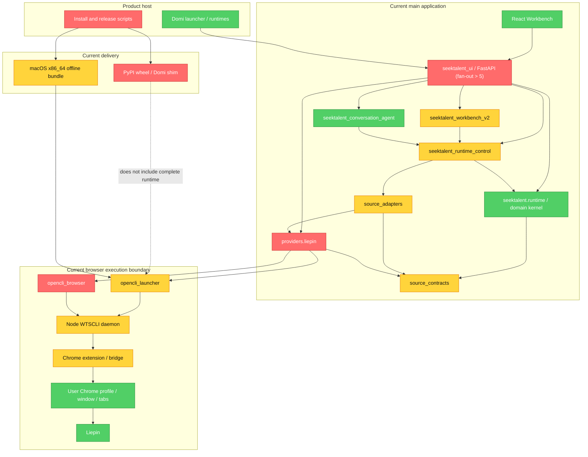
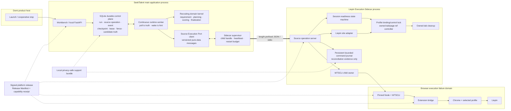
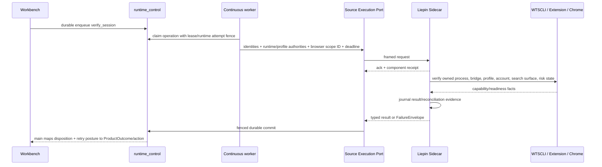

# External Execution Plane v1：本地运行拓扑与唯一生命周期所有者

状态：**已批准；完成 #321 reconciliation，合并至 `main` 后生效**
Owner：GitHub [#323](https://github.com/FrankQDWang/SeekTalent/issues/323)
范围：规划与契约；不实施产品代码，不替代 #324 的任务状态语义、#325 的完整 wire schema 或 #326 的发布实现。

## 1. 决策摘要

SeekTalent External Execution Plane v1 采用一个**受监督的本地模块化系统**：

- 主应用继续拥有 FastAPI/UI、SQLite durable control plane、continuous worker、招聘领域内核、LLM、候选事实和用户可见投影。
- 新增一个由主应用启动和监督的 **Liepin Execution Sidecar**，它是浏览器执行资源的唯一生命周期 owner。
- Sidecar 不是远程微服务：它与主应用同机、同用户、同产品 release、同一升级与回滚单元，不拥有独立业务数据库，也不独立部署。
- 主应用只能通过版本化、纯数据的 **Source Execution Port** 请求浏览器来源操作；该 IPC 位于 main 内部 `RuntimeSourceLane*` 应用边界之下的 Liepin worker/provider seam。领域代码不得再看到 WTSCLI command、localhost port、extension、profile、window、tab 或 page ref，也不得把 `RuntimeSourceLane*` 直接序列化。
- 现有 SQLite `runtime_control` 仍是 run、source operation、lease、fence、checkpoint、candidate truth 的唯一 durable truth；不得叠加第二套 workflow runtime。
- Sidecar 可以保留一个有界的 **Sidecar Command Journal** 用于“浏览器命令可能已发生”的 reconciliation，但它不拥有 run 状态、candidate truth 或 retry policy。
- v1 按 #321 冻结契约先使用用户现有 Chrome Stable profile/login compatibility mode，但必须确定性绑定一个 profile、production extension instance 和猎聘账号主体，并由 sidecar 持有该 binding 的唯一 product control lock。Dedicated-profile 真实账号 spike 不阻塞 T1/T2，但其证据是 #326 production release gate 的必需输入；不在 production 中维护双 profile path。
- 主应用 ↔ sidecar 首选 length-prefixed JSON over stdin/stdout；sidecar ↔ WTSCLI 过渡期可复用加固后的 product-specific loopback。T3 前 WTSCLI 必须提供 foreground/serve mode、owned child handle、ready/stop、stdout/stderr drain 及动态 endpoint/token/state dir，或由 sidecar 自己承载 bridge server；当前 detached restart 模式不满足唯一 owner。Native Messaging 只做限时 spike。
- 第一个稳定的纵向 operation 是 `verify_session`；但用户可运行 release 不得出现主应用和 sidecar 同时控制同一 browser profile 的双 owner。实现可以分 PR，release ownership 必须 hard cut。

明确拒绝：

- 不把 Temporal、Restate、Prefect、Celery 或其他 server/broker 装进用户电脑。
- 不把本地应用拆成独立部署的远程微服务。
- 不引入两个 durable control plane、长期双写或“旧/新路径都试一次”的 fallback。
- 不在 #323 中顺手重排全仓目录、拆所有大文件或清理所有死代码。
- 不用 Playwright 直接替换现有生产 WTSCLI/extension；Playwright 先作为 exact-artifact test harness。

## 2. Code-first Architecture Audit

### Brooks-Lint Review

**Mode:** Architecture Audit
**Scope:** External Execution Plane 的真实调用链；仓库共有约 1,079 个文件且嵌套超过四层，审计抽样覆盖 UI composition、Workbench v2、`runtime_control`、SourceLane、Liepin provider、OpenCLI/WTSCLI browser boundary、Domi bootstrap 和 release scripts。
**Health Score:** 49/100

当前领域内核和 durable control 基础可复用，但浏览器 lifecycle 与产品版本配对缺少概念完整性；这会把机器差异放大成无法解释的用户失败。

### Module Dependency Graph



### 当前代码事实

| 事实 | Code truth | 拓扑含义 |
|---|---|---|
| Run 已 durable enqueue，但执行唤醒仍是进程内提示 | [`runtime_service.py`](../../src/seektalent_workbench_v2/runtime_service.py) 先写 `runtime_control` 再调用 `on_run_queued`；[`runtime_runner.py`](../../src/seektalent_workbench_v2/runtime_runner.py) 只在 `wake()` 时创建 daemon thread | SQLite 已能作为 queue truth，但当前没有持续 owner 消费它 |
| Workbench v2 runner 没有进入 FastAPI lifespan | [`server.py`](../../src/seektalent_ui/server.py) 的 lifespan 只管理两个 outbox runner；`workbench_v2_runtime_runner` 没有 start/stop/join | 进程启动、冷队列恢复和有界关闭没有统一生命周期 |
| 恢复原语存在，但 Workbench v2 主动关闭了可恢复恢复 | [`recovery.py`](../../src/seektalent_runtime_control/recovery.py) 支持 checkpoint resume；[`runtime_runner.py`](../../src/seektalent_workbench_v2/runtime_runner.py) 传入 `resume_recoverable=False` | 不应重造 durable engine；应修正 owner 和启动策略 |
| Main process 在 provider factory 内直接创建 browser runtime | [`providers/liepin/client.py`](../../src/seektalent/providers/liepin/client.py) 调用 `ensure_opencli_runtime()`、连接 daemon、创建 lifecycle/automation/site adapter | Browser process、connection、profile/tab 状态还没有进程边界或唯一 owner |
| Daemon endpoint 和身份仍是全机隐式常量 | [`daemon_transport.py`](../../src/seektalent/opencli_browser/daemon_transport.py) 固定 `127.0.0.1:19825` 与 `X-OpenCLI: 1` | 旧 OpenCLI、残留 daemon 和并行产品实例可能争抢同一隐式资源 |
| 连接失败会在 main process 中触发 `daemon restart` | [`daemon_process.py`](../../src/seektalent/opencli_browser/daemon_process.py) 对若干 reason 直接执行 `daemon restart` | 当前代码不能证明被重启的进程是本产品创建的 owner |
| 当前 launcher 没有返回可监督的 WTSCLI child contract | Python 侧只执行 CLI `daemon restart`，没有 foreground handle、ready/stop 或 stdout/stderr ownership | T3 前必须新增 WTSCLI foreground/serve contract，或由 sidecar 承载 bridge server；否则“sidecar owns WTSCLI child”不可实现 |
| Bridge pairing 已有强校验基础 | [`browser_bridge_manifest.py`](../../src/seektalent/browser_bridge_manifest.py)、[`opencli_launcher.py`](../../src/seektalent/opencli_launcher.py) 和 [`daemon_transport.py`](../../src/seektalent/opencli_browser/daemon_transport.py) 校验 implementation、build、protocol、capabilities、extension state | 应保留并提升为 Release Manifest + Machine Capability/Startup Receipt，不应推倒重来 |
| Browser control 已有 fence、owned tab 和 reclaim | [`automation.py`](../../src/seektalent/opencli_browser/automation.py)、[`lifecycle.py`](../../src/seektalent/opencli_browser/lifecycle.py)、[`lifecycle_registry.py`](../../src/seektalent/opencli_browser/lifecycle_registry.py) | 这些是目标 sidecar 的核心资产；registry 当前只是 fail-open mirror，extension state 仍 authoritative |
| Daemon 模式的 session probe 只要找到 Liepin host tab 就返回 ready | [`liepin_site_adapter.py`](../../src/seektalent/providers/liepin/liepin_site_adapter.py) 的 daemon 分支在 `_select_liepin_host_tab()` 成功后直接返回 `ready` | “有 tab”仍可能是假绿灯，没有完整证明 account/search surface/risk state |
| Source lane seam 是 main 内部应用边界，不是 IPC schema | [`source_contracts/runtime_lanes.py`](../../src/seektalent/source_contracts/runtime_lanes.py) 的 request 含 `RequirementSheet`、callback 和 object context，result 含领域对象 map、provider snapshot 和 private continuation；[`providers/liepin/client.py`](../../src/seektalent/providers/liepin/client.py) 的 worker client 更接近 browser execution seam | #325 在 Liepin worker/provider boundary 定义 operation-specific 纯数据 DTO；保留 main 内部 SourceLane 业务语义，不把它序列化 |
| 在线产品安装并不交付完整产品 | [`install-seektalent-domi.sh`](../../scripts/install-seektalent-domi.sh) 与 [`install-seektalent-domi.ps1`](../../scripts/install-seektalent-domi.ps1) 在线安装 PyPI package；launcher 却要求 WTSCLI runtime、bridge identity/manifest 已存在 | 同版本 Python package 在不同用户机可能拥有不同或缺失的浏览器执行组件 |
| 完整 offline artifact 只覆盖 macOS Intel | [`.github/workflows/build-macos-intel-offline.yml`](../../.github/workflows/build-macos-intel-offline.yml) 是唯一完整 browser bundle workflow | Windows 11 x64 与 macOS arm64 还没有同等级 exact-artifact release evidence |

### Findings

#### 🔴 Critical

**Dependency Disorder — 浏览器 mutable state 没有单一生命周期 owner**
Symptom: FastAPI composition、provider factory、launcher、daemon client、site adapter 和 lifecycle thread 分别知道并改变 daemon、extension、profile、window、tab、page ref 与 cleanup 状态；main process 还能重启一个仅凭固定端口发现的 daemon。
Source: *Clean Architecture* — Dependency Inversion Principle；*The Mythical Man-Month* — Conceptual Integrity。
Consequence: 开发机的残留 daemon、扩展、profile、tab 和登录状态成为隐形 fixture；用户机任一差异都会穿过多层并被压成通用错误，且没有组件能给出完整因果链。
Remedy: 将所有 browser execution mutable state 收敛到一个受监督 sidecar；main app 只依赖 Source Execution Port 的纯数据 contract。

**Change Propagation — 产品配对知识泄漏到安装、启动和运行时多处**
Symptom: Python version、WTSCLI version、fork commit、bridge build、extension version、Node path、固定 port/header 与 profile 假设分布在 Python 常量、GitHub workflow、shell/PowerShell installer、外部 WTSCLI repo 和 Chrome 状态中；PyPI installer 与 offline bundle 的交付内容不同。
Source: *A Philosophy of Software Design* — Information Leakage；*Refactoring* — Shotgun Surgery。
Consequence: 一次升级或一台 clean machine 会要求多个独立位置恰好一致；CI/开发机通过不能证明用户拿到同一运行拓扑。
Remedy: 由 #326 交付单一 versioned release root 和 Release Manifest；main/sidecar/WTSCLI/bridge 必须 exact pair，CWS extension 必须落在显式 compatibility window，实际机器组合进入 Machine Capability Receipt。

#### 🟡 Warning

**Domain Model Distortion — Source lane contract 同时承担领域对象与进程内调用细节**
Symptom: `RuntimeSourceLaneRequest` 直接携带 `RequirementSheet`、callback 和任意 object context，result 直接携带候选领域对象、provider snapshots 和 private continuation。
Source: *Domain-Driven Design* — Bounded Context；*Clean Architecture* — Interface Segregation Principle。
Consequence: 浏览器边界无法安全序列化、重放或独立测试；若直接搬进 sidecar，只会把主应用内存模型复制成脆弱的 wire protocol。
Remedy: #325 在现有 seam 上定义 operation-oriented、版本化、纯数据 DTO；callback 改为 progress message，private continuation 留在 sidecar 并只返回 opaque reference。

**Cognitive Overload — 可靠性热点由超大模块承载多个抽象层**
Symptom: `runtime_control/store.py` 约 4,278 行、`liepin_site_adapter.py` 约 3,651 行、Workbench v2 service 约 2,157 行、runtime service 约 1,686 行；浏览器 readiness、DOM 操作、恢复和状态投影在同一热点内交错。
Source: *Refactoring* — Divergent Change / Long Method；*A Philosophy of Software Design* — Tactical Programming。
Consequence: 大规模“先清债再重构”会拖住交付，而继续在热点里追加 machine-specific fallback 又会放大认知负担。
Remedy: 不做全仓清理；只在纵向 hard cut 时把新 owner 的责任搬到明确模块，切换后删除旧路径，再拆被迁移边界阻挡的局部职责。

**Accidental Complexity — wake 与 restart 被当作生命周期监督**
Symptom: runtime runner 通过 spawn-on-wake thread list 驱动 durable queue；daemon 通过固定端口 probe 后执行 restart；两者都缺少一个从 startup 到 bounded shutdown 的 owner tree。
Source: *A Philosophy of Software Design* — Strategic vs. Tactical Programming。
Consequence: wake 丢失、冷启动队列、parent crash、未知进程占端口和 restart loop 会呈现为偶发边缘问题。
Remedy: main app 使用 continuous worker；sidecar supervisor 只监督自己持有的 child handles，并设置 bounded restart budget。

**Testability Seam — 有单元注入点，但没有完整产品拓扑 seam**
Symptom: runtime/provider 类已有 factory、Protocol 和 fake client，但现有 Playwright 只覆盖 Web contract，完整 offline workflow 只覆盖 macOS x86_64，测试没有从 release artifact 启动真实 sidecar/WTSCLI/extension/profile 组合。
Source: *Working Effectively with Legacy Code* — The Seam Model。
Consequence: 20 多台开发电脑仍共享开发安装、历史 cache/profile 和人工修复经验，无法代表 clean user machine。
Remedy: 用合成 Liepin contract site + exact release artifact 建立 process topology seam，并在三个目标平台注入 crash、profile lock、extension mismatch 和 unknown owner。

#### 🟢 Suggestion

**Knowledge Duplication — OpenCLI/WTSCLI/bridge 身份语言仍有漂移**
Symptom: 产品对外称 WTSCLI/SeekTalent bridge，代码和 header 仍大量使用 OpenCLI identity。
Source: *Domain-Driven Design* — Ubiquitous Language。
Consequence: 支持、发布和运行日志难以区分 legacy OpenCLI、SeekTalent fork 与当前 product component。
Remedy: 架构层统一称 `Liepin Execution Sidecar`；WTSCLI 只作为其当前 browser engine，并在 receipt 中使用明确 product component identity。

### Testability 与 Conway's Law 结论

- `runtime_factory`、worker Protocol、provider Protocol、bridge manifest 和 browser lifecycle 已提供可复用 seam；缺的是跨进程、跨 artifact 的 seam，而不是更多 mock class。
- 已知 Domi 与 SeekTalent 是不同产品 ownership。Domi 只应提供 host launch/stop 与临时 runtime path；SeekTalent 拥有自己的 control plane、sidecar 和诊断投影。Domi 不读取 SeekTalent runtime DB、browser journal 或原始日志。
- WTSCLI 的仓库/团队 ownership 不能代替 SeekTalent 的产品责任：WTSCLI 提供 pinned component artifact，SeekTalent release owner 决定是否接受该 exact build。

## 3. 目标运行拓扑



该拓扑只有两个本地 product process：main app 与其 child sidecar。Node/WTSCLI 是 sidecar 拥有的子进程；用户现有 Chrome 是外部用户资源，sidecar 只通过生产扩展控制自己创建的 owned tabs。它们都不是独立产品服务。

## 4. 唯一 ownership 矩阵

“Owner”指能创建、改变、恢复、关闭并解释该 mutable state 的唯一组件。用户、Chrome/CWS 与产品团队对凭据或 artifact 的法定/发布 ownership，与运行时 lifecycle ownership 分开表达。

| 资源或事实 | 唯一 runtime owner | 其他组件允许做什么 | 禁止 |
|---|---|---|---|
| User intent、requirement、run/stage | Main app / `runtime_control` | Sidecar 只读取一个 operation 所需的最小投影 | Sidecar 自建第二份 run 状态机 |
| Source operation durable state、retry policy、lease/runtime attempt fence | Main app / `runtime_control` | Sidecar 返回 ack/progress/result/failure 与 reconciliation evidence | Sidecar 决定业务 retry 或 final run status |
| Candidate truth、scoring、finalization | Main app domain kernel | Sidecar 返回 provider payload 的受限结果 | Sidecar 写 candidate DB 或评分 |
| Main ↔ sidecar process lifecycle | Main app `SidecarSupervisor` | Domi 只对 main 发 launch/stop；OS 回收 main | Domi 或 UI 直接 kill sidecar/WTSCLI |
| Sidecar process identity | Supervisor + inherited pipe/session nonce | Support bundle 读取 receipt | 仅凭 PID/端口认定 owner |
| WTSCLI/Node child process | Sidecar，在 foreground/serve ownership contract 生效后 | Main app 读取 sanitized component receipt；hard cut 前旧路径仍由当前 release 单独运行 | Main app 执行 `daemon restart`、sidecar 接管 detached/unowned daemon，或任何组件 kill unknown PID |
| Extension connection/capabilities | Sidecar | Release owner规定兼容窗口；Chrome/CWS分发 artifact | Main app绕过 sidecar直接 probe extension |
| Selected profile binding generation 与产品 control lock | Sidecar | 用户选择/登录并拥有 Chrome profile；main app只持 opaque profile ID/generation | 同 binding 启动第二 product controller；操作中自动切 profile；preferred profile 不匹配时 fallback 到其他 context |
| Provider account binding/readiness | Sidecar | 用户拥有账号和凭据；main app只见 opaque account hash/status | 导出 cookie/token；main app复制登录状态 |
| Existing-profile host window | 用户/Chrome | Sidecar只选择 host window，并创建 owned tab | Sidecar关闭 host window或改变 user tab |
| Future optional dedicated profile/window | Sidecar | 用户可见并可完成人机交互 | 与 existing-profile path 在同一 operation 自动 fallback |
| Owned tab、page ref、control scope/fence | Sidecar | Main app只见 operation-level progress | Main app持久化或复用 page ref |
| User tab / host tab | 用户/Chrome | Sidecar只读 host selection；沿用 `CONTEXT.md` 现有规则 | 把 user tab升级为 owned tab |
| Browser command journal | Sidecar | Main app按 operation ID请求 reconciliation | Journal成为 candidate/run truth；记录敏感 DOM/body；无限保留 |
| Cleanup / tab reclamation | Sidecar | Main app接收非业务阻塞的 cleanup evidence | cleanup failure改写已提交业务结果 |
| Release Manifest | SeekTalent release owner | Domi验证并启动当前 release；Machine Capability Receipt 记录实际机器组合 | 在线临时解析依赖后仍宣称 exact artifact |
| WTSCLI artifact | WTSCLI component owner构建；SeekTalent release owner接纳 | Sidecar只运行 receipt 中 pinned artifact | 用户机运行 npm install/任意系统 OpenCLI |
| Support bundle projection | Main app | Sidecar提供 allowlisted receipt/journal projection | Domi读取原始 DB/log，或默认远程上传 |

## 5. Process lifecycle 与监督规则

### 5.1 Main application lifecycle

```text
starting → control_plane_ready → worker_ready → sidecar_ready → serving
   │                │                 │                │
   └──── typed startup failure / degraded-but-UI-visible ────┘
serving → draining → worker_stopped → sidecar_stopped → stopped
```

1. Domi 只启动 main process，并把 Domi JWT、候选 Python/Node runtime path 等作为启动输入。Main 必须按 release manifest/hash 验证实际 runtime，不能只凭 PATH 或 version string 接受宿主 runtime；验证结果写入 machine capability receipt。Domi 不再拥有其子进程。
2. Main 初始化 schema 和 local product lock，再启动 continuous worker。SQLite queue 是事实源；wake 只能降低 poll latency。
3. Supervisor 启动与当前 release exact-paired 的 sidecar，持续 drain stdout protocol 与 stderr logs，等待有 deadline 的 startup handshake。
4. Sidecar 未 ready 时 UI 仍可启动并展示 typed capability failure；source operation 不得被 claim 为可执行。
5. Main 关闭时先停止接收新 source operation，worker 到 safe boundary，sidecar 进入 bounded drain；超时只终止 supervisor 持有的 child tree。
6. Main crash 时 pipe EOF 是 sidecar 的 parent-death signal；sidecar 停止接新命令、完成有界 journal flush、请求 owned-tab reclaim，然后结束自己创建的 WTSCLI child tree。v1 不关闭用户拥有的 Chrome/profile/host window。

### 5.2 Sidecar lifecycle

```text
stopped → starting → ready → busy → ready → draining → stopped
              │        │       │
              └→ degraded ←────┘
                       └→ crashed → bounded_restart → starting
```

- `starting`：验证 own release manifest/capability receipt、创建 session nonce/start token、取得 selected-profile binding generation 的 product control lock、以 foreground/serve contract 启动 pinned WTSCLI（或启动 sidecar-owned bridge server）、验证 bridge/extension。该锁防止第二个 SeekTalent controller，不主张拥有用户的 Chrome 进程。
- `ready`：组件兼容且能接 operation；不代表猎聘账号已经 ready，账号/search/risk 是 `verify_session` 的 operation result。
- `busy`：至少一个 source operation 正在执行；同一 `(source, profile, provider account)` concurrency 固定为 1。
- `degraded`：sidecar protocol 仍活着，但缺 extension、profile locked、Chrome unsupported 或 account needs attention；拒绝不满足 capability 的 operation。
- `crashed`：main 记录 process exit receipt；未形成 durable result 的 operation 进入 reconciliation，不自动假定失败或重试。
- `bounded_restart`：预算由 #324 结合 fault-injection evidence 固定并写入 receipt；超限产生 typed infrastructure disposition。只有存在具体用户动作时 main 才能映射为 `needs_attention`，否则映射为 `failed`；禁止无限隐藏重启或用未经验证的数字冒充 SLO。
- `draining`：停止 ack 新 operation，完成/中止到明确 safe boundary，flush journal，reclaim owned tabs，关闭自己创建的 child handles。

### 5.3 Child process ownership

- T3 前置：WTSCLI 必须提供 foreground/serve mode、ready/stop protocol、可持续 drain 的 stdout/stderr，并接受 product-specific endpoint/token/state dir；若无法提供，sidecar 必须自己承载 bridge server。detached + unref daemon 不能进入目标拓扑。
- POSIX：sidecar/WTSCLI 使用独立 process group；Windows：sidecar 使用新 process group，产品化实现必须验证 Job Object 的 child-tree 回收。
- 只能 cooperative stop/terminate/kill 当前 supervisor 持有的 `Popen` ownership tree。
- 发现端口被未知进程占用时 fail closed，返回 typed ownership conflict；不得 restart 或 kill。
- Restart budget 按 component 分开：sidecar 由 main 监督，WTSCLI 由 sidecar 监督，Chrome/profile 问题默认需要 reconcile/user action，而不是无脑重启。
- Heartbeat 只证明 process/liveness；operation 完成只由 main app durable result transition 决定。

### 5.4 Sidecar Command Journal

- Journal 是 sidecar 私有、可跨 sidecar restart 的有界持久记录，至少按 product build、sidecar generation、operation ID、idempotency key、command ordinal、WTS command ID 和 request hash 索引。
- 它只记录 command accepted/dispatched/observed/cleanup 等 reconciliation facts 与 allowlisted cause reference；禁止记录 candidate truth、run outcome、retry policy、cookie、DOM/body 或 screenshot。
- Main app 仍是 operation durable state 的唯一 owner。Journal 不能独立推进业务状态，只能回答 query/reconcile；main 使用当前 lease/runtime attempt fence 决定是否提交。
- Sidecar 只有在 durable `accepted` journal record 提交后才能 ack request；只有在 durable `dispatch_intent` 提交后才能产生 browser side effect；观察到外部结果后追加 `observed`，main 确认 fenced commit 后追加 `reconciled`。每次转换的 sync policy 由 #325 冻结，不得只依赖内存 buffer。
- 新 sidecar generation 必须能按 operation/idempotency key 查询旧 generation 的未 reconciled 记录。schema/version/path 属于 product data contract；corruption、unsupported migration、rollback mismatch 或磁盘写失败都必须在新的 browser side effect 前 fail closed，并产生 canonical Failure Envelope reference。
- Retention 受条数、字节和时间三重上限约束；只有 terminal 且已由 main 确认 reconciliation 的旧记录可以压缩。

### 5.5 三个状态命名空间与三种 authority

- `SidecarLifecycleState`：`stopped/starting/ready/busy/degraded/draining/crashed/bounded_restart`，只描述进程与能力生命周期。
- `SourceOperationDisposition`：封闭枚举 `completed/partial/user_action_required/incompatible/failed/cancelled/reconciliation_unknown`，只报告一次 source operation 的事实；`RetryPosture` 另行表达 `no_retry/safe_retry/reconcile_first`。`verify_session` 的 `ready/not_ready` 是 operation-specific readiness fact，不是所有 operation 的通用完成 disposition。
- `ProductOutcome`：`succeeded_with_results/succeeded_empty/degraded_with_results/needs_attention/failed/cancelled`，只由 main/#324 持久化。
- `runtime_attempt_fence_token` 保护 main durable writes；`profile_binding_generation` 保护选定 profile/extension/account binding；browser activation 后由 sidecar/extension 产生 controller-only `control_key + browser_control_fence_token`，browser boundary 在每条 command 上验证。`browser_control_scope_id` 只是 correlation identity，不是 authority；main 不得生成或伪造 browser control authority，三种 authority 也不能复用一个 `fence` 字段。

## 6. IPC、信任边界与版本配对

### 6.1 Main ↔ sidecar

采用 length-prefixed JSON over inherited stdin/stdout：

- stdout 只承载 protocol frame，stderr 只承载日志；两条 pipe 必须持续 drain，避免 deadlock。
- 第一帧是双向 handshake；OS parent-child handle + 高熵 parent session nonce + exact product build 共同确认 identity。
- 每帧必须有 schema/protocol version、message type、correlation ID 和有界长度；Pydantic 只用于外部边界模型，不复制全量领域模型。
- Secret 不进入 argv、日志或 error message。Sidecar 获得的输入限于单次 source operation 所需字段；完整 JD、简历正文和候选 DB 不默认跨边界。
- Main 持有 deadline 与 `runtime_attempt_fence_token`；过期 token 的晚结果不能提交，但可以用于 reconciliation evidence。
- Pipe EOF、malformed frame、oversize frame、protocol mismatch 和 sidecar exit 是不同 failure domain，不能压成 generic backend unavailable。

### 6.2 Sidecar ↔ WTSCLI ↔ extension

过渡方案：

1. Sidecar 启动 pinned WTSCLI child 并持有 handle。
2. Loopback 改为 SeekTalent product-specific identity、动态或独占 port、独立 state dir、严格 Host/Origin/method/content-type/body-size 校验和每次启动高熵 capability token。
3. Unknown owner 只产生 typed failure；删除 main-process `daemon restart` ownership。
4. 保留现有 bridge implementation/build/protocol/capability 校验；sidecar/extension activation 产生 controller-only `control_key + browser_control_fence_token`，每条 browser command 必须携带并由 browser boundary 验证，main 只接收非敏感 evidence reference；实际状态写入 startup/operation receipt。

目标 spike：Chrome Native Messaging。只有 production extension ID、Windows registry、macOS host manifest、企业策略、service-worker restart 与 parent recovery 全部通过后，才可替换 production loopback；失败则继续加固 loopback，不维持两个 production bridge。

### 6.3 Version/capability handshake

| Pair | 规则 | 不匹配行为 |
|---|---|---|
| Main app ↔ sidecar | 相同 `productBuildId`；相同 protocol major；minor 必须在显式范围 | Sidecar 不进入 ready，UI 展示 reinstall/rollback action |
| Sidecar ↔ WTSCLI runtime | Product manifest 中 exact version、fork commit、file hash | Fail closed；不得使用 PATH 中其他 OpenCLI |
| WTSCLI ↔ bridge manifest | Exact implementation/build/protocol/capability | Fail closed；保留现有强校验 |
| Bridge ↔ production extension | Extension ID 精确；protocol/capability 落入 N/N-1 compatibility matrix；actual build/version 进入 receipt | Fail closed 或执行已证明兼容的组合；不尝试降级 extension |
| Sidecar ↔ Chrome Stable | 只接受 Release Manifest 声明的 Stable version/policy 范围，并把实际 Chrome/profile mode/instance lock 写入 Machine Capability/Startup Receipt | Beta/Dev/Canary、Edge/其他 Chromium 为 v1 unsupported；profile locked 时不自动换 profile |
| Binary ↔ user data | Release 与 data/profile 分目录；schema 有显式 version | 二进制 rollback 不无提示回滚数据 |

Startup receipt 至少包含：product/main/sidecar build、protocol、sidecar PID/start token、WTSCLI/Node/bridge/extension/Chrome version、profile mode/opaque path hash、profile binding generation、provider account hash（若已绑定）、endpoint/token reference、capabilities、restart count、last exit reason。#322 决定 canonical schema 与最终 support-bundle projection。

### 6.4 Manifest、receipt 与 operation evidence

- **Release Manifest**：发布时生成、不可变，声明 artifact hash、main/sidecar/WTSCLI/bridge build、协议兼容窗口、支持平台和 schema；#326 拥有。
- **Machine Capability Receipt**：安装/preflight 后针对一台机器生成，记录 manifest 验证结果、实际 OS/Chrome/extension/runtime/profile mode 与支持结论；#322 定义 canonical projection，#326 负责随 artifact 产出。
- **Startup Receipt**：每次 main/sidecar generation 启动时生成，记录实际 process/component identity 和 readiness facts；它不是 release manifest。
- **Operation Evidence**：按 operation/attempt 记录 disposition、journal/cause references 与 source coverage；它不是 Product Outcome。

这些对象可以互相引用，但不得混称为一个 product/capability receipt，也不得把未经 manifest/hash 验证的 PATH runtime 写成已验证 component。

## 7. Browser profile 策略

### 7.1 v1 冻结默认：用户现有 Chrome Stable profile/login

- v1 只支持 Chrome Stable；每个 Release Manifest 声明实际验证的 Stable version window，Machine Capability Receipt 记录当前机器实际版本。Edge、其他 Chromium 和 Chrome Beta/Dev/Canary 不是 v1 生产目标。
- 用户首次使用或存在多个 profile/account 时做一次明确选择。Sidecar 将一个 hard `contextId`/opaque profile ID、一个 production extension instance 和一个 opaque provider account hash 确定性绑定并产生 binding generation；任何一项变化都返回 `user_action_required`，由 main 映射为 `needs_attention`。preferred profile 不匹配时不得 fallback 到唯一在线 context。
- Sidecar 是该绑定上的唯一 browser controller；main app 不能旁路，也不能自动猜测另一个 profile/account/extension。
- 沿用现有 `CONTEXT.md`：user tab/host window 属于用户，sidecar 只能在选定 host window 创建 inactive owned tab，绝不导航或关闭 user tab/host window。
- Readiness 必须验证 owned process/bridge → production extension → selected profile → opaque provider account → recruiter search surface → risk state，不能以存在 Liepin tab 代替。
- 登录、短信/二维码/验证码、风控挑战和明确网站确认必须在 headed Chrome 中由用户完成；产品不得收集密码、验证码或 cookie。

### 7.2 Release 前必做、采用结果可选：SeekTalent dedicated profile/window spike

- Dedicated-profile 采用不是 T1/T2 blocker，也不得未经证据改写 #321 compatibility-mode 默认；但真实账号 spike 的执行与结论是 #326 production release gate 的必需证据。
- 若继续 spike，profile 位于 release root 之外，用户重新登录，不复制现有 cookie；sidecar 持有唯一 profile instance lock，并唯一创建/导航/关闭 dedicated window。
- Spike 必须覆盖真实账号登录、搜索、风控、长会话、企业策略、extension 分发和用户迁移。证据证明更可靠且体验可接受后，才能通过新的产品决议改变默认；未通过则保留 compatibility mode 并记录 residual risk。
- Operation 开始后禁止在 existing/dedicated profile 之间自动 fallback；这会改变 provider account 和副作用边界。

### 7.3 Migration 与 rollback

1. v1 在 receipt 中显式记录 selected profile/extension/account binding，不再把 `local-chrome-profile` 机器隐式状态当默认事实。
2. 用户重新选择 profile/account 会产生新的 binding generation；旧 attempt/fence 立即失效，已有 operation 先 reconcile，不能透明续跑。
3. 失败回滚以完整 product release pointer 为单位；用户 profile/data 不回滚，且不得要求用户清空 Chrome profile。
4. Dedicated profile 若在未来被接受，使用一次性明确迁移/登录流程；不能在同一 operation 中切回 existing profile。

## 8. 第一个纵向 operation：`verify_session`

`verify_session` 是第一条稳定 Source Execution Port operation，因为它可以在不获取候选、不评分、不写 candidate truth 的情况下验证最易漂移的产品拓扑。



### 8.1 Contract constraints（#325 细化 schema）

Input 至少表达：

- `contract_version`、`run_id`、`operation_id`、`attempt_no`、idempotency key/request hash、correlation ID；
- `runtime_attempt_fence_token`、`profile_binding_generation`、`browser_control_scope_id`；scope ID 仅用于 correlation。初始 request 不携带 browser authority；activation 后的 `control_key + browser_control_fence_token` 只在 sidecar ↔ WTSCLI/extension command boundary 使用，main 不得伪造或获得 controller secret；
- deadline value、monotonic/wall-clock semantics 与明确单位；
- source=`liepin`、requested profile mode/hard `contextId`/opaque profile ID、required capabilities；
- 允许的 user-interaction policy；不需要 JD、简历或候选正文。

Output 至少表达：

- actual Machine Capability/Startup Receipt references 与 profile/account operation facts；
- readiness facts：process、bridge、extension、profile lock、account、search surface、risk state；
- `SourceOperationDisposition`、operation-specific readiness facts、user/support action、独立的 retry/reconcile posture、canonical Failure Envelope/cause reference，以及 browser control authority 的非敏感 evidence reference；
- cleanup/reconciliation evidence；不返回 page ref、cookie、DOM 或 raw screenshot。

Port 除提交 operation 外还必须支持 readiness、query/status、cancel、reconcile 和 drain。Transport 断连只代表通信状态未知；调用方必须先 query/reconcile，不能直接把 operation 标成失败。Progress message 可以丢失，但 terminal disposition、journal 与 safe checkpoint 不得依赖 progress delivery。

### 8.2 Hard-cut acceptance

- 相同 idempotency key + request hash 重复提交不会重复创建 profile/window/tab；返回已提交结果或执行 reconciliation。相同 key + 不同 hash 必须 conflict，禁止猜测复用。
- Main/sidecar 任一方在 browser probe 后、main commit 前崩溃，重启后能区分“未执行”“已执行并有 journal”“结果未知需用户确认”。
- 旧 `runtime_attempt_fence_token` 的晚结果不能覆盖新 attempt；旧 `profile_binding_generation` 或失效的 `control_key + browser_control_fence_token` 不能继续产生 browser side effect。`browser_control_scope_id` 只参与关联，不能替代 fencing 校验。
- `verify_session` 不能写 candidate/scoring/finalization state。
- v1 existing-profile path 不导航、复用或关闭 user tab/host window，只控制自己创建的 owned tabs；未来 dedicated path 必须在独立决议与测试中证明其 window/profile ownership。
- 失败必须定位到 component/capability/readiness domain，并给用户动作与本地 cause reference。
- Operation hard cut 后，旧的 main-process `session_status_probe` 调用路径从 production composition 删除。

### 8.3 如何在不制造双 owner 的前提下分批交付

- 可以先合入纯 contract、fake sidecar 和 exact-artifact tests，但 production composition 不启用第二 owner。
- `verify_session` 是第一个实现和验证的 operation，但 production hard cut 前 #325 必须已冻结并验证当前 live `verify_session/search/cards/details/continuation/cleanup` 的 operation-specific 纯数据 DTO；不得用 generic `RuntimeSourceLaneRequest` 或 arbitrary command port 暂时代替。
- Sidecar executable 必须先能承载所有仍在生产使用的 Liepin browser lifecycle；`verify_session` 先完成不代表允许 search/cards 继续旁路 sidecar。
- 正式切换 release 中，`ensure_opencli_runtime`、daemon connect/restart、automation/lifecycle/site adapter 的创建全部移到 sidecar；main app 同时删除直接 browser imports。
- Contract 可以按 `verify_session → search → cards → details/continuation → cleanup` 分 PR 实现和测试，但 T3 production routing 只在全部 live operation contract 已就绪后一次 hard cut；切换后立即删除 sidecar 内临时 legacy translation。不得发布 generic “execute arbitrary SourceLaneRequest”。
- 若 hard-cut release 失败，回滚到 previous release；同一 release 内不自动尝试旧 browser path。

## 9. Failure containment

| Failure | 唯一处理者 | Main durable outcome constraint | 用户/支持动作 |
|---|---|---|---|
| Main crash / pipe EOF | Sidecar drain owned tree | Operation 保持可 reconcile；重启后先查 journal，再决定 retry | 自动恢复或明确 unknown-side-effect action |
| Sidecar crash | Main supervisor | 记录 process exit/cause；不得直接把整条 run 失败 | Bounded restart；超限返回 typed infrastructure failure，只有具体用户动作存在时才 needs attention |
| WTSCLI child crash | Sidecar | 返回 component failure/reconciliation evidence | Sidecar只重启 owned handle |
| Unknown process owns endpoint | Sidecar | 不派发 operation | 提示端口/legacy component conflict；不 kill |
| Extension missing/disabled/incompatible | Sidecar | Typed capability failure | 安装/启用/等待兼容 extension |
| Chrome absent/unsupported/profile locked | Sidecar | Operation 未执行 | 安装支持版本、关闭其他 controller 或选择 profile |
| Login expired / risk / verification | Sidecar readiness | `user_action_required` disposition，由 main 映射为 `needs_attention`；不是 infrastructure retry | 在 headed window 完成人机动作后重新 verify |
| DOM/search surface drift | Sidecar adapter | Typed provider contract failure | 进入 #322 evidence/contract-site reproduction |
| Deadline/IPC disconnect | Main fence + sidecar journal | Late result rejected；先 reconcile 后 retry | 自动或人工取决于副作用可确认性 |
| Cleanup/reclaim failure | Sidecar | 不改写已 durable commit 的候选/业务结果 | 记录 cleanup evidence，后台重试或人工关闭 owned tab |
| Disk full/SQLite unavailable | Main control plane | 在 claim/commit 边界 fail closed | 释放空间/修复 DB；不继续 browser side effect |
| Upgrade during active operation | Main release supervisor | Drain 到 safe boundary；未完成 operation 在旧 release 完成或明确暂停 | 不同时运行两个 release owner |

## 10. 保留、迁移与删除边界

### 10.1 必须保留并演进

- `runtime_control` 的 run/event/checkpoint/executor lease/attempt generation/fence/candidate truth。
- `RuntimeRecoveryService` 的 named checkpoint recovery 语义；具体状态由 #324 决定。
- 现有 source plan/lane/result 的业务语义和 `completed/blocked/partial/failed/cancelled` 区分。
- Bridge implementation/build/protocol/capability/extension pairing 校验。
- Browser control scope/fence、owned inactive tab、host window/user tab 不可接管、idle deadline、reclaim 和 cleanup fault isolation。
- `tach.toml` 已表达的 domain/runtime/provider 依赖方向；新 port/sidecar 边界加入现有工具，不另建治理体系。

### 10.2 对应 hard cut 后立即删除

- `WorkbenchV2RuntimeQueueRunner` 的 spawn-on-wake/thread-list 行为及其旧测试期望（由 runtime reliability slice 处理）。
- Main-process 直接 `ensure_opencli_runtime`、connect/restart daemon、持有 automation/lifecycle/site adapter 的 production composition。
- Production 固定 `127.0.0.1:19825`、`X-OpenCLI: 1` 与未知 owner restart/kill 路径。
- 仅检查 host tab 就返回 ready 的 session branch。
- 任何把 SourceLane callback、任意 object context、private continuation、领域对象或 browser ref 序列化跨 IPC boundary 的路径；main 内部 SourceLane 业务语义保留。
- 同 release 的 old/new browser fallback、长期 feature flag/dual-write adapter。
- 把 PyPI wheel/shim 描述为完整产品的安装路径。

### 10.3 不由 #323 清理

- 与 external execution boundary 无关的大文件、目录命名、archive docs、重复 helper 和旧实验代码。
- requirement、candidate、scoring、reflection、finalization 等未被证据判定为 ownership 根因的领域逻辑。
- 单纯为了“看起来更像微服务”而创建的 repository/service layers。

技术债处理规则：**只在它阻挡新 boundary、hard cut、测试 seam 或删除旧 owner 时处理；否则进入独立 debt backlog。**

## 11. 迁移顺序与 release gates

### Phase T0 — 冻结 contract 与现状 evidence

- #321 冻结支持平台、人工交互、恢复/回滚和最低可靠性门槛。
- #322 冻结 canonical Failure Envelope/事件/receipt、support bundle、clean-machine/fault-injection baseline。
- #324 冻结 task/outcome/attempt/recovery semantics；#325 在 #322/#323/#324 之上冻结 source-operation wire contract 与 evidence transport。
- 建本地 synthetic Liepin contract site，禁止使用真实用户 DOM/cookie 作为默认 trace。

Gate：没有任何 production routing 改变；可以独立回滚 docs/contract/test harness。

### Phase T1 — Main runtime 单一 owner

- 将 runtime queue 改为 lifespan-owned continuous worker；SQLite poll 是 truth，wake 是 hint。
- Startup recovery 恢复 recoverable checkpoint；shutdown stop/join 有界且幂等。

Gate：cold queued run、第二个 queued run、recoverable restart、duplicate wake、bounded shutdown 全部通过。

### Phase T2 — Sidecar contract 与不可达 harness

- 实现 main↔sidecar framing、handshake、receipt、supervisor 与 fake/synthetic browser harness。
- 先补 WTSCLI foreground/serve ownership contract 或 sidecar-owned bridge server，再移动 browser construction/lifecycle 代码到 sidecar executable；production composition 尚不启用第二 owner。
- 按 operation-specific DTO 实现并测试全部 live browser operation；`verify_session` 最先完成。Native Messaging 与 dedicated profile 分别 spike。

Gate：main/sidecar/Node crash、pipe EOF、unknown endpoint owner、profile lock、extension restart 在三平台 exact artifact 上可判定。

### Phase T3 — Browser ownership release hard cut

- 一个 release 中把所有 live Liepin browser construction 和 command ownership 切到 sidecar。
- Main app 只通过 Source Execution Port；删除 direct browser imports 与 old restart/readiness path。
- `verify_session/search/cards/details/continuation/cleanup` 的已冻结 DTO 全部由同一 sidecar owner 提供；main 不保留 generic legacy bypass。

Gate：同一 profile 永远只有一个 controller；previous release 可整体回滚；同 release 没有 fallback 到旧 path。

### Phase T4 — Operation-by-operation 优化与发布闭环

- 在不改变已冻结 wire contract 的前提下逐条优化 `search → cards → details/continuation → cleanup` 实现，并删除剩余临时 translation。
- #326 发布 Windows 11 x64、macOS arm64、macOS x86_64 三个 signed exact artifacts；用户机不运行 pip/npm dependency resolution。
- #322 将 capability/failure receipt 纳入 PR/nightly/release/manual support gates。

Gate：不存在 generic arbitrary browser command port；sidecar 没有变成第二个领域单体。

## 12. 实现 spikes 与 release 阻塞关系

| Spike | 时间盒 | v1 阻塞关系 | 成功标准 | 失败后决策 |
|---|---:|---|---|---|
| Main↔sidecar stdio supervision | 3 天 | 阻塞 T2/T3 | Win/mac framing、stderr drain、parent EOF、bounded child-tree cleanup、malformed/oversize frame | 修正监督协议；不换成 gRPC/service mesh |
| WTSCLI foreground/serve ownership | 3 天 | 阻塞 T2/T3 | owned child handle、ready/stop、stdout/stderr drain、动态 endpoint/token/state dir；无 detached/unref | sidecar 自己承载 bridge server；不得宣称拥有未知 daemon |
| Product-specific loopback ownership | 3 天 | 若 v1 继续 loopback，则阻塞 T3 | 动态/独占 port、token、state dir、unknown owner fail closed、legacy OpenCLI 共存 | 暂停 topology release，不复用 19825 |
| Extension compatibility | 3 天 | 阻塞 v1 release | Desktop N/N-1 × extension N/N-1 全部工作或 fail closed | 暂停 production extension rollout，不假设 extension 可降级 |
| Native Messaging | 5 天 | 非 v1 前置；仅在选择它时阻塞 bridge cut | Production extension ID、Win registry、mac manifest、enterprise policy、service-worker restart、parent recovery | 保留唯一加固 loopback production path |
| Dedicated profile/window | 3–5 天 | 不阻塞 T1/T2；spike evidence 阻塞 #326 production release，采用结果不强制 | 真实账号登录、风控、搜索、长会话、企业策略和迁移可接受 | v1 继续 existing-profile compatibility mode，并记录 residual risk |
| PyInstaller onedir / interim Domi runtime | 3–5 天 | 由 #326 决定具体技术；完整 artifact 始终阻塞 release | 三 artifact 启动、native wheels、Node child、sign/notarize、rollback | 暂沿用 Domi runtime，但完整 offline bundle/receipt 不退让 |

DBOS 不在本拓扑关键路径。它只能按 #320 做 replacement-only 5 日 spike；不能与现有 `runtime_control` 共存。

## 13. 对下游 Wayfinder 任务的硬约束

### 对 #324：可靠任务状态、提交与恢复

- Main `runtime_control` 是唯一 workflow truth；sidecar lifecycle/command journal 不能产生第二个 run status。
- Browser side effect 不能承诺 exactly-once；每种 operation 必须有 idempotency/reconciliation posture。
- Sidecar crash、user action、cleanup failure、partial candidate result 必须是不同语义。
- 恢复只能从命名 safe boundary/checkpoint 发生；不能 replay 任意 Python frame。

### 对 #325：Source Execution Port 与 Failure Envelope transport

- Wire payload 必须 pure-data、versioned、bounded；禁止 callback、领域对象、private continuation、tab/page ref。
- Request 必须表达 `contract_version/run_id/operation_id/attempt_no`、request hash/idempotency、deadline clock/unit、`runtime_attempt_fence_token`、`profile_binding_generation` 和仅用于 correlation 的 `browser_control_scope_id`；controller-only `control_key + browser_control_fence_token` 只存在于 sidecar ↔ WTSCLI/extension command boundary，Source Port result/evidence 只返回非敏感 authority reference。Wire 还必须表达 ack/progress/result/failure、component receipt 和 cause reference；same-key/different-hash 必须 conflict。
- IPC seam 位于 main 内部 `RuntimeSourceLane*` 之下的 Liepin worker/provider boundary；必须覆盖当前 production `verify_session/search/cards/details/continuation/cleanup`，禁止 generic arbitrary command。
- Sidecar journal 只提供 command reconciliation evidence；#325 冻结 ack/dispatch/observed/reconciled 原子顺序，main durable source operation 负责提交、retry 和 late-result rejection。
- #325 只传输/引用 #322 canonical Failure Envelope、receipt 和 event identity，不另造 schema。

### 对 #326：产品包与发布证据

- 发布单元包含 exact main/sidecar/WTSCLI/bridge receipt；CWS extension 使用兼容窗口和 actual receipt。
- 三个 native artifact：Windows 11 x64、macOS arm64、macOS x86_64；不把 wheel 当产品。
- Release/data/profile 分离，versioned immutable release root + atomic current/previous pointer。
- Clean HOME、non-admin、空 profile、旧 OpenCLI remnants、proxy/CA、extension mismatch、profile lock 都是 release evidence，不是用户现场前置证据。
- Dedicated-profile 真实账号 spike 必须执行并记录采用/拒绝依据；最终 artifact + production extension + 受控真实猎聘账号 canary 必须通过。

### 对 #322：可诊断性与故障注入

- 当前五位用户的历史错误不可获得，不阻塞本拓扑。
- #322 唯一定义 canonical Failure Envelope、事件关联、Release Manifest 引用、Machine Capability/Startup Receipt、support projection 与 fault matrix；#325 只负责 transport。
- Receipt 和 Failure Envelope 默认本机、allowlist-first、用户预览、手动导出；不上传 cookie、token、JD/简历正文、真实 DOM/screenshot。
- Support bundle 必须能把“跑不了”归类到 product/component、process、IPC、bridge、profile/account、provider surface、network、storage 或 unknown-with-cause-reference。

## 14. #321 reconciliation 结果

生产可靠性契约由 [#321](https://github.com/FrankQDWang/SeekTalent/issues/321) / [PR #330](https://github.com/FrankQDWang/SeekTalent/pull/330) 跟踪，并以合并至 `main` 的版本为准。本拓扑逐项对齐如下：

| #321 冻结约束 | #323 对齐结果 |
|---|---|
| Windows 11 x64、macOS arm64、macOS x86_64；Chrome Stable only | 目标 release/receipt 与 clean-machine gates 固定三平台和 Stable window；其他平台/browser preflight fail closed |
| v1 默认用户现有 profile/login compatibility mode；production 前执行 dedicated-profile spike | Section 7 固定 hard context binding 与 generation；spike 不阻塞 T1/T2，但其证据阻塞 #326 release，采用结果不强制 |
| SQLite durable queue + startup continuous worker | Main lifecycle 以 SQLite poll 为 truth，wake 为 hint；该实现由 #324/runtime slice 落地 |
| At-least-once dispatch + idempotent/fenced commit + reconcile | Main owns durable operation/attempt/fence；sidecar journal 持久化 command reconciliation evidence，不承诺 external exactly-once |
| Source port pure data，支持 readiness/query/cancel/reconcile/drain | Section 5/6/8 固定 stdio transport、三种 authority 与 protocol capabilities；完整 operation-specific schema 留给 #325，不序列化 RuntimeSourceLane |
| `succeeded_with_results` / `succeeded_empty` / `degraded_with_results` / `needs_attention` / `failed` / `cancelled` | Sidecar 只产生 `SourceOperationDisposition`、retry posture 和 Failure Envelope reference；最终 Product Outcome 由 main/#324 决定。只有具体用户动作存在时 `user_action_required` 才映射为 `needs_attention` |
| local-only allowlisted diagnostics；历史五用户日志不阻塞 | Journal 只提供 privacy-safe facts；canonical Failure Envelope/receipt/projection 交给 #322，本拓扑不等待历史 case |
| 完整 signed bundle，不是 wheel；A/B rollback | Main/sidecar/WTSCLI/bridge exact pair，production extension compatibility receipt，release/profile/data 分离；实现交给 #326 |
| 没有现场基线时不制造 99.x% SLO | Restart budget 由 #324 结合 fault evidence 固定并写入 receipt；发布使用 deterministic gates |

Reconciliation 没有发现阻塞性架构冲突。仍待 #322/#324/#325/#326 决定的内容是下游 evidence/semantics/wire/release contract，不再改变 #323 的唯一 ownership 结论。

## 15. #323 完成门禁

只有同时满足以下条件，#323 才能关闭：

- #321 的批准版本已合并至 `main`，并逐项 reconciliation，无阻塞性冲突。
- 每个 process、durable state、browser resource、version receipt 和 cleanup action 都有且只有一个 owner。
- `verify_session` 的目标 flow、failure domains、idempotency/reconciliation 和 hard-cut rollback 已明确。
- Dedicated profile、Native Messaging、loopback isolation、sidecar supervision 等未知项均有时间盒和失败后的确定 fallback。
- WTSCLI foreground/serve ownership 或 sidecar-owned bridge server 已被明确列为 T2/T3 前置，未把 detached daemon 当成 owned child。
- #324/#325/#326 能从本文得到明确输入，不需要重新决定 runtime ownership。
- 没有把 Temporal/microservices、全仓清债、长期 dual stack 或第二个 durable runtime偷偷带回方案。

## 16. 最终推荐

采用：**SQLite durable control plane + continuous local worker + one supervised Liepin Execution Sidecar + Source Execution Port + validated single-owner profile strategy + exact Release Manifest and receipts**。

这不是用“分布式系统技术栈”替换单体，而是承认本地产品已有多个独立失败域，并为每个 mutable state 建立唯一 owner、durable boundary、typed failure 和可重复 release evidence。它允许团队绕开无关技术债，以 `verify_session` 开始逐纵向 operation hard cut；同时不会把第二个更重的系统部署到用户电脑。
