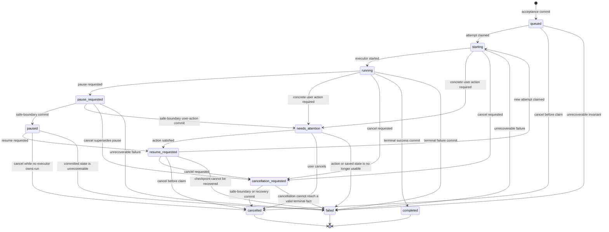

# External Execution Plane v1 — Task Semantics and Recovery Contract

Status: **decision contract for cross-review**

Tracks: **Wayfinder #324**

Depends on: [Reliability Contract](./external-execution-plane-v1-reliability-contract.md), [Runtime Topology](./external-execution-plane-v1-runtime-topology.md)

Implementation status: **not implemented by this document**

## 1. Decision summary

The External Execution Plane (EEP) keeps the existing local-first control-plane direction, but replaces implicit task behavior with one durable, fenced state machine.

This document freezes the following decisions:

1. Sidecar health, source facts, retry authority, and product result remain four independent namespaces. They are never collapsed into one `status`.
2. A run is a durable product intent. An executor attempt is replaceable execution capacity inside a non-terminal run.
3. Every executor mutation requires the active `runtime_attempt_fence_token`. Executor identity or attempt number alone is insufficient authority.
4. A terminal run is immutable. A user rerun or missing-source completion creates a linked new run; it never reopens the old run.
5. A crash may create a new attempt only while the same run is non-terminal and only from a committed safe checkpoint.
6. Checkpoint, compact candidate truth, checkpoint pointer, and the state transition caused at that boundary commit atomically.
7. Ambiguous external effects always enter `reconcile_first`. `safe_retry` is earned by evidence; it is never inferred from an exception type.
8. `needs_attention` is a non-terminal product outcome reserved for one concrete user action. Infrastructure exhaustion is `failed`, not `needs_attention`.
9. `partial` is a source fact. It becomes `degraded_with_results` only when committed candidate truth is usable and the run is intentionally finalized.
10. Required-source `empty` is successful execution with zero results. It maps to `succeeded_empty` when the required search objective is fully covered.

## 2. Scope and non-scope

### 2.1 In scope

- durable run and attempt semantics;
- the complete run-control transition graph;
- terminal immutability and linked reruns;
- pause, resume, cancellation, and `needs_attention` behavior;
- runtime attempt fencing and late-write rejection;
- atomic acceptance, checkpoint, command-application, and finalization boundaries;
- reconcile-before-retry rules;
- failure-to-state and coverage-to-outcome mapping;
- crash, concurrency, and property-test obligations;
- preserve, migrate, and delete decisions against current code.

### 2.2 Explicitly out of scope

- Failure Envelope fields or serialization; issue #322 owns that contract;
- Source Port request/response, receipt, or wire DTOs; the Source Port contract owns them;
- sidecar process supervision and packaging implementation;
- a runtime refactor or database migration in this change;
- raw provider payload, browser artifacts, or telemetry upload policy changes.

This contract may name a fact that another contract must carry, but it does not define that contract's wire shape.

## 3. Current code truth

The target below is grounded in current code and tests, not inferred from older planning prose.

| Area | Current fact | Decision |
|---|---|---|
| Run states | `queued`, `starting`, `running`, `pause_requested`, `paused`, `resume_requested`, `cancellation_requested`, `cancelled`, `completed`, `failed` | Preserve the useful control states; add `needs_attention` and a separate product outcome. |
| Terminal behavior | `cancelled`, `completed`, and `failed` only self-transition | Preserve and strengthen as storage-level terminal immutability. |
| Attempts | Lease acquisition increments `attempt_no`; only one active lease is allowed | Preserve monotonic attempts and single active attempt. |
| Write fencing | Store checks active `(runtime_run_id, executor_id, attempt_no)` | Migrate to an opaque `runtime_attempt_fence_token` required on every executor write. |
| Late writes | Tests reject stale event, checkpoint, stage output, and completion writes | Preserve and expand to every executor-owned mutation. |
| Checkpoints | `write_checkpoint` commits checkpoint, latest pointer, and compact candidate truth together | Preserve this transaction and include boundary state/event/command application. |
| Commands | Cancel supersedes pause/resume; queued and paused cancel immediately | Preserve precedence; remove cross-transaction command/state windows. |
| Recovery | A recoverable checkpoint can resume as a new attempt; corrupt or absent checkpoint fails | Preserve the rule; production currently disables recovery and must migrate only after gates pass. |
| Acceptance | Run creation and initial queued event/snapshot are separate transactions | Migrate to one durable acceptance transaction. |
| Finalization | Outcome event/status, finalization data, and lease release are separate writes | Migrate to one terminal commit with fence revocation. |
| Source facts | Lane and round results use `completed`, `partial`, `blocked`, `failed`, and `cancelled`; lane results also expose `retryable` | Preserve facts; delete `retryable` as execution authority. |
| Coverage | Runtime coverage is `complete`, `degraded`, or `empty`; public mapping treats required `empty` as failure | Replace with the mapping in section 12. |
| Reruns | `run_kind` supports `primary`, `rerun`, and `fork`, but lineage is not durable | Preserve `run_kind`; add explicit root and parent lineage. |

## 4. Domain boundaries

### 4.1 Run

A **run** is one durable execution of an approved product intent. It owns:

- one immutable `runtime_run_id`;
- one frozen input/requirement revision;
- selected and required source scope;
- run-control state;
- zero or one current product outcome;
- attempt history;
- checkpoint and compact candidate truth;
- source coverage and finalization revision;
- lineage when created from another run.

A run is not a process, thread, sidecar, browser tab, source request, or lease.

### 4.2 Attempt

An **attempt** is one executor's temporary authority to advance a non-terminal run. It owns:

- a monotonically increasing `attempt_no` within the run;
- a lease lifetime;
- one opaque `runtime_attempt_fence_token`;
- heartbeat and release facts;
- no product identity of its own.

Replacing an attempt does not create a new run. Replacing a terminal run always creates a new run.

### 4.3 Safe checkpoint

A **safe checkpoint** is a committed restart boundary whose state is sufficient to resume without guessing whether local durable candidate truth was committed. A checkpoint is safe only when its named boundary has an implementation-specific validator and crash tests.

Arbitrary stage strings are not safe checkpoints. The initial v1 registry is:

| Boundary | Meaning | Resume rule |
|---|---|---|
| `before_source_dispatch` | No source operation for the next dispatch has been issued | A new attempt may continue locally if all authorities remain valid. |
| `runtime_candidate_checkpoint` | Candidate truth and its evidence-safe projection are durably committed | A new attempt resumes from committed candidates and must not reconstruct them from UI events. |
| `after_round_controller` | The completed round decision and its candidate truth are committed | A new attempt begins the next planned step, not the completed round. |

Existing ad hoc values such as `after_scoring` and `after_source` are not automatically recoverable. They must be migrated to a registered boundary or treated as diagnostic-only checkpoints.

## 5. Four independent semantic namespaces

These are the four semantic namespaces. The run-control FSM in section 6 is a storage/control mechanism, not a fifth result namespace.

### 5.1 `SidecarLifecycleState`

Closed enum:

```text
stopped | starting | ready | busy | degraded | draining | crashed | bounded_restart
```

It answers only: **what is the local sidecar process doing?**

It never decides whether a source operation happened, whether retry is permitted, or whether the product run succeeded.

### 5.2 `SourceOperationDisposition`

Closed enum:

```text
completed | partial | user_action_required | incompatible | failed | cancelled | reconciliation_unknown
```

It answers only: **what is currently known about one source operation?**

`partial` means some safe output exists but the requested source scope was not fully completed. `reconciliation_unknown` means dispatch may have crossed an external side-effect boundary and the system cannot yet prove the result.

`ready` and `not_ready` are `verify_session` readiness facts. They are not source operation dispositions, sidecar lifecycle states, retry postures, or product outcomes.

### 5.3 `RetryPosture`

Closed enum:

```text
no_retry | safe_retry | reconcile_first
```

It answers only: **what execution action is currently authorized?**

- `no_retry`: no automatic repeat is authorized.
- `safe_retry`: a repeat is authorized because non-occurrence or idempotent safety was proved and all current authorities are valid.
- `reconcile_first`: a repeat is forbidden until reconciliation resolves the external effect.

`RetryPosture` is the sole retry authority. A source result's `retryable` boolean, an HTTP status, an exception class, a Failure Envelope, or a sidecar crash cannot grant retry permission.

### 5.4 `ProductOutcome`

Closed enum:

```text
succeeded_with_results | succeeded_empty | degraded_with_results | needs_attention | failed | cancelled
```

It answers only: **what durable product result may be shown to the user?**

All values except `needs_attention` are terminal. `needs_attention` is deliberately non-terminal and is valid only with one concrete, displayable user action.

## 6. Durable run-control state machine

Closed enum:

```text
queued
starting
running
pause_requested
paused
needs_attention
resume_requested
cancellation_requested
cancelled
completed
failed
```

### 6.1 State graph



### 6.2 Transition table

| From | Allowed target | Required condition |
|---|---|---|
| `queued` | `starting` | Claim transaction creates attempt, lease, and fence. |
| `queued` | `cancelled` | Cancellation commits before any attempt owns the run. |
| `queued` | `failed` | Durable input or storage invariant prevents execution. |
| `starting` | `running` | Active fenced attempt confirms executor start. |
| `starting` | `needs_attention` | A concrete user action is known and checkpointed. |
| `starting` | `cancellation_requested` | Cancellation accepted while attempt is active. |
| `starting` | `failed` | Failure is terminal under section 11. |
| `running` | `pause_requested` | Pause command accepted. |
| `running` | `needs_attention` | User-action state commits at a safe boundary. |
| `running` | `cancellation_requested` | Cancellation command accepted. |
| `running` | `completed` | Terminal outcome and coverage commit atomically. |
| `running` | `failed` | Terminal failure commits atomically. |
| `pause_requested` | `paused` | Pause applies at a safe boundary and releases the fence. |
| `pause_requested` | `needs_attention` | User-action requirement applies at a safe boundary. |
| `pause_requested` | `cancellation_requested` | Cancel supersedes pause. |
| `pause_requested` | `failed` | No safe continuation exists. |
| `paused` | `resume_requested` | Resume command accepted. |
| `paused` | `cancelled` | No executor owns the run; cancel commits immediately. |
| `paused` | `failed` | Stored checkpoint is proved corrupt or unsupported. |
| `needs_attention` | `resume_requested` | The named action is satisfied and authorities are revalidated. |
| `needs_attention` | `cancelled` | User cancels while no executor owns the run. |
| `needs_attention` | `failed` | The action/checkpoint can no longer produce a valid continuation. |
| `resume_requested` | `starting` | A new attempt claims the committed checkpoint. |
| `resume_requested` | `cancellation_requested` | Active claimant receives cancellation. |
| `resume_requested` | `cancelled` | Cancellation wins before claim. |
| `resume_requested` | `failed` | Checkpoint validation fails. |
| `cancellation_requested` | `cancelled` | Cancellation is observed at a safe boundary or recovery proves no active executor. |
| `cancellation_requested` | `failed` | External state cannot be reconciled within bounded policy and no user action can resolve it. |

Idempotent replay may return the already committed state without emitting a new transition. It does not justify general self-transitions.

### 6.3 Authorized triggerers

| Transition family | Authorized triggerer | Forbidden triggerer |
|---|---|---|
| acceptance to `queued` | main-owned acceptance service inside the acceptance transaction | UI projection, sidecar, source adapter |
| `queued`/`resume_requested` to `starting` | main-owned worker claim transaction | executor before claim, UI wake thread, sidecar journal |
| `starting` to `running` | active fenced executor | stale attempt, sidecar lifecycle observer |
| request to `pause_requested`, `resume_requested`, or `cancellation_requested` | main-owned lifecycle command service with command idempotency and state preconditions | source adapter, browser extension, Failure Envelope |
| safe-boundary transition to `paused`, `needs_attention`, or `cancelled` | active fenced executor in the atomic boundary commit, or main recovery service after proving no active executor | unfenced worker code, sidecar journal alone |
| recovery to `resume_requested` | main-owned recovery service after checkpoint, retry posture, and authority validation | sidecar restart loop, client retry |
| terminal `completed` or `failed` | active fenced finalizer in the terminal transaction; main recovery service may commit `failed` after authority is revoked | stale attempt, UI, delayed source response |
| no-owner cancellation to `cancelled` | main-owned lifecycle command service or recovery service | source adapter, sidecar process |

The sidecar reports lifecycle and reconciliation facts. It never directly transitions a run.

### 6.4 State/outcome invariants

| Run-control state | Allowed `ProductOutcome` |
|---|---|
| `queued`, `starting`, `running`, `pause_requested`, `paused`, `resume_requested`, `cancellation_requested` | none |
| `needs_attention` | `needs_attention` |
| `completed` | `succeeded_with_results`, `succeeded_empty`, `degraded_with_results` |
| `failed` | `failed` |
| `cancelled` | `cancelled` |

No other pair is valid in storage.

## 7. Terminal immutability and linked reruns

### 7.1 Terminal immutability

Once a terminal commit stores `completed`, `failed`, or `cancelled`:

- run-control state, product outcome, terminal timestamp, terminal coverage, and finalization revision are immutable;
- no executor lease may become active for that run;
- no checkpoint, candidate, source fact, stage output, or completion write may be appended by an executor attempt;
- late cleanup facts may be stored in a separate diagnostic record, but cannot rewrite the product outcome;
- a delayed source response cannot reopen or improve the run.

This is enforced by both application checks and conditional storage writes. Reading state and then issuing an unconditional update is insufficient.

### 7.2 Linked rerun

A rerun creates a new `runtime_run_id` and stores:

- `run_kind = rerun`;
- `root_runtime_run_id`: the first run in the lineage;
- `parent_runtime_run_id`: the immediate run requested again;
- `rerun_reason`: closed v1 enum `user_rerun | missing_source_completion`;
- a new start idempotency namespace tied to the rerun request.

The prior run remains immutable and independently inspectable. Candidate truth may be imported only through an explicit, versioned reuse decision; it is never silently shared by mutable reference.

For a primary run, `root_runtime_run_id` is the run itself and `parent_runtime_run_id` is absent. A rerun inherits its parent's root and names its immediate parent.

`fork` remains a distinct product action. It creates a new run with changed intent or inputs and must not be presented as recovery.

### 7.3 Idempotent start

The same start idempotency key with the same canonical start intent returns the same run. Reusing a key with a different canonical intent is a conflict. It must not return whichever row happened to exist first.

## 8. Non-terminal recovery and new attempts

A new attempt in the same run is allowed only when all of the following are true:

1. the run is non-terminal;
2. no active, unexpired attempt fence exists;
3. the latest checkpoint uses a registered safe boundary and passes schema validation;
4. compact candidate truth referenced by the checkpoint is committed and internally consistent;
5. every ambiguous external operation is reconciled or remains blocked in `reconcile_first`;
6. profile binding generation, browser control fence, and other current authorities are valid;
7. cancellation has not won command precedence.

Claiming the run atomically:

- increments `attempt_no`;
- creates the active lease;
- mints the `runtime_attempt_fence_token`;
- records the exact checkpoint being claimed;
- moves `queued` or `resume_requested` to `starting`;
- appends the claim event and projection.

Failure of any item leaves no partial claim.

## 9. `runtime_attempt_fence_token`

### 9.1 Authority

The token is an opaque, high-entropy capability minted by the main runtime-control store. It is bound to one `(runtime_run_id, attempt_no, lease_id)` and is never derived from executor identity, thread identity, or a predictable counter.

The raw token is returned only to the owning executor. Durable storage keeps the representation needed for constant-time validation; logs, UI events, Failure Envelopes, and support bundles must not contain the token.

### 9.2 Mutations requiring the token

Every executor-originated durable mutation requires the active token, including:

- heartbeat and lease renewal;
- control event append and projection update;
- checkpoint and checkpoint pointer write;
- compact candidate truth and evidence-safe candidate update;
- source disposition or source progress write;
- stage output and finalization revision write;
- pause/cancel safe-boundary application;
- product outcome and terminal completion;
- any executor-authored outbox intent.

Control-plane user commands do not borrow an executor token. They use their own idempotency and state preconditions.

### 9.3 Revocation

The token becomes invalid when any of these commits:

- lease expiry;
- explicit lease release;
- pause, `needs_attention`, cancellation, failure, or completion;
- successful claim of a newer attempt;
- administrative invalidation after a proven invariant violation.

Revocation is monotonic. Clock rollback cannot revive it.

### 9.4 Late-write rejection

A durable executor write succeeds only if one conditional transaction proves:

```text
run is non-terminal
AND attempt is active
AND attempt number matches
AND fence token matches
AND lease is not expired according to monotonic stored time
AND expected run/checkpoint revision matches when required
```

Otherwise the write changes no run data and returns a stable stale-authority reason. A store-authored diagnostic may record the rejection under the #322 diagnostic contract; the stale executor cannot author that record.

## 10. Atomic commit boundaries

### 10.1 Durable acceptance

The start API may report accepted only after one transaction commits:

- the run row and canonical intent digest;
- run and start idempotency keys;
- initial `queued` state;
- initial event and projection/snapshot;
- lineage fields when this is a rerun or fork.

A crash before commit is not accepted. A crash after commit is discoverable by the continuous worker without another UI wake-up.

### 10.2 Checkpoint and candidate truth

At a safe boundary, one transaction commits:

- checkpoint state and schema version;
- the run's latest checkpoint pointer and revision;
- compact candidate identities and evidence-safe candidate truth;
- source coverage facts known at that boundary;
- the boundary event/projection;
- any pause, cancellation, or `needs_attention` command applied at that boundary;
- the resulting run-control transition and fence revocation when execution stops.

The system must never expose a checkpoint that points past committed candidate truth or candidate truth that a resumed checkpoint cannot see.

Large private artifacts may commit separately, but their absence cannot invalidate compact candidate truth. The checkpoint references only already committed artifact identities.

### 10.3 Terminal finalization

One fenced transaction commits:

- terminal run-control state;
- terminal `ProductOutcome`;
- immutable coverage summary;
- finalization revision and committed candidate identity set;
- terminal reason and timestamp;
- terminal event/projection;
- active lease/fence revocation.

Cleanup, browser release, telemetry export, and artifact retention run afterward. Their failure is diagnostic and cannot rewrite the terminal product outcome.

## 11. Failure-to-state and retry mapping

### 11.1 Rules

1. Diagnostic facts do not imply retry permission.
2. A crash before an external dispatch intent may be `safe_retry` from the last checkpoint.
3. A crash or disconnect after dispatch intent but before a conclusive observation is `reconciliation_unknown` plus `reconcile_first`.
4. Reconciliation may promote to `safe_retry` only after proving the operation did not happen, or to `no_retry` after observing a conclusive result.
5. Bounded infrastructure recovery exhaustion is terminal `failed`; it never becomes `needs_attention` merely to keep the run visible.
6. `needs_attention` requires one concrete action whose completion can resume the same run from a safe checkpoint.

### 11.2 Matrix

| Fact | Source disposition | Retry posture | Run-control effect | Product outcome |
|---|---|---|---|---|
| Local crash before source dispatch; checkpoint valid | unchanged | `safe_retry` | `resume_requested`, then new attempt | none |
| Transport disconnect or deadline before dispatch intent commits | unchanged | `safe_retry` | recover from the last safe checkpoint | none |
| Dispatch may have occurred; result unknown | `reconciliation_unknown` | `reconcile_first` | stay non-terminal while bounded reconciliation runs | none |
| Transport disconnect or deadline after dispatch intent | `reconciliation_unknown` | `reconcile_first` | do not redispatch; query durable sidecar facts | none |
| Main or sidecar crashes with an operation in flight | derived from the last durable dispatch/observation fact | `safe_retry` before intent; otherwise `reconcile_first` | recover according to the durable boundary, not process exit type | none |
| Reconciliation proves dispatch did not occur | prior fact retained until retry | `safe_retry` | new attempt may continue | none |
| Reconciliation observes completed operation | `completed` or `partial` | `no_retry` | commit observed facts, continue/finalize | derived in section 12 |
| Login, CAPTCHA, permission, or binding action is concretely required | `user_action_required` | `no_retry` until action is satisfied | safe checkpoint, release fence, `needs_attention` | `needs_attention` |
| Source/runtime version cannot execute required contract | `incompatible` | `no_retry` | continue other sources or finalize | `degraded_with_results` or `failed` |
| Source completes with zero candidates | `completed` | `no_retry` | record empty coverage | `succeeded_empty` if required objective is covered |
| Source commits some candidates but cannot finish scope | `partial` | `no_retry` or `reconcile_first` from external facts | continue or intentionally finalize | `degraded_with_results` only with committed usable results |
| User cancels before claim or while paused/needs-attention | `cancelled` for unfinished operations | `no_retry` | `cancelled` immediately | `cancelled` |
| User cancels during active execution | pending until safe boundary/reconciliation | `no_retry` | `cancellation_requested`, then `cancelled` | `cancelled` |
| Runtime/sidecar restart budget exhausted | existing source fact | `no_retry` | `failed` | `failed` |
| Checkpoint missing, corrupt, unsupported, or internally inconsistent | existing source fact | `no_retry` | `failed` | `failed` |
| Non-critical LLM step fails after usable candidate truth is committed | no source disposition rewrite | `no_retry` for that model call | finalize only if the product result remains truthful | `degraded_with_results`; otherwise `failed` |
| Cleanup fails after terminal business commit | unchanged | `no_retry` | no run-state rewrite | unchanged terminal outcome |

### 11.3 Reconcile-first procedure

Without defining the Source Port wire shape, main applies this fixed procedure:

1. Load the durable source operation identity and its last dispatch/observation state from main truth.
2. Query the sidecar journal for facts bound to that operation identity and current source/profile/browser generations.
3. Reject facts from a stale run attempt or stale runtime/profile/browser authority.
4. If the journal proves a conclusive operation result, commit the corresponding source disposition and set `no_retry`.
5. If the journal proves no dispatch occurred, revalidate every current authority and then, and only then, set `safe_retry`.
6. If facts are missing, contradictory, outside the retained journal range, or cannot prove non-occurrence, remain `reconcile_first`.
7. When bounded reconciliation is exhausted, finalize from committed candidate truth: `degraded_with_results` when usable results exist, otherwise `failed`.

An empty journal lookup alone is not proof that an external side effect did not occur. The Source Port must provide enough durable evidence to distinguish “not dispatched” from “journal fact unavailable”; section 16 constrains that contract without defining its DTO.

### 11.4 `needs_attention`

A valid `needs_attention` commit contains, without defining a wire schema here:

- one stable action reason;
- one user-safe instruction;
- the affected source or authority;
- the checkpoint from which completion can resume;
- no active runtime attempt fence.

The state is invalid for generic timeouts, retries exhausted, unknown errors, daemon crashes, packaging failures, or unsupported code paths. If no user action can deterministically advance the same run, the state is not `needs_attention`.

When the action is satisfied, the control plane revalidates all authorities and moves to `resume_requested`. The worker creates a new attempt; the old attempt never returns.

## 12. Coverage-to-outcome mapping

### 12.1 Inputs

Final outcome is derived from immutable finalization inputs:

- required source set and optional source set frozen at acceptance;
- each source's final `SourceOperationDisposition`;
- committed compact candidate count and usability gate;
- unresolved user action or reconciliation state;
- cancellation precedence.

UI event counts, raw browser rows, temporary files, and uncommitted in-memory candidates are not outcome inputs.

### 12.2 Precedence

Apply in this order:

1. accepted cancellation → `cancelled`;
2. concrete resumable user action → `needs_attention`;
3. active reconciliation or authorized same-run retry → no terminal outcome;
4. all required work conclusively covered → success mapping;
5. incomplete required work with usable committed candidates → degradation mapping;
6. otherwise → `failed`.

### 12.3 Matrix

| Required-source coverage | Optional-source coverage | Committed usable candidates | Outcome |
|---|---|---:|---|
| Every required source `completed`; at least one result | any conclusive optional facts | > 0 | `succeeded_with_results` |
| Every required source `completed`; all required results empty | any conclusive optional facts | 0 | `succeeded_empty` |
| At least one required source `partial`, `failed`, `incompatible`, or unresolved after bounded reconciliation | any | > 0 | `degraded_with_results` |
| Required source scope incomplete | any | 0 | `failed` |
| Required source is `user_action_required` and action is resumable | any | any | `needs_attention` |
| Cancellation wins | any | any | `cancelled` |

Optional-source failure alone does not downgrade a fully satisfied required objective. It remains a coverage warning. If the product promise marks that source required, its failure follows the required-source rows above.

`partial` never means success by itself. Only candidates committed at a safe boundary count toward `degraded_with_results`. A partial source with zero usable committed candidates contributes to `failed` when required coverage is incomplete.

### 12.4 Candidate preservation and UI expression

| Outcome/state | Candidate preservation | Required UI expression |
|---|---|---|
| `succeeded_with_results` | Freeze the terminal committed candidate set. | Show final results and complete required coverage. |
| `succeeded_empty` | Freeze an empty terminal candidate set and complete coverage. | Show “search completed, no matching candidates”; never show an infrastructure error. |
| `degraded_with_results` | Freeze only candidates committed at safe checkpoints. | Show usable results plus incomplete required-source coverage; never imply full coverage. |
| `needs_attention` | Preserve committed candidates and the resumable checkpoint; remain mutable through a future attempt. | Show current partial progress and exactly one action; never render as terminal or still running. |
| `failed` | Retain evidence-safe committed candidates for audit/support and possible explicit linked-rerun import. | Show failure and incomplete coverage. Do not present retained candidates as a successful finalized list. |
| `cancelled` | Retain evidence-safe committed candidates and coverage as cancellation-time facts. | Show cancelled and, if useful, a labelled retained-progress count; never relabel it degraded success. |

Private artifacts continue to follow the existing retention and privacy policy. Preservation here refers to compact, evidence-safe durable truth, not raw DOM, full resumes, or browser payloads.

### 12.5 Migration from current public status

| Current behavior | Target behavior |
|---|---|
| Required `empty` maps to public `failed` | Required sources conclusively executed with zero results map to `succeeded_empty`. |
| Any optional non-success maps completion to `degraded` | Optional failure is a warning when required objective is fully satisfied. |
| Source `retryable: bool` is projected as authority | Retry action comes only from durable `RetryPosture`; UI may display a derived hint but cannot command execution from it. |
| Runtime `complete/degraded/empty` and public `succeeded/degraded/failed` coexist | `ProductOutcome` becomes the canonical durable result; older fields are temporary projections during migration. |

## 13. Pause, resume, and cancellation

### 13.1 Command precedence

Precedence is:

```text
cancel > pause > resume
```

A later cancel supersedes pending pause/resume. Idempotency keys are bound to the canonical command payload; a reused key with different content is a conflict.

### 13.2 Pause

- accepting pause changes `running` to `pause_requested`;
- the executor continues only to the next registered safe boundary;
- checkpoint, candidate truth, command application, `paused` transition, event, and fence release commit atomically;
- pause never creates a new run;
- no executor remains active while paused.

### 13.3 Resume

- accepting resume changes `paused` or action-satisfied `needs_attention` to `resume_requested`;
- resume validates the latest safe checkpoint before claim;
- claim creates a new attempt and fence in the same run;
- missing or invalid checkpoint fails the run rather than restarting from guessed state.

### 13.4 Cancellation

- queued, paused, and `needs_attention` runs cancel immediately because no executor owns them;
- active runs enter `cancellation_requested` and stop at a safe boundary;
- if an external operation is ambiguous, cancellation reconciles it before declaring the source fact;
- committed candidate truth is retained for audit/support, but the product outcome is `cancelled`, not `degraded_with_results`;
- cancellation never grants a retry.

## 14. Crash and property-test obligations

Implementation is not complete until deterministic fault injection proves each invariant below on SQLite and the production worker path.

### 14.1 Acceptance crash points

- crash before acceptance transaction commit: no accepted run exists;
- crash after commit but before response: idempotent replay returns the same run;
- crash after commit with no UI wake-up: the continuous worker discovers the run;
- same idempotency key with different canonical intent is rejected.

### 14.2 Claim and fence crash points

- two concurrent claimers produce exactly one active attempt;
- crash after attempt insert but before state/event commit leaves no partial claim;
- expired attempt cannot heartbeat, checkpoint, write candidates, append output, apply a command, or finalize;
- a newer attempt with the same `executor_id` still rejects the older token;
- clock rollback cannot extend or revive a revoked fence;
- terminal state prevents all future claims.

### 14.3 Checkpoint crash points

- crash before checkpoint transaction: neither checkpoint pointer nor candidate truth advances;
- crash after transaction: both are visible together;
- pause/cancel crash injection at every statement cannot produce `paused`/`cancelled` with an active fence;
- resumed execution never duplicates a completed round or loses committed candidates;
- corrupt, missing, unsupported, or mismatched checkpoint fails closed.

### 14.4 External-effect recovery

- crash before dispatch intent permits safe retry;
- crash after dispatch intent and before observation cannot dispatch again;
- reconciliation observing completion does not repeat the operation;
- reconciliation proving non-occurrence is the only ambiguous path promoted to `safe_retry`;
- restart budget exhaustion is terminal `failed`, never `needs_attention`;
- stale browser/profile/runtime authority prevents retry even when the operation itself is retry-safe.

### 14.5 Finalization crash points

- outcome, coverage, finalization revision, terminal event, and fence revocation are all-or-nothing;
- repeated terminal command returns the existing terminal fact without another revision;
- delayed source results and old attempts cannot change a terminal outcome;
- cleanup failure after commit cannot rewrite the outcome;
- terminal rerun creates a linked new run and preserves the old run byte-for-byte in terminal fields.

### 14.6 State-machine properties

Generate command, crash, lease-expiry, reconciliation, and source-result sequences and assert:

- every stored state/outcome pair is valid under section 6.4;
- terminal states have no outgoing transition;
- at most one active fence exists per run;
- attempt numbers are strictly increasing and never reused;
- candidate truth visible from a checkpoint is monotonic by committed revision;
- `safe_retry` is unreachable directly from `reconciliation_unknown` without a reconciliation proof;
- `needs_attention` always has one action and no active fence;
- `degraded_with_results` always has at least one usable committed candidate;
- `succeeded_empty` has complete required coverage and zero committed usable candidates;
- cancellation precedence is invariant under command reordering and idempotent replay.

### 14.7 Crash timeline

| Timeline point | Durable truth before the next point | Crash interpretation |
|---|---|---|
| T0: start request received | no accepted fact | Client may replay the same start key. |
| T1: acceptance transaction committed | `queued`, intent digest, initial event/projection | Run exists and is discoverable; replay returns it. |
| T2: claim transaction committed | `starting`, active attempt/fence, claimed checkpoint | Only that fence may advance the run. |
| T3: source dispatch intent committed | operation may cross external boundary | Recovery is `reconcile_first`; redispatch is forbidden. |
| T4: conclusive source observation committed | source disposition is known | Recovery continues from the observed fact and does not repeat the operation. |
| T5: safe checkpoint transaction committed | checkpoint, candidate truth, coverage, boundary event agree | A new attempt may resume from this exact boundary when authorities permit. |
| T6: terminal transaction committed | outcome, coverage, finalization, event, fence revocation agree | Run is immutable; any further work requires a linked new run. |

A crash between two points is interpreted only from the earlier committed point. In-memory progress, DOM state, thread completion, sidecar process exit, and a response that did not commit cannot advance the timeline.

## 15. Preserve, migrate, delete

### 15.1 Preserve

| Existing asset | Why it remains |
|---|---|
| `seektalent_runtime_control.fsm` terminal immutability | Correct base invariant. |
| Atomic `claim_next_runnable_run` pattern | Correct ownership boundary for one worker claim. |
| Monotonic per-run `attempt_no` | Useful audit and ordering fact. |
| Active-lease checks on event/checkpoint/output/completion | Correct direction; token strengthens authority. |
| Atomic checkpoint plus compact candidate-truth projection | Core recovery invariant already present. |
| Cancel superseding pause/resume | Correct lifecycle command precedence. |
| Queued/paused immediate cancellation | Correct no-owner behavior. |
| Recovery failure on corrupt or missing checkpoint | Correct fail-closed behavior. |
| Current stale-attempt and clock-rollback tests | Seed cases for the expanded fault suite. |
| Existing source lane facts and finalization coverage | Inputs to the new canonical mapping. |

### 15.2 Migrate

| Current location/behavior | Migration |
|---|---|
| `RuntimeRunRecord` and `runtime_control_runs` | Add product outcome, immutable terminal revision, canonical intent digest, and rerun lineage. |
| `RuntimeExecutorLease` and lease table | Add opaque attempt fence token storage and conditional validation on every executor mutation. |
| `(executor_id, attempt_no)` authorization | Retain as metadata; require token as actual capability. |
| `create_run` plus separate queued event | Commit acceptance, event, snapshot, lineage, and intent digest atomically. |
| Lifecycle command application across multiple store calls | Commit checkpoint/candidate truth/command/state/event/fence release atomically. |
| Executor finalization plus later lease release | Commit outcome/coverage/finalization/event/fence revocation atomically. |
| Production `resume_recoverable=False` path | Enable same-run recovery only after crash, fence, checkpoint, and continuous-worker gates pass. |
| Ad hoc checkpoint names | Register and validate the three v1 safe boundaries; treat unknown names as non-recoverable. |
| Runtime/public coverage mappings | Make `ProductOutcome` canonical and apply section 12. |
| UI run projection | Render pause, cancellation, `needs_attention`, and terminal outcomes without collapsing them into running/failed. |
| Idempotency lookup | Compare canonical intent/command digest and reject key reuse with changed content. |

### 15.3 Delete after migration

| Legacy behavior | Reason for deletion |
|---|---|
| `retryable` as a source-result execution authority | Conflicts with reconcile-first and allows retry from incomplete evidence. |
| Required empty-result search mapped to failure | Confuses successful execution with business result cardinality. |
| Optional-source failure automatically degrading a satisfied required objective | Confuses optional coverage warning with product failure. |
| Unfenced executor status updates | Permit stale attempts to mutate run truth. |
| Separate checkpoint-written event after checkpoint truth commit | Creates an avoidable observable split; boundary event belongs in the transaction. |
| Separate terminal lease release after completion/failure | Leaves a terminal run temporarily holding active execution authority. |
| Returning an existing idempotency row without validating canonical intent | Hides conflicting commands or starts. |
| Treating arbitrary `safe_boundary` strings as recoverable | Makes recovery correctness depend on naming rather than proof. |
| Any in-place reopen of terminal runs | Violates auditability and late-write safety. |

## 16. Hard constraints on Source Port issue #325

Issue #325 may choose transport and DTO details, but its contract must make these #324 invariants possible:

- main can assign a stable operation identity and distinguish dispatch intent, conclusive observation, and reconciliation uncertainty;
- dispatch intent is durable before an external side effect can begin;
- sidecar reconciliation facts remain queryable after process restart within a declared retention boundary;
- absence inside a proved-complete journal range is distinguishable from unavailable or truncated journal history;
- every operation is bound to the current runtime attempt plus profile and browser authority generations, without making the sidecar owner of run state;
- stale runtime/profile/browser authority is rejected before a new external side effect;
- `partial`, `user_action_required`, `incompatible`, `failed`, `cancelled`, and unknown reconciliation remain distinguishable facts;
- Source Port never grants `safe_retry`, chooses `ProductOutcome`, reopens a run, or commits main candidate truth;
- source-returned candidates affect product outcome only after main commits them with a safe checkpoint;
- wire payloads do not make raw runtime databases, DOM, prompts, resumes, browser payloads, or fence tokens part of support/telemetry surfaces.

This section is a semantic compatibility gate, not a receipt or wire schema.

## 17. Implementation gates and ownership boundaries

This document authorizes no broad rewrite. Implementation should land in bounded slices, each preserving the existing passing behavior until its migration gate is met:

1. schema/model migration for outcomes, lineage, intent digests, and attempt fences;
2. conditional fenced writes and expanded stale-write tests;
3. atomic acceptance, safe-boundary command application, and terminal finalization;
4. `needs_attention`, linked rerun, and coverage mapping;
5. production recovery enablement after continuous-worker and reconciliation prerequisites;
6. deletion of legacy retry and status projections after all callers migrate.

Issue #322 remains the owner of diagnostic Failure Envelope semantics. Source Port work remains the owner of source wire DTOs and external-operation evidence transport. Runtime topology remains the owner of sidecar lifecycle and worker supervision. This document owns only the durable task semantics that those components must obey.

## 18. Acceptance checklist for #324

- [x] Four namespaces are closed and non-overlapping.
- [x] Complete run-control transition graph is frozen.
- [x] Terminal immutability and linked rerun behavior are explicit.
- [x] Same-run recovery is limited to new attempts on non-terminal runs.
- [x] Checkpoint and compact candidate truth atomicity is frozen.
- [x] `runtime_attempt_fence_token` authority and late-write rejection are frozen.
- [x] Pause, resume, cancellation, `needs_attention`, and `partial` semantics are explicit.
- [x] Reconcile-before-safe-retry is mandatory.
- [x] Failure-to-state and coverage-to-outcome matrices are explicit.
- [x] Crash and property-test obligations cover every durable boundary.
- [x] Preserve, migrate, and delete mappings are grounded in current code.
- [x] Failure Envelope, receipt schema, Source Port wire DTO, and runtime implementation remain out of scope.
