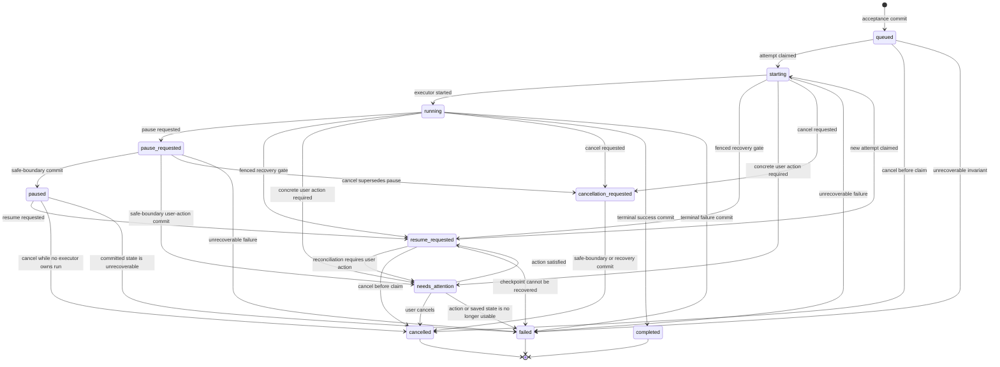

# External Execution Plane v1 — Task Semantics and Recovery Contract

Status: **decision contract for cross-review**

Tracks: **Wayfinder #324**

Depends on: [Reliability Contract](./external-execution-plane-v1-reliability-contract.md), [Runtime Topology](./external-execution-plane-v1-runtime-topology.md)

Implementation status: **not implemented by this document**

## 1. Decision summary

The External Execution Plane (EEP) keeps the existing local-first control-plane direction, but replaces implicit task behavior with one durable, fenced state machine.

This document freezes the following decisions:

1. Sidecar health, source facts, retry authority, and product result remain four independent namespaces. They are never collapsed into one `status`.
2. A run is a durable product intent. An executor attempt is replaceable execution capacity inside a non-terminal run.
3. Every executor mutation requires the active `runtime_attempt_fence_token`. Executor identity or attempt number alone is insufficient authority.
4. A terminal run is immutable. A user rerun or missing-source completion creates a linked new run; it never reopens the old run.
5. A crash may create a new attempt only while the same run is non-terminal and only from a committed safe checkpoint.
6. Checkpoint, compact candidate truth, checkpoint pointer, and the state transition caused at that boundary commit atomically.
7. Ambiguous external effects always enter `reconcile_first`. `safe_retry` is earned by evidence; it is never inferred from an exception type.
8. `needs_attention` is a non-terminal product outcome reserved for one concrete user action. Infrastructure exhaustion is `failed`, not `needs_attention`.
9. `partial` is a source fact. It becomes `degraded_with_results` only when committed candidate truth is usable and the run is intentionally finalized.
10. Required-source `empty` is successful execution with zero results. It maps to `succeeded_empty` when the required search objective is fully covered.

## 2. Scope and non-scope

### 2.1 In scope

- durable run and attempt semantics;
- the complete run-control transition graph;
- terminal immutability and linked reruns;
- pause, resume, cancellation, and `needs_attention` behavior;
- runtime attempt fencing and late-write rejection;
- atomic acceptance, checkpoint, command-application, and finalization boundaries;
- reconcile-before-retry rules;
- failure-to-state and coverage-to-outcome mapping;
- crash, concurrency, and property-test obligations;
- preserve, migrate, and delete decisions against current code.

### 2.2 Explicitly out of scope

- Failure Envelope fields or serialization; issue #322 owns that contract;
- Source Port request/response, receipt, or wire DTOs; the Source Port contract owns them;
- sidecar process supervision and packaging implementation;
- a runtime refactor or database migration in this change;
- raw provider payload, browser artifacts, or telemetry upload policy changes.

This contract may name a fact that another contract must carry, but it does not define that contract's wire shape.

## 3. Current code truth

The target below is grounded in current code and tests, not inferred from older planning prose.

| Area | Current fact | Decision |
|---|---|---|
| Run states | `queued`, `starting`, `running`, `pause_requested`, `paused`, `resume_requested`, `cancellation_requested`, `cancelled`, `completed`, `failed` | Preserve the useful control states; add `needs_attention` and a separate product outcome. |
| Terminal behavior | `cancelled`, `completed`, and `failed` only self-transition | Preserve and strengthen as storage-level terminal immutability. |
| Attempts | Lease acquisition increments `attempt_no`; only one active lease is allowed | Preserve monotonic attempts and single active attempt. |
| Write fencing | Store checks active `(runtime_run_id, executor_id, attempt_no)` | Migrate to an opaque `runtime_attempt_fence_token` required on every executor write. |
| Late writes | Tests reject stale event, checkpoint, stage output, and completion writes | Preserve and expand to every executor-owned mutation. |
| Checkpoints | `write_checkpoint` commits checkpoint, latest pointer, and compact candidate truth together, but `get_latest_recoverable_checkpoint` scans newest-to-oldest and can skip a corrupt/unsupported newest row in favor of an older valid row | Preserve checkpoint/candidate atomicity; delete fallback and validate exactly the run's newest referenced checkpoint. |
| Commands | Cancel supersedes pause/resume and queued/paused cancel immediately, but command row, requested run state, and accepted event are separate transactions and idempotency does not bind a canonical digest | Preserve precedence; add one command-acceptance transaction and same-key/different-digest conflict. |
| Recovery | A valid checkpoint can resume as a new attempt; production currently disables recovery, and newest-checkpoint fallback can mask corruption | Enable only after gates pass; newest referenced corruption/unsupported schema fails closed even when an older checkpoint is valid. |
| Acceptance | Run creation and initial queued event/snapshot are separate transactions | Migrate to one durable acceptance transaction. |
| Finalization | Outcome event/status, finalization data, and lease release are separate writes | Migrate to one terminal commit with fence revocation. |
| Source-operation truth | `runtime_control` has no main-owned source-operation ledger or source-operation outbox; dispatch/observation facts live in lane results and provider/sidecar journals | Add the ledger and outbox before recovery depends on operation truth. |
| Source facts | Lane and round results use `completed`, `partial`, `blocked`, `failed`, and `cancelled`; lane results expose `retryable`; Liepin merge forces `completed` and clears partial/block reasons whenever any candidates exist | Preserve factual candidates/reasons; never let candidate presence erase partiality; delete `blocked`/`retryable` through the exhaustive mapping in section 12. |
| Requirement revision | Run stores one mutable `approved_requirement_revision_id`; amendment rows already carry base/result revisions, target round, and effective boundary, but activation updates the run and events in separate calls | Split immutable accepted base revision from active revision and durable amendment activation lineage. |
| Coverage | Runtime coverage is `complete`, `degraded`, or `empty`; public mapping treats required `empty` as failure | Replace with the mapping in section 12. |
| Reruns | `run_kind` supports `primary`, `rerun`, and `fork`, but lineage is not durable | Preserve `run_kind`; add explicit root and parent lineage. |

## 4. Domain boundaries

### 4.1 Run

A **run** is one durable execution of an approved product intent. It owns:

- one immutable `runtime_run_id`;
- one immutable accepted base requirement revision plus durable amendment lineage and current active revision;
- acceptance-frozen required/optional source scope and required/optional product capabilities/stages;
- run-control state;
- zero or one current product outcome;
- attempt history;
- checkpoint and compact candidate truth;
- source coverage and finalization revision;
- lineage when created from another run.

A run is not a process, thread, sidecar, browser tab, source request, or lease.

### 4.2 Attempt

An **attempt** is one executor's temporary authority to advance a non-terminal run. It owns:

- a monotonically increasing `attempt_no` within the run;
- a lease lifetime;
- one opaque `runtime_attempt_fence_token`;
- heartbeat and release facts;
- no product identity of its own.

Replacing an attempt does not create a new run. Replacing a terminal run always creates a new run.

### 4.3 Safe checkpoint

A **safe checkpoint** is a committed restart boundary whose state is sufficient to resume without guessing whether local durable candidate truth was committed. A checkpoint is safe only when its named boundary has an implementation-specific validator and crash tests.

Arbitrary stage strings are not safe checkpoints. The initial v1 registry is:

| Boundary | Meaning | Resume rule |
|---|---|---|
| `before_source_dispatch` | No source operation for the next dispatch has been issued | A new attempt may continue locally if all authorities remain valid. |
| `runtime_candidate_checkpoint` | Candidate truth and its same-SQLite commit references are durably committed | A new attempt resumes from committed candidates and must not reconstruct them from UI events. |
| `after_round_controller` | The completed round decision and its candidate truth are committed | A new attempt begins the next planned step, not the completed round. |

Existing ad hoc values such as `after_scoring` and `after_source` are not automatically recoverable. They must be migrated to a registered boundary or treated as diagnostic-only checkpoints.

The recoverable checkpoint is exactly the row referenced by the run's newest committed checkpoint pointer/revision. Recovery never scans backward for a more convenient valid row. If that referenced row is missing, corrupt, unsupported, or inconsistent, recovery fails closed even when an older valid checkpoint exists.

### 4.4 Durable source operation

A **source operation** is one main-owned logical request to one source operation kind inside a run. It is not a sidecar command, source lane result, browser control scope, or executor attempt. A retry/reconciliation attempt retains the logical `operation_id`; its runtime attempt and reconciliation revision may advance.

The target main-owned source-operation ledger contains at least:

| Fact | Durable meaning |
|---|---|
| `runtime_run_id`, `operation_id` | Parent run and stable logical operation identity. |
| `source_id`, `operation_kind` | Frozen source and typed operation such as `verify_session`, search, or detail retrieval. |
| `canonical_request_hash`, `idempotency_key` | Same key/same hash replays; same key/different hash conflicts. |
| `accepted_requirement_revision_id` | Exact active requirement revision used when this operation was accepted. |
| `runtime_attempt_no`, `runtime_attempt_authority_ref` | Attempt that received execution authority; reference is safe metadata/hash, never the raw bearer fence token. |
| `operation_phase` | Main-known `accepted`, `dispatch_intent`, `observed`, `reconciled`, or `main_committed` progression. |
| `dispatch_intent_ref` | Main's durable knowledge of dispatch intent; absence never proves the side effect did not occur. |
| `conclusive_observation_ref` | Authenticated immutable result/evidence reference when a conclusive observation exists. |
| `source_operation_disposition` | Current main-owned interpretation of the operation fact. |
| `retry_posture` | Current main-owned execution authority; never inferred by the sidecar. |
| `reconciliation_revision` | Monotonic main revision of reconciliation interpretation. |
| `main_commit_ref` | Checkpoint/candidate/coverage commit that consumed the operation result; absent until main commit succeeds. |

Every ledger transition uses expected-revision compare-and-swap. The current schema has no such ledger or outbox; all references in this contract are target requirements, not claims about implemented tables.

### 4.5 Historical evidence versus mutation authority

**Mutation authority** is current and revocable: an expired/released/revoked attempt cannot write main state, commit results, renew authority, or redispatch.

**Authenticated historical evidence** is immutable: a fact durably journaled while its authority was valid remains readable after that attempt/fence expires when its operation identity, canonical request hash, source, attempt, profile binding generation, browser control generation, and producer authenticity all match. Expiry removes permission; it does not erase history.

Historical evidence never writes main state by itself. Current main recovery authority validates it and performs any ledger/reconciliation update through a no-owner expected-revision transaction. A newly authored post-revocation fact, unverifiable claim, generation mismatch, request-hash mismatch, or mutable replay is rejected; a valid pre-revocation journal fact delivered late is admissible only as read-only reconciliation input.

This does not admit a stale executor event/result into the canonical trusted timeline defined by #322/PR #333. The admissible object is the already durable immutable sidecar journal fact; the new trusted mutation is authored by current main recovery authority and references that history.

## 5. Four independent semantic namespaces

These are the four semantic namespaces. The run-control FSM in section 6 is a storage/control mechanism, not a fifth result namespace.

### 5.1 `SidecarLifecycleState`

Closed enum:

```text
stopped | starting | ready | busy | degraded | draining | crashed | bounded_restart
```

It answers only: **what is the local sidecar process doing?**

It never decides whether a source operation happened, whether retry is permitted, or whether the product run succeeded.

### 5.2 `SourceOperationDisposition`

Closed enum:

```text
completed | partial | user_action_required | incompatible | failed | cancelled | reconciliation_unknown
```

It answers only: **what is currently known about one source operation?**

`partial` means some safe output exists but the requested source scope was not fully completed. `reconciliation_unknown` means dispatch may have crossed an external side-effect boundary and the system cannot yet prove the result.

`ready` and `not_ready` are `verify_session` readiness facts. They are not source operation dispositions, sidecar lifecycle states, retry postures, or product outcomes.

### 5.3 `RetryPosture`

Closed enum:

```text
no_retry | safe_retry | reconcile_first
```

It answers only: **what execution action is currently authorized?**

- `no_retry`: no automatic repeat is authorized.
- `safe_retry`: reconciliation proved non-occurrence or operation-specific idempotent safety; the later claim must still validate every current authority before any repeat begins.
- `reconcile_first`: a repeat is forbidden until reconciliation resolves the external effect.

`RetryPosture` is the sole retry authority. A source result's `retryable` boolean, an HTTP status, an exception class, a Failure Envelope, or a sidecar crash cannot grant retry permission.

### 5.4 `ProductOutcome`

Closed enum:

```text
succeeded_with_results | succeeded_empty | degraded_with_results | needs_attention | failed | cancelled
```

It answers only: **what durable product result may be shown to the user?**

All values except `needs_attention` are terminal. `needs_attention` is deliberately non-terminal and is valid only with one concrete, displayable user action.

## 6. Durable run-control state machine

Closed enum:

```text
queued
starting
running
pause_requested
paused
needs_attention
resume_requested
cancellation_requested
cancelled
completed
failed
```

### 6.1 State graph



### 6.2 Transition table

| From | Allowed target | Required condition |
|---|---|---|
| `queued` | `starting` | Claim transaction creates attempt, lease, and fence. |
| `queued` | `cancelled` | Cancellation commits before any attempt owns the run. |
| `queued` | `failed` | Durable input or storage invariant prevents execution. |
| `starting` | `running` | Active fenced attempt confirms executor start. |
| `starting` | `resume_requested` | Main recovery has irreversibly invalidated the old lease/fence, validated the checkpoint, observed that cancel did not win, and authenticated the recorded historical evidence needed to reconcile or durably park `reconcile_first`. Current profile/browser authority is a later claim gate, not a parking precondition. |
| `starting` | `needs_attention` | A concrete user action is known and checkpointed. |
| `starting` | `cancellation_requested` | Cancellation accepted while attempt is active. |
| `starting` | `failed` | Failure is terminal under section 11. |
| `running` | `pause_requested` | Pause command accepted. |
| `running` | `resume_requested` | Main recovery has irreversibly invalidated the old lease/fence, validated the checkpoint, observed that cancel and pending pause did not win, and authenticated the recorded historical evidence needed to reconcile or durably park `reconcile_first`. Current profile/browser authority is a later claim gate, not a parking precondition. |
| `running` | `needs_attention` | User-action state commits at a safe boundary. |
| `running` | `cancellation_requested` | Cancellation command accepted. |
| `running` | `completed` | Terminal outcome and coverage commit atomically. |
| `running` | `failed` | Terminal failure commits atomically. |
| `pause_requested` | `paused` | Pause applies at a safe boundary and releases the fence. |
| `pause_requested` | `needs_attention` | User-action requirement applies at a safe boundary. |
| `pause_requested` | `cancellation_requested` | Cancel supersedes pause. |
| `pause_requested` | `failed` | No safe continuation exists. |
| `paused` | `resume_requested` | Resume command accepted. |
| `paused` | `cancelled` | No executor owns the run; cancel commits immediately. |
| `paused` | `failed` | Stored checkpoint is proved corrupt or unsupported. |
| `needs_attention` | `resume_requested` | The named action is satisfied and authorities are revalidated. |
| `needs_attention` | `cancelled` | User cancels while no executor owns the run. |
| `needs_attention` | `failed` | The action/checkpoint can no longer produce a valid continuation. |
| `resume_requested` | `starting` | The atomic claim revalidates the checkpoint and every current runtime/profile/browser authority, proves no operation remains `reconcile_first`, and creates the new attempt/lease/fence. |
| `resume_requested` | `needs_attention` | No-owner reconciliation identifies one concrete user action necessary to complete the frozen required objective and atomically commits action/outcome/minimal Failure Envelope truth. |
| `resume_requested` | `cancelled` | No-owner expected-revision cancellation proves no active fence and commits terminal cancellation directly. |
| `resume_requested` | `failed` | Checkpoint validation fails. |
| `cancellation_requested` | `cancelled` | Cancellation is observed at a safe boundary or recovery proves no active executor. |

Idempotent replay may return the already committed state without emitting a new transition. It does not justify general self-transitions.

### 6.3 Authorized triggerers

| Transition family | Authorized triggerer | Forbidden triggerer |
|---|---|---|
| acceptance to `queued` | main-owned acceptance service inside the acceptance transaction | Workbench/UI read model, sidecar, source adapter |
| `queued`/`resume_requested` to `starting` | main-owned worker claim transaction | executor before claim, UI wake thread, sidecar journal |
| `starting` to `running` | active fenced executor | stale attempt, sidecar lifecycle observer |
| request to `pause_requested`, `resume_requested`, `cancellation_requested`, or direct no-owner `cancelled` | main-owned lifecycle command service with command idempotency and state preconditions; cancel in `resume_requested` uses direct no-owner CAS | source adapter, browser extension, Failure Envelope |
| safe-boundary transition to `paused`, `needs_attention`, or `cancelled` | active fenced executor in the atomic boundary commit, or main recovery service after proving no active executor | unfenced worker code, sidecar journal alone |
| `starting`/`running` recovery to `resume_requested` | main-owned recovery service after the old lease/fence is durably `expired`, `released`, or `revoked`; checkpoint validates; cancel has not won; no pending pause must be applied; recorded historical evidence authenticates; ambiguity may durably remain `reconcile_first` | active or stale executor, sidecar restart loop, client retry, diagnostic journal by itself |
| `resume_requested` reconciliation to `needs_attention` | main-owned no-owner recovery transaction with expected-revision CAS, proof of no active fence, and one concrete action necessary for the frozen required objective | sidecar, stale executor, optional-only action, Workbench/UI read model |
| active-owner terminal commit | active fenced finalizer with matching expected run/operation revisions | stale attempt, UI, delayed source response |
| no-owner terminal commit | main-owned control/recovery transaction with expected-revision CAS and proof that no active runtime fence exists; used by queued/paused/`resume_requested`/needs-attention cancellation and recovery failure | sidecar, diagnostic journal, any transaction that merely assumes the lease is gone |

The sidecar reports lifecycle and reconciliation facts. It never directly transitions a run.

`resume_requested` is the no-owner parking state for crash recovery from `starting` or `running`. If any source operation remains `reconcile_first`, the run stays there and is ineligible for claim. Reading authenticated immutable history uses the profile/browser generations recorded with that history; it does not require the current profile/browser authority to be usable. A conclusive reconciliation result or proved `safe_retry` removes the ambiguity blocker. If reconciliation instead identifies one concrete user action necessary for the frozen required objective, main follows the listed `resume_requested -> needs_attention` edge. `pause_requested` is different: after old-authority invalidation, main first applies `cancel > pause > resume`; cancel follows the listed cancellation edge, otherwise the pending pause commits `paused`. Recovery must not bypass it through `resume_requested`.

`resume_requested` never has an active fence. Cancellation therefore goes directly to `cancelled` through the no-owner CAS; there is no legal `resume_requested -> cancellation_requested` window. The atomic claim moves `resume_requested -> starting` while creating the active attempt/lease/fence, after which active-owner cancellation uses `starting -> cancellation_requested`.

Once cancellation is durably accepted, `cancellation_requested` has exactly one outgoing edge: `cancelled`. Reconciliation may preserve `reconciliation_unknown` source evidence, but exhaustion cannot rewrite the user's cancellation as `failed` or any success outcome.

### 6.4 State/outcome invariants

| Run-control state | Allowed `ProductOutcome` |
|---|---|
| `queued`, `starting`, `running`, `pause_requested`, `paused`, `resume_requested`, `cancellation_requested` | none |
| `needs_attention` | `needs_attention` |
| `completed` | `succeeded_with_results`, `succeeded_empty`, `degraded_with_results` |
| `failed` | `failed` |
| `cancelled` | `cancelled` |

No other pair is valid in storage.

Every stored `needs_attention` pair also has exactly one active action, a resumable safe-checkpoint reference, a non-dangling minimal Failure Envelope reference, and no active fence. Every stored `failed` pair has a non-dangling minimal Failure Envelope reference. Historical actions/envelopes may remain append-only after their current pointers are cleared or replaced.

## 7. Terminal immutability and linked reruns

### 7.1 Terminal immutability

Once a terminal commit stores `completed`, `failed`, or `cancelled`:

- run-control state, product outcome, terminal timestamp, terminal coverage, and finalization revision are immutable;
- no executor lease may become active for that run;
- no checkpoint, candidate, source fact, stage output, or completion write may be appended by an executor attempt;
- late cleanup facts may be stored in a separate diagnostic record, but cannot rewrite the product outcome;
- a delayed source response cannot reopen or improve the run.

This is enforced by both application checks and conditional storage writes. Reading state and then issuing an unconditional update is insufficient.

### 7.2 Linked rerun

A rerun creates a new `runtime_run_id` and stores:

- `run_kind = rerun`;
- `root_runtime_run_id`: the first run in the lineage;
- `parent_runtime_run_id`: the immediate run requested again;
- `rerun_reason`: closed v1 enum `user_rerun | missing_source_completion`;
- a new start idempotency namespace tied to the rerun request.

The prior run remains immutable and independently inspectable. Candidate truth may be imported only through an explicit, versioned reuse decision; it is never silently shared by mutable reference.

For a primary run, `root_runtime_run_id` is the run itself and `parent_runtime_run_id` is absent. A rerun inherits its parent's root and names its immediate parent.

`fork` remains a distinct product action. It creates a new run with changed intent or inputs and must not be presented as recovery.

### 7.3 Idempotent start

The same start idempotency key with the same canonical start intent returns the same run. Reusing a key with a different canonical intent is a conflict. It must not return whichever row happened to exist first.

## 8. Non-terminal recovery and new attempts

Main recovery may move `starting` or `running` to `resume_requested` only when all of the following are true:

1. the run is non-terminal;
2. the old lease/fence is durably and irreversibly `expired`, `released`, or `revoked`;
3. the latest checkpoint uses a registered safe boundary and passes schema validation;
4. compact candidate truth referenced by the checkpoint is committed and internally consistent;
5. historical source facts are authenticated against the operation/request/attempt and the profile/browser generations recorded when those facts were journaled; an ambiguity may durably retain `RetryPosture = reconcile_first`;
6. cancellation has not won command precedence;
7. the run-control state is not `pause_requested`; after a crash in that state, main applies `cancel > pause > resume` and commits cancellation or `paused` instead.

This parking transition does not require a currently usable profile/browser binding and does not authorize a new attempt or side effect. While any operation remains `reconcile_first`, the run retains no active runtime fence and the claim query excludes it. Reconciliation may read authenticated immutable history from an old generation. It may commit a conclusive fact, prove `safe_retry`, or atomically move to `needs_attention` when a concrete user action is necessary for the frozen required objective.

A new attempt in the same run is allowed only when the atomic claim proves all of the following: the run is still non-terminal and `resume_requested`; no operation remains `reconcile_first`; the newest checkpoint/candidate truth still validates; cancellation has not won; current runtime/profile/browser authorities are usable for the next operation; and the expected run/checkpoint/operation revisions still match. Invalid current authority blocks claim or becomes the concrete `needs_attention` action; it does not leave the run pretending to have an active executor.

Claiming the run atomically:

- increments `attempt_no`;
- creates the active lease;
- mints the `runtime_attempt_fence_token`;
- records the exact checkpoint being claimed;
- moves `queued` or `resume_requested` to `starting`;
- appends the claim event and same-SQLite snapshot/outbox intent.

Failure of any item leaves no partial claim.

## 9. `runtime_attempt_fence_token`

### 9.1 Authority

`runtime_attempt_fence_token` is the one and only runtime-attempt bearer fence capability. It is opaque, high entropy, minted by main, bound to one `(runtime_run_id, attempt_no)`, and never derived from executor identity, thread identity, or a predictable counter.

Every Source Port request carries that same token through the authenticated transport owned by #325, only to the owning executor/sidecar request. Request acceptance and every resulting commit additionally bind and validate the token against the exact `operation_id`, canonical request hash, active lease, expected revisions, and current run/attempt. There is no second delegated authorization material or parallel database token.

The bearer token is usable only through main-controlled bounded commit APIs. Possessing it gives the sidecar no SQLite connection, arbitrary SQL access, or permission to commit another operation/hash/revision. The authenticated Source Port transport terminates token exposure at the owning executor/sidecar request; provider and browser code do not receive or reuse it, and none of those components can bypass the commit API. #325 freezes token transport confidentiality/authentication, replay protection, and request scoping. Logs, UI events, Failure Envelopes, sidecar journals, and support bundles contain only safe token references/hashes.

`runtime_attempt_fence_token`, `profile_binding_generation`, and controller-only `control_key + browser_control_fence_token` are separate least-privilege authorities. They are never copied into one generic fence field, substituted for one another, or used outside their storage, profile-binding, and browser-command boundaries.

### 9.2 Mutations requiring the token

Every executor-originated business mutation must pass through a main-controlled bounded commit API and requires the active `runtime_attempt_fence_token`, including:

- heartbeat and lease renewal;
- control event append and same-SQLite snapshot/outbox update;
- checkpoint and checkpoint pointer write;
- compact candidate truth and evidence-safe candidate update;
- source disposition or source progress write;
- stage output and finalization revision write;
- pause/cancel safe-boundary application;
- product outcome and terminal completion;
- source-operation ledger observation/reconciliation/main-commit updates.

Each bounded commit verifies active lease, run/attempt, token, exact operation/request hash, and expected revisions in one main transaction. The sidecar may append its own private immutable command journal under its own authority, but it cannot write main events, ledger rows, candidates, checkpoints, outcomes, or outbox rows or obtain a main SQLite connection.

Control-plane user commands do not borrow an executor token. They use their own idempotency and state preconditions.

### 9.3 Revocation

The token becomes invalid when any of these commits:

- lease expiry;
- explicit lease release;
- pause, `needs_attention`, cancellation, failure, or completion;
- successful claim of a newer attempt;
- administrative invalidation after a proven invariant violation.

Revocation is irreversible. Clock rollback cannot revive it.

### 9.4 Store-authoritative lease validity

The current store persists UTC ISO lease expiry and irreversible lease status; it does not persist a cross-process monotonic clock or a durable time high-watermark. This contract does not pretend otherwise.

The implementable v1 authority rule is:

- the lease row must still be durably `active`;
- run, attempt, lease, token, and expected run/checkpoint revision must match in the same transaction;
- main storage code, not the executor or diagnostic producer, obtains the UTC decision time used for lease validation;
- the durable UTC `lease_expires_at` must be later than that store-observed decision time;
- renewal expiry is computed by main storage from its decision time and a bounded lease duration; executor-supplied `occurred_at`, `observed_at`, heartbeat time, or proposed expiry is never authority;
- expiry uses a conditional `active -> expired` update and revokes the fence in the same transaction;
- `expired`, `released`, and `revoked` rows have no transition back to `active`, including after process restart or wall-clock rollback.

A wall-clock rollback while a lease is still durably `active` may delay UTC expiry, but it cannot authorize a competing attempt or revive a non-active fence; this is a bounded liveness/health concern, not permission to infer time from executor events. A future durable high-watermark may reduce that delay, but it is neither claimed as current code nor required to explain v1 safety.

### 9.5 Late-write rejection

A durable executor write succeeds only if one conditional transaction proves:

```text
run is non-terminal
AND attempt is active
AND attempt number matches
AND fence token matches
AND the store-observed UTC decision time is before durable lease_expires_at
AND expected run/checkpoint revision matches when required
```

Otherwise the write changes no run data and returns a stable stale-authority reason. A store-authored diagnostic may record the rejection under the #322 diagnostic contract; the stale executor cannot author that record.

## 10. Atomic commit boundaries

In this section, **same-SQLite snapshot/outbox intent** means authoritative rows committed in the same main database transaction. It does not mean an external Workbench/UI read model or diagnostic export. Those consumers update after the business commit and never become transition, retry, lease, or outcome authority.

### 10.1 Durable acceptance

The start API may report accepted only after one transaction commits:

- the run row and canonical intent digest;
- run and start idempotency keys;
- immutable `accepted_base_requirement_revision_id` and the initially equal `active_requirement_revision_id`;
- the frozen required/optional source and product-capability objective;
- initial `queued` state;
- initial event and same-SQLite snapshot/outbox intent;
- lineage fields when this is a rerun or fork.

A crash before commit is not accepted. A crash after commit is discoverable by the continuous worker without another UI wake-up.

### 10.2 Lifecycle command acceptance

Accepting a pause, resume, or cancellation command is one transaction that commits:

- the command row, command kind, and canonical command digest;
- the command idempotency key and same-key/same-digest replay result;
- expected run revision and the observed precondition state;
- the requested run-control state, with `cancel > pause > resume` precedence;
- the accepted command event and same-SQLite snapshot/outbox intent.

Same key with a different digest is a conflict. A crash cannot leave an accepted command row without its requested state, or a requested state without the command/event that explains it.

When a command immediately causes a no-owner terminal transition, this same transaction also includes every section 10.7 terminal fact; there is no command-accepted/terminal-finalization window.

### 10.3 Source-operation ledger and outbox

The target main-owned ledger advances through five explicit durable boundaries. These are logical storage requirements, not a #325 wire DTO:

1. **Accepted.** One transaction inserts the operation identity, source/kind, canonical request hash and idempotency key, accepted requirement revision, runtime attempt/authority reference, initial retry posture, expected revision, and a durable dispatch outbox intent. Only a committed outbox intent may be delivered. Same key/same hash replays; same key/different hash conflicts.
2. **Dispatch intent.** Before an external effect can begin, the owning sidecar commits its private immutable dispatch intent. Main then records the authenticated intent reference through the fenced commit adapter. Absence in main never proves non-dispatch; recovery reconciles the sidecar journal. Outbox redelivery is at-least-once and remains bound to the same operation ID and request hash.
3. **Observation.** Main commits an authenticated immutable observation reference, its conclusiveness, the `SourceOperationDisposition`, and expected ledger revision. Candidate bytes are not main product truth at this boundary.
4. **Reconciliation.** Current main recovery authority uses expected-revision compare-and-swap to increment `reconciliation_revision` and commit the interpreted disposition and `RetryPosture`. Authenticated historical evidence may be input; it cannot perform this mutation.
5. **Main commit.** One main transaction commits `main_commit_ref`, source coverage, the exact checkpoint/candidate-truth revision that consumed the result, the boundary event, and same-SQLite snapshot/outbox intent. Replaying the same operation cannot consume it twice.

An outbox row is marked delivered only after acknowledgement; delivery failure leaves committed business truth and intent replayable. The current schema has neither this ledger nor this outbox, so implementation must add and migrate them before production recovery is enabled.

### 10.4 Checkpoint and candidate truth

At a safe boundary, one transaction commits:

- checkpoint state and schema version;
- the run's latest checkpoint pointer and revision;
- compact candidate identities and evidence-safe candidate truth;
- source coverage facts known at that boundary;
- every consumed source-operation `main_commit_ref`;
- the boundary event and same-SQLite snapshot/outbox intent;
- any pause, cancellation, or `needs_attention` command applied at that boundary;
- the resulting run-control transition and fence revocation when execution stops.

The system must never expose a checkpoint that points past committed candidate truth or candidate truth that a resumed checkpoint cannot see.

Large private artifacts may commit separately, but their absence cannot invalidate compact candidate truth. The checkpoint references only already committed artifact identities.

### 10.5 `needs_attention` and action resolution

Entering `needs_attention` is one transaction that commits the active action, current `ProductOutcome = needs_attention`, safe checkpoint and candidate truth, a locally durable minimal #322 Failure Envelope row and non-dangling reference, state/event/same-SQLite snapshot, and active fence release or proof that no fence exists. This applies equally to active safe-boundary entry and no-owner `resume_requested -> needs_attention` reconciliation.

The synchronous minimal row is written when the main business transaction invokes the #322-owned schema/validator and main diagnostics transaction participant inside the same main SQLite transaction domain. Runtime-control does not define a second Failure Envelope schema or diagnostic store. Journal event, Operation Evidence, and support projection are asynchronous follow-up outputs; their failure cannot block or roll back the business truth and minimal envelope/ref.

Resolving the action to resume is one no-owner, expected-revision transaction that:

- marks the active action resolved while retaining immutable action history;
- clears the current active action and current `ProductOutcome = needs_attention`;
- revalidates the checkpoint and all runtime/profile/browser authorities;
- commits `resume_requested`, its event, and same-SQLite snapshot/outbox intent.

Cancelling or failing from `needs_attention` uses the same no-owner authority and atomically replaces the current outcome with `cancelled` or `failed`, clears the active action while retaining history, and commits the terminal facts. Every durable `needs_attention` or `failed` state has a non-dangling minimal Failure Envelope reference; #322 owns the envelope schema, not this document.

### 10.6 Requirement amendment activation

`accepted_base_requirement_revision_id` is immutable for the run. `active_requirement_revision_id` may advance only through an append-only durable amendment lineage containing the base revision, result revision, target round/effective boundary, status, and applied event/ref.

At the named boundary, one transaction compares the run's active revision with the amendment base, marks the amendment applied, changes the active revision to the result, and commits the boundary event and same-SQLite snapshot/outbox intent. A next-round amendment remains pending and cannot affect an operation accepted before activation. Every source operation stores the exact active revision under which it was accepted. Recovery reconstructs revision truth from the base plus applied lineage; it never guesses from the newest draft or partially applied event.

### 10.7 Terminal finalization

There are exactly two legal terminal authorities:

- an active fenced finalizer whose attempt/token and expected revisions validate; or
- a main-owned no-owner transaction that compares expected revision and proves no active fence. Queued/paused/`needs_attention` cancellation and recovery failure use this path.

The authorized transaction commits:

- terminal run-control state;
- terminal `ProductOutcome`;
- immutable coverage summary;
- finalization revision and committed candidate identity set;
- terminal reason and timestamp;
- terminal event and same-SQLite snapshot/outbox intent;
- source-operation main-commit references and any active-action replacement;
- a locally durable minimal Failure Envelope row and non-dangling reference for `failed`;
- active lease/fence revocation when an active finalizer exists.

The failure row uses the same #322-owned schema/validator and main diagnostics transaction participant defined in section 10.5; runtime-control does not create or own a parallel envelope store.

If cancellation was accepted, unresolved or exhausted reconciliation evidence remains durably unknown but the terminal state/outcome is `cancelled`; it cannot become `failed`.

Cleanup, browser release, telemetry export, and artifact retention run afterward. Their failure is diagnostic and cannot rewrite the terminal product outcome.

## 11. Failure-to-state and retry mapping

### 11.1 Rules

1. Diagnostic facts do not imply retry permission.
2. A crash before an external dispatch intent may be `safe_retry` from the last checkpoint.
3. A crash or disconnect after dispatch intent but before a conclusive observation is `reconciliation_unknown` plus `reconcile_first`.
4. Reconciliation may promote to `safe_retry` only after proving the operation did not happen, or to `no_retry` after observing a conclusive result.
5. Bounded infrastructure recovery exhaustion is terminal `failed`; it never becomes `needs_attention` merely to keep the run visible.
6. `needs_attention` requires one concrete action whose completion is necessary to finish the frozen required objective and can resume the same run from a safe checkpoint.
7. Optional source/capability failure or user action cannot downgrade or block an already complete required objective; it remains an optional coverage warning or explicit optional continuation.
8. A capability or stage is required only if acceptance froze it as required. Recovery/finalization cannot reclassify it after observing success or failure.

### 11.2 Matrix

| Fact | Source disposition | Retry posture | Run-control effect | Product outcome |
|---|---|---|---|---|
| Local crash before source dispatch; checkpoint valid | unchanged | `safe_retry` | `resume_requested`, then new attempt | none |
| Transport disconnect or deadline before dispatch intent commits | unchanged | `safe_retry` | recover from the last safe checkpoint | none |
| Dispatch may have occurred; result unknown | `reconciliation_unknown` | `reconcile_first` | after old-fence invalidation, park in `resume_requested`; do not claim | none |
| Transport disconnect or deadline after dispatch intent | `reconciliation_unknown` | `reconcile_first` | after old-fence invalidation, park in `resume_requested`; do not redispatch; query durable sidecar facts | none |
| Main or sidecar crashes with an operation in flight | derived from the last durable dispatch/observation fact | `safe_retry` before intent; otherwise `reconcile_first` | guarded `starting`/`running -> resume_requested`; park there while reconciliation blocks | none |
| Reconciliation proves dispatch did not occur | prior fact retained until retry | `safe_retry` | new attempt may continue | none |
| Reconciliation observes completed operation | `completed` or `partial` | `no_retry` | commit observed facts, continue/finalize | derived in section 12 |
| Login, CAPTCHA, permission, or binding action is concretely required for the frozen required objective | `user_action_required` | `no_retry` until action is satisfied | safe checkpoint, release fence, `needs_attention` | `needs_attention` |
| Optional source needs user action after the frozen required objective is complete | `user_action_required` | `no_retry` unless the user explicitly chooses optional continuation | do not block or downgrade finalization | success derived from required coverage, plus warning |
| Source/runtime version cannot execute a required contract | `incompatible` | `no_retry` | continue other sources or finalize required coverage | `degraded_with_results` with usable committed results; otherwise `failed` |
| Source completes with zero candidates | `completed` | `no_retry` | record empty coverage | `succeeded_empty` if required objective is covered |
| Required source commits some candidates but cannot finish scope | `partial` | `no_retry` or `reconcile_first` from external facts | continue or intentionally finalize | `degraded_with_results` only with committed usable results |
| Optional source is partial while the frozen required objective is complete | `partial` | derived from its external facts | do not block or downgrade finalization | success derived from required coverage, plus warning |
| User cancels before claim or while paused/needs-attention | `cancelled` for unfinished operations | `no_retry` | `cancelled` immediately | `cancelled` |
| User cancels during active execution | pending until safe boundary/reconciliation | `no_retry` | `cancellation_requested`, then `cancelled` | `cancelled` |
| Runtime/sidecar restart budget exhausted | existing source fact | `no_retry` | `failed` | `failed` |
| Checkpoint missing, corrupt, unsupported, or internally inconsistent | existing source fact | `no_retry` | `failed` | `failed` |
| Truly optional/non-critical LLM capability fails while the frozen required objective remains complete | no source disposition rewrite | `no_retry` for that model call | preserve completed required capability/source coverage | normal success outcome plus warning |
| Acceptance-frozen required product capability/stage fails | no source disposition rewrite; update its independent required-capability coverage | `no_retry` for that model call | finalize from required capability plus source coverage | `degraded_with_results` only with usable committed candidates; otherwise `failed` |
| Cleanup fails after terminal business commit | unchanged | `no_retry` | no run-state rewrite | unchanged terminal outcome |

### 11.3 Reconcile-first procedure

Without defining the Source Port wire shape, main applies this fixed procedure:

1. Load the durable source operation identity and its last dispatch/observation state from main truth.
2. Query the sidecar journal for facts bound to that operation identity and the source/profile/browser generations recorded when those facts were journaled. Current-generation usability is not required for this historical read.
3. Admit an immutable fact that was durably journaled while its mutation authority was valid when operation identity, request hash, attempt, source, profile/browser generations, and producer authenticity match. Its attempt may now be stale; that changes write authority, not historical truth.
4. Reject facts authored after revocation, facts whose authority-at-journal-time cannot be proved, mutable claims, and any operation/request/generation mismatch. The old attempt cannot commit, redispatch, or choose retry; current main recovery authority alone may apply the evidence through an expected-revision ledger transaction.
5. If the journal proves a conclusive operation result, commit the corresponding source disposition and set `no_retry`.
6. If the journal proves no dispatch occurred, set `safe_retry` for that operation. Do not claim or begin a new side effect until the later atomic claim revalidates every current runtime/profile/browser authority and expected revision.
7. If facts are missing, contradictory, outside the retained journal range, or cannot prove non-occurrence, retain `RetryPosture = reconcile_first`; crash recovery parks the run in `resume_requested` with no active fence and the claim query excludes it.
8. If reconciliation identifies one concrete user action necessary to complete the frozen required objective, use the no-owner expected-revision transaction to commit `resume_requested -> needs_attention` with action/outcome/minimal Failure Envelope truth.
9. When bounded reconciliation is exhausted, first apply cancellation precedence. If cancellation was accepted, preserve unknown source evidence and use the no-owner terminal transaction to commit `cancelled`. Otherwise finalize from the frozen required objective and committed candidate truth: incomplete required coverage plus usable results is `degraded_with_results`; incomplete required coverage without usable results is `failed`; optional-only uncertainty remains a warning on the normal success outcome.

An empty journal lookup alone is not proof that an external side effect did not occur. The Source Port must provide enough durable evidence to distinguish “not dispatched” from “journal fact unavailable”; section 16 constrains that contract without defining its DTO.

### 11.4 `needs_attention`

A valid `needs_attention` commit contains, without defining a wire schema here:

- one stable action reason;
- one user-safe instruction;
- the affected source or authority;
- the checkpoint from which completion can resume;
- a non-dangling minimal #322 Failure Envelope reference;
- no active runtime attempt fence.

The state is invalid for generic timeouts, retries exhausted, unknown errors, daemon crashes, packaging failures, unsupported code paths, or an optional source/capability action after the frozen required objective is complete. If no user action is necessary to deterministically advance the required objective in the same run, the state is not `needs_attention`.

Entry and resolution obey section 10.5. When the action is satisfied, the action-resolution transaction retains historical action/envelope evidence, clears the current action and `needs_attention` outcome, revalidates all authorities, and moves to `resume_requested`. The worker creates a new attempt; the old attempt never returns. An optional diagnostic export failure cannot prevent these business commits.

## 12. Coverage-to-outcome mapping

### 12.1 Inputs

Final outcome is derived from immutable finalization inputs:

- required source set and optional source set frozen at acceptance;
- required product capability/stage set and optional capability/stage set frozen at acceptance;
- each source's final `SourceOperationDisposition`;
- independent required product capability/stage coverage; capability failure never rewrites a source disposition;
- committed compact candidate count and usability gate;
- unresolved user action or reconciliation state;
- cancellation precedence.

The **frozen required objective** is the union of acceptance-frozen required sources and required product capabilities/stages. Required/optional classification is immutable for the run: finalization cannot promote a failed optional LLM step into a required path to manufacture degradation, and cannot demote a failed required stage to preserve success.

UI event counts, raw browser rows, temporary files, and uncommitted in-memory candidates are not outcome inputs.

### 12.2 Precedence

Apply in this order:

1. accepted cancellation → `cancelled`;
2. concrete resumable user action necessary to complete the frozen required objective → `needs_attention`;
3. active reconciliation or authorized same-run retry → no terminal outcome;
4. all required work conclusively covered → success mapping;
5. incomplete required work with usable committed candidates → degradation mapping;
6. otherwise → `failed`.

### 12.3 Matrix

| Required-source coverage | Required product capability/stage coverage | Committed usable candidates | Outcome |
|---|---|---:|---|
| Every required source `completed`; at least one result | complete | > 0 | `succeeded_with_results` |
| Every required source `completed`; all required results empty | complete | 0 | `succeeded_empty` |
| At least one required source `partial`, `failed`, `incompatible`, or unresolved after bounded reconciliation | complete or incomplete | > 0 | `degraded_with_results` |
| Required sources complete | at least one acceptance-frozen required capability/stage incomplete or failed | > 0 | `degraded_with_results` |
| Any part of the frozen required objective incomplete | any incomplete required coverage | 0 | `failed` |
| A required source or required capability/stage is `user_action_required` and its action is resumable | action blocks required objective | any | `needs_attention` |
| Frozen required objective complete; only optional source/capability needs action or failed | complete | > 0 | `succeeded_with_results` plus optional coverage warning/continuation |
| Frozen required objective complete; only optional source/capability needs action or failed | complete | 0 | `succeeded_empty` plus optional coverage warning/continuation |
| Cancellation wins | any | any | `cancelled` |

Optional-source or optional-capability failure alone does not downgrade a fully satisfied required objective. Optional `user_action_required` is a coverage warning or user-chosen continuation, not `needs_attention`. If acceptance froze that source/capability as required, it follows the required-objective rows above.

`partial` never means success by itself. Only candidates committed at a safe boundary count toward `degraded_with_results`. A partial source with zero usable committed candidates contributes to `failed` when required coverage is incomplete.

### 12.4 Candidate preservation and UI expression

| Outcome/state | Candidate preservation | Required UI expression |
|---|---|---|
| `succeeded_with_results` | Freeze the terminal committed candidate set. | Show final results and complete required coverage. |
| `succeeded_empty` | Freeze an empty terminal candidate set and complete coverage. | Show “search completed, no matching candidates”; never show an infrastructure error. |
| `degraded_with_results` | Freeze only candidates committed at safe checkpoints. | Show usable results plus incomplete required-source coverage; never imply full coverage. |
| `needs_attention` | Preserve committed candidates and the resumable checkpoint; remain mutable through a future attempt. | Show current partial progress and exactly one action required to complete the frozen required objective; never render as terminal or still running. |
| `failed` | Retain evidence-safe committed candidates for audit/support and possible explicit linked-rerun import. | Show failure and incomplete coverage. Do not present retained candidates as a successful finalized list. |
| `cancelled` | Retain evidence-safe committed candidates and coverage as cancellation-time facts. | Show cancelled and, if useful, a labelled retained-progress count; never relabel it degraded success. |

Private artifacts continue to follow the existing retention and privacy policy. Preservation here refers to compact, evidence-safe durable truth, not raw DOM, full resumes, or browser payloads.

### 12.5 Migration from current public status

| Current behavior | Target behavior |
|---|---|
| Required `empty` maps to public `failed` | Required sources conclusively executed with zero results map to `succeeded_empty`. |
| Any optional non-success maps completion to `degraded` | Optional failure is a warning when required objective is fully satisfied. |
| Source `retryable: bool` is treated as authority | Retry action comes only from durable `RetryPosture`; UI may display a derived hint but cannot command execution from it. |
| Runtime `complete/degraded/empty` and public `succeeded/degraded/failed` coexist | `ProductOutcome` becomes the canonical durable result; older fields are temporary compatibility read-model fields during migration. |

### 12.6 Exhaustive legacy lane migration

The current lane model still contains `blocked` and `retryable`, and Liepin merge currently forces `completed` and clears partial/block reasons whenever any candidates exist. Migration must preserve the factual candidate set independently from coverage and apply this exhaustive mapping before removing the legacy fields:

| Legacy fact/reason family | Target disposition | Required preservation |
|---|---|---|
| Conclusively completed requested scope, including zero candidates | `completed` | Preserve candidate count, scope, evidence, and completion reason. |
| Candidates exist but requested scope is conclusively incomplete | `partial` | Preserve candidates plus the partial/stop/block reason; candidate presence never changes this to `completed`. |
| Login, CAPTCHA, account approval, permission, profile binding, or equivalent concrete action | `user_action_required` | Preserve the exact safe user action and whether acceptance made it required or optional. |
| Unsupported source/runtime version, capability, operation, filter, or site contract | `incompatible` | Preserve the unsupported capability/version fact; do not relabel it retryable. |
| Conclusively observed provider/local execution failure with no ambiguous external effect | `failed` | Preserve the typed failure evidence and minimal Failure Envelope reference. |
| Dispatch/effect may have happened but no conclusive observation exists | `reconciliation_unknown` | Preserve dispatch/observation evidence and set `RetryPosture = reconcile_first`. |
| Legacy cancellation | `cancelled` | Preserve cancellation-time candidates/evidence without success relabelling. |
| Missing, unknown, or unregistered legacy blocked reason | `reconciliation_unknown` | Fail closed into classification/reconciliation; never silently map to `completed`, `failed`, or `safe_retry`. |

`RetryPosture` is derived separately from the durable external-effect facts. No legacy `retryable: bool`, candidate count, or generic blocked reason grants execution authority.

## 13. Pause, resume, and cancellation

### 13.1 Command precedence

Precedence is:

```text
cancel > pause > resume
```

A later cancel supersedes pending pause/resume. Idempotency keys are bound to the canonical command payload; a reused key with different content is a conflict.

### 13.2 Pause

- accepting pause changes `running` to `pause_requested`;
- the executor continues only to the next registered safe boundary;
- checkpoint, candidate truth, command application, `paused` transition, event, and fence release commit atomically;
- pause never creates a new run;
- no executor remains active while paused.

### 13.3 Resume

- accepting resume changes `paused` or action-satisfied `needs_attention` to `resume_requested`;
- resume validates the latest safe checkpoint before claim;
- claim creates a new attempt and fence in the same run;
- missing or invalid checkpoint fails the run rather than restarting from guessed state.

### 13.4 Cancellation

- queued, paused, `resume_requested`, and `needs_attention` runs cancel through the no-owner expected-revision terminal transaction after proving no active fence;
- `resume_requested` cancellation commits directly to `cancelled`; it never waits in `cancellation_requested` because claim has not created an owner;
- active runs enter `cancellation_requested` and stop at a safe boundary;
- an active fenced finalizer may commit cancellation at a safe boundary; if the executor is lost, main recovery may use the no-owner path only after irreversibly invalidating the old fence;
- if an external operation is ambiguous, cancellation reconciles it for historical source truth, but bounded exhaustion preserves unknown evidence and still finalizes `cancelled`;
- committed candidate truth is retained for audit/support, but the product outcome is `cancelled`, not `degraded_with_results`;
- `cancellation_requested -> failed` is forbidden; accepted cancellation has exactly one terminal result;
- cancellation never grants a retry.

## 14. Crash and property-test obligations

Implementation is not complete until deterministic fault injection proves each invariant below on SQLite and the production worker path.

### 14.1 Acceptance crash points

- crash before acceptance transaction commit: no accepted run exists;
- crash after commit but before response: idempotent replay returns the same run;
- crash after commit with no UI wake-up: the continuous worker discovers the run;
- same idempotency key with different canonical intent is rejected.
- every lifecycle command crash point leaves either none of command row/requested state/event/idempotency digest or all of them;
- same command key with a different canonical digest is rejected;
- requirement activation crash points leave either the old active revision and pending amendment, or the new active revision plus applied lineage/event; a next-round amendment never activates early.

### 14.2 Claim and fence crash points

- two concurrent claimers produce exactly one active attempt;
- crash after attempt insert but before state/event commit leaves no partial claim;
- expired attempt cannot heartbeat, checkpoint, write candidates, append output, apply a command, or finalize;
- a newer attempt with the same `executor_id` still rejects the older token;
- executor-supplied `occurred_at`, `observed_at`, heartbeat time, or proposed expiry cannot extend lease authority;
- after lease/fence expiry, release, or revocation commits, restart with wall clock moved backward cannot restore `active` or accept the old token;
- restart plus wall-clock rollback while a lease row is still `active` may delay its durable UTC expiry, but cannot create a second attempt, change its token/revision, or bypass reconciliation;
- the single Source Port `runtime_attempt_fence_token` cannot be replayed for another run, attempt, operation, canonical request hash, or expected revision, and #325 transport tests cover confidentiality/authentication and replay rejection;
- browser/profile authority cannot substitute for `runtime_attempt_fence_token`, the runtime token cannot substitute for browser/profile authority, and the sidecar cannot write main SQLite directly or bypass the bounded commit API;
- no-owner terminal compare-and-swap fails if the expected run revision changed or any active fence exists;
- terminal state prevents all future claims.

### 14.3 Checkpoint crash points

- crash before checkpoint transaction: neither checkpoint pointer nor candidate truth advances;
- crash after transaction: both are visible together;
- pause/cancel crash injection at every statement cannot produce `paused`/`cancelled` with an active fence;
- resumed execution never duplicates a completed round or loses committed candidates;
- corrupt, missing, unsupported, or mismatched newest referenced checkpoint fails closed;
- when the newest referenced checkpoint is corrupt/unsupported and an older valid checkpoint exists, recovery still fails closed and never scans backward.

### 14.4 External-effect recovery

- source-operation acceptance and its outbox intent are all-or-nothing;
- crash/replay before or after each `accepted`, `dispatch_intent`, `observed`, `reconciled`, and `main_committed` boundary cannot duplicate dispatch or consume one operation result twice;
- outbox redelivery retains the same operation identity and request hash; acknowledgement/delivery marking never deletes the only dispatch intent;
- `main_commit_ref`, source coverage, checkpoint pointer, and candidate truth are all visible together or not at all;
- an expired/released/revoked old fence plus a valid checkpoint is required before main recovery can move `starting` or `running` to `resume_requested`;
- invalid checkpoint, winning cancel, pending pause, unauthenticated historical evidence, or still-active old fence forbids the parking edge; unusable current profile/browser authority alone does not;
- unresolved `reconcile_first` parks the run in `resume_requested` with no active fence and prevents worker claim until reconciliation becomes conclusive or proves `safe_retry`;
- `resume_requested` cancel uses no-owner CAS directly to `cancelled` and cannot become stuck in `cancellation_requested`;
- `resume_requested` reconciliation that finds a required concrete user action atomically commits action/outcome/minimal envelope and moves to `needs_attention` without an executor fence;
- crash in `pause_requested` applies `cancel > pause > resume`: cancel follows cancellation edges, otherwise the run becomes `paused`, never `resume_requested`;
- crash before dispatch intent permits safe retry;
- crash after dispatch intent and before observation cannot dispatch again;
- reconciliation observing completion does not repeat the operation;
- reconciliation proving non-occurrence is the only ambiguous path promoted to `safe_retry`;
- immutable evidence journaled while authority was valid remains admissible for read-only reconciliation after that attempt expires;
- stale mutation, evidence authored after revocation, and operation/request/profile/browser generation mismatches are rejected;
- cancellation accepted before reconciliation exhaustion preserves unknown evidence and ends `cancelled`, never `failed`;
- restart budget exhaustion is terminal `failed`, never `needs_attention`;
- unusable current runtime/profile/browser authority prevents claim and every new side effect even when the operation is `safe_retry`; it does not prevent authenticated historical reconciliation or no-owner parking.

### 14.5 Action and finalization crash points

- entering `needs_attention` atomically commits action/outcome/checkpoint/minimal Failure Envelope ref/event and fence release or proof that no active fence exists;
- action resolution atomically retains action history, clears the current action and `needs_attention` outcome, and commits `resume_requested`;
- cancelling/failing from `needs_attention` atomically replaces the outcome and clears the active action;
- optional diagnostic export failure cannot roll back or block the minimal envelope/ref and business-state transaction;
- outcome, coverage, finalization revision, terminal event, and fence revocation are all-or-nothing;
- active-fenced and no-owner terminal paths produce the same terminal invariants, and no other authority can finalize;
- repeated terminal command returns the existing terminal fact without another revision;
- delayed source results and old attempts cannot change a terminal outcome;
- cleanup failure after commit cannot rewrite the outcome;
- terminal rerun creates a linked new run and preserves the old run byte-for-byte in terminal fields.

### 14.6 State-machine properties

Generate command, crash, lease-expiry, reconciliation, and source-result sequences and assert:

- every stored state/outcome pair is valid under section 6.4;
- every actual state change is one edge listed in sections 6.1 and 6.2; recovery cannot create an implicit edge or self-transition;
- `resume_requested` has no active fence, cancel reaches `cancelled` directly, and no sequence contains `resume_requested -> cancellation_requested`;
- terminal states have no outgoing transition;
- at most one active fence exists per run;
- attempt numbers are strictly increasing and never reused;
- candidate truth visible from a checkpoint is monotonic by committed revision;
- every source operation has monotonic ledger/reconciliation revisions and at most one `main_commit_ref`;
- `safe_retry` is unreachable directly from `reconciliation_unknown` without a reconciliation proof;
- `needs_attention` always has one action necessary for the frozen required objective and no active fence; optional-only action can never reach it;
- authenticated reconciliation may reach `resume_requested -> needs_attention` only through the no-owner atomic action transaction;
- `degraded_with_results` always has at least one usable committed candidate and at least one incomplete acceptance-frozen required source/capability/stage;
- `succeeded_with_results` and `succeeded_empty` always have complete frozen required objective coverage, regardless of optional warnings;
- `succeeded_empty` has zero committed usable candidates;
- failed optional LLM/source coverage cannot be reclassified as required after acceptance, and failed required coverage cannot be reclassified as optional;
- candidate presence cannot erase `partial`, stop reason, or block reason;
- every legacy blocked reason maps to exactly one section 12.6 family, with unknown reasons failing closed to `reconciliation_unknown`;
- cancellation precedence is invariant under command reordering and idempotent replay, and `cancellation_requested` cannot reach `failed`.

### 14.7 Crash timeline

| Timeline point | Durable truth before the next point | Crash interpretation |
|---|---|---|
| T0: start request received | no accepted fact | Client may replay the same start key. |
| T1: acceptance transaction committed | `queued`, intent digest, initial event and same-SQLite snapshot/outbox intent | Run exists and is discoverable; replay returns it. |
| T2: claim transaction committed | `starting`, active attempt/fence, claimed checkpoint | Only that fence may advance the run. Recovery cannot use `resume_requested` until the fence is durably non-active. |
| T3: source dispatch intent committed | operation may cross external boundary | After old-fence invalidation, recovery parks the run in `resume_requested` plus `reconcile_first`; worker claim and redispatch are forbidden. |
| T4: conclusive source observation committed | source disposition is known | Reconciliation removes the claim blocker; recovery continues from the observed fact and does not repeat the operation. |
| T5: safe checkpoint transaction committed | checkpoint, candidate truth, coverage, boundary event agree | A new attempt may resume from this exact boundary when authorities permit. |
| T6: terminal transaction committed | outcome, coverage, finalization, event, fence revocation agree | Run is immutable; any further work requires a linked new run. |

A crash between two points is interpreted only from the earlier committed point. In-memory progress, DOM state, thread completion, sidecar process exit, and a response that did not commit cannot advance the timeline.

## 15. Preserve, migrate, delete

### 15.1 Preserve

| Existing asset | Why it remains |
|---|---|
| `seektalent_runtime_control.fsm` terminal immutability | Correct base invariant. |
| Atomic `claim_next_runnable_run` pattern | Correct ownership boundary for one worker claim. |
| Monotonic per-run `attempt_no` | Useful audit and ordering fact. |
| Active-lease checks on event/checkpoint/output/completion | Correct direction; token strengthens authority. |
| Atomic checkpoint plus compact candidate-truth commit | Core recovery invariant already present. |
| Cancel superseding pause/resume | Correct lifecycle command precedence. |
| Queued/paused immediate cancellation | Correct no-owner behavior. |
| Typed corrupt/missing/unsupported checkpoint failures | Preserve the failure semantics, while deleting the older-checkpoint fallback. |
| Current stale-attempt and clock-rollback tests | Seed cases for the expanded fault suite. |
| Existing source lane facts and finalization coverage | Inputs to the new canonical mapping. |

### 15.2 Migrate

| Current location/behavior | Migration |
|---|---|
| `RuntimeRunRecord` and `runtime_control_runs` | Add product outcome, immutable terminal revision, canonical intent digest, and rerun lineage. |
| `RuntimeExecutorLease` and lease table | Add opaque attempt fence token storage and conditional validation on every executor mutation. |
| `(executor_id, attempt_no)` authorization | Retain as metadata; require token as actual capability. |
| Executor-provided heartbeat/expiry timestamps | Main storage computes lease validity and renewal from store-observed UTC plus durable UTC expiry; diagnostic producer times are never authority. |
| FSM/recovery mismatch | Add the guarded `starting`/`running` to `resume_requested` recovery edges, park `reconcile_first` there, and prohibit bypassing `pause_requested`. |
| No source-operation ledger/outbox | Add the main-owned ledger, five durable boundaries, request idempotency, expected revisions, and dispatch outbox before recovery enablement. |
| `create_run` plus separate queued event | Commit acceptance, event, same-SQLite snapshot/outbox intent, requirement base/active revisions, lineage, and intent digest atomically. |
| Lifecycle command application across multiple store calls | Commit command row/digest/requested state/event/same-SQLite snapshot-outbox atomically; commit safe-boundary command/checkpoint/candidates/state/fence release atomically. |
| Executor finalization plus later lease release | Commit outcome/coverage/finalization/event/fence revocation atomically. |
| Terminal paths assume an active executor | Add active-fenced and main-owned no-owner expected-revision terminal authorities with identical terminal invariants. |
| `needs_attention` current action/outcome lifecycle | Add atomic entry, minimal Failure Envelope ref, fence release, and action-resolution/replacement transactions with historical retention. |
| Production `resume_recoverable=False` path | Enable same-run recovery only after crash, fence, checkpoint, and continuous-worker gates pass. |
| Newest-to-oldest checkpoint fallback | Validate only the newest referenced checkpoint; an invalid newest row fails closed even when an older row is valid. |
| Ad hoc checkpoint names | Register and validate the three v1 safe boundaries; treat unknown names as non-recoverable. |
| Single mutable approved-requirement pointer and split activation calls | Add immutable accepted base revision, active revision, append-only amendment lineage, and atomic boundary activation. |
| Liepin candidate merge and legacy `blocked`/`retryable` lane facts | Preserve candidates and reasons independently; migrate exhaustively through section 12.6 and derive retry authority only from `RetryPosture`. |
| Runtime/public coverage mappings | Freeze required sources and required product capabilities/stages at acceptance, make `ProductOutcome` canonical, and apply section 12 without rewriting source disposition for model failures. |
| Workbench/UI read model | Render pause, cancellation, `needs_attention`, and terminal outcomes without collapsing them into running/failed; keep it non-authoritative and post-commit. |
| Idempotency lookup | Compare canonical intent/command digest and reject key reuse with changed content. |

### 15.3 Delete after migration

| Legacy behavior | Reason for deletion |
|---|---|
| `retryable` as a source-result execution authority | Conflicts with reconcile-first and allows retry from incomplete evidence. |
| `blocked` as a durable source disposition | Collapses user action, incompatibility, conclusive failure, and external uncertainty. |
| Candidate-presence merge that forces `completed` and clears partial/block reasons | Destroys factual coverage and makes partial success indistinguishable from complete scope. |
| Required empty-result search mapped to failure | Confuses successful execution with business result cardinality. |
| Optional-source failure automatically degrading a satisfied required objective | Confuses optional coverage warning with product failure. |
| Unfenced executor status updates | Permit stale attempts to mutate run truth. |
| Separate checkpoint-written event after checkpoint truth commit | Creates an avoidable observable split; boundary event belongs in the transaction. |
| Separate terminal lease release after completion/failure | Leaves a terminal run temporarily holding active execution authority. |
| Returning an existing idempotency row without validating canonical intent | Hides conflicting commands or starts. |
| Scanning backward past an invalid newest referenced checkpoint | Resumes from stale truth and masks corruption. |
| `cancellation_requested -> failed` | Rewrites an accepted user cancellation as a business failure. |
| `needs_attention` or `failed` without a durable minimal Failure Envelope reference | Leaves business failure truth dangling on an optional diagnostic export. |
| Treating arbitrary `safe_boundary` strings as recoverable | Makes recovery correctness depend on naming rather than proof. |
| Any in-place reopen of terminal runs | Violates auditability and late-write safety. |

## 16. Hard constraints on Source Port issue #325

Issue #325 may choose transport and DTO details, but its contract must make these #324 invariants possible:

- main can assign a stable operation identity and distinguish dispatch intent, conclusive observation, and reconciliation uncertainty;
- every Source Port request carries the same main-minted `runtime_attempt_fence_token`, and authenticated transport/replay protection preserves its run/attempt plus operation/request-hash scope without introducing another authorization material;
- dispatch intent is durable before an external side effect can begin;
- sidecar reconciliation facts remain queryable after process restart within a declared retention boundary;
- absence inside a proved-complete journal range is distinguishable from unavailable or truncated journal history;
- every operation is bound to the current runtime attempt plus profile and browser authority generations, without making the sidecar owner of run state;
- stale runtime/profile/browser authority is rejected before a new external side effect;
- `partial`, `user_action_required`, `incompatible`, `failed`, `cancelled`, and unknown reconciliation remain distinguishable facts;
- Source Port never grants `safe_retry`, chooses `ProductOutcome`, reopens a run, or commits main candidate truth;
- source-returned candidates affect product outcome only after main commits them with a safe checkpoint;
- wire payloads do not make raw runtime databases, DOM, prompts, resumes, browser payloads, or fence tokens part of support/telemetry surfaces.

This section is a semantic compatibility gate, not a receipt or wire schema.

## 17. Implementation gates and ownership boundaries

Implementation must not land schema, FSM, ledger, fencing, atomic transitions, and outcome migration in one PR. Use independently reviewable slices with their own migration and crash-test gate:

1. **Source-operation ledger foundation:** add only operation identity/request idempotency, the five ledger phases, dispatch outbox, expected revisions, and ledger/outbox crash tests. Do not change outcome/FSM behavior in this slice.
2. **Historical-evidence reconciliation:** read authenticated sidecar history, distinguish stale mutation from admissible facts, add reconciliation revisions/postures, and prove no duplicate dispatch.
3. **Fence transport and bounded commit API:** add the single `runtime_attempt_fence_token` to authenticated Source Port transport, bind request/commit validation to run/attempt/operation/hash/revisions, enforce conditional main writes and late-write rejection, and test replay/scope plus browser/profile authority separation.
4. **Atomic transition boundaries:** separately migrate start acceptance, lifecycle command acceptance, source main commit/checkpoint, action entry/resolution, and the two terminal-authority transactions, with fault injection at every statement.
5. **Checkpoint and requirement lineage hardening:** delete newest-checkpoint fallback, register safe boundaries, add immutable accepted base plus amendment lineage, and prove atomic activation.
6. **Source-lane migration:** preserve Liepin partial/reasons, exhaustively map `blocked`, remove retry authority from lane booleans, and validate all mapping families including unknown reasons.
7. **Outcome/FSM hard cut:** add canonical `ProductOutcome`, `needs_attention` lifecycle, linked rerun, cancellation-only terminal edge, and migrate the Workbench/UI read model.
8. **Recovery enablement and legacy deletion:** enable continuous recovery only after every prior crash/property gate passes; then remove old retry/status compatibility fields and dead paths.

Issue #322 and PR #333 remain the owners of diagnostic event ordering, Failure Envelope schema/validator, the main diagnostics transaction participant, receipts, Operation Evidence, and support/fault evidence. Main business transactions synchronously use that participant in the same main SQLite transaction domain for the required minimal Failure Envelope row/ref; runtime-control does not create a second schema or store. Journal event, Operation Evidence, and support projection remain asynchronous and cannot block business truth. Diagnostic `occurred_at`/`observed_at`, journal events, and boundary facts may inform reconciliation, but cannot validate a lease, grant `safe_retry`, transition a run, classify required coverage, or choose `ProductOutcome`. Source Port work remains the owner of source wire DTOs, authenticated token transport/replay protection, and external-operation evidence transport. Runtime topology remains the owner of sidecar lifecycle and worker supervision. This document owns only the durable task semantics that those components must obey.

## 18. Document and cross-review acceptance for #324

- [x] Four namespaces are closed and non-overlapping.
- [x] Complete run-control graph, including guarded `starting`/`running -> resume_requested`, `reconcile_first` parking, and `cancel > pause > resume`, is consistent across graph, table, trigger ownership, and tests.
- [x] Terminal immutability and linked rerun behavior are explicit.
- [x] Same-run recovery is limited to new attempts on non-terminal runs.
- [x] Main-owned source-operation ledger/outbox phases and checkpoint/candidate/main-commit atomicity are frozen without claiming current implementation.
- [x] The single Source Port `runtime_attempt_fence_token`, bounded commit API scope, store-authoritative durable UTC lease validity, irreversible non-active states, and restart/wall-clock-rollback tests are frozen without a second delegated authorization or a claimed current durable high-watermark.
- [x] Stale mutation authority is separated from authenticated immutable historical evidence.
- [x] Active-fenced and no-owner terminal authorities, cancellation precedence, `needs_attention` action resolution, minimal Failure Envelope refs, and `partial` semantics are explicit.
- [x] Command acceptance and requirement amendment activation are atomic, with immutable base revision and durable lineage.
- [x] Reconcile-before-safe-retry is mandatory.
- [x] Failure-to-state and coverage-to-outcome matrices use the immutable acceptance-frozen required objective; optional action/failure remains warning or continuation.
- [x] Crash and property-test obligations cover every durable boundary.
- [x] Preserve, migrate, and delete mappings are grounded in current code.
- [x] Failure Envelope, receipt schema, Source Port wire DTO, and runtime implementation remain out of scope.
- [x] PR #333 diagnostic ownership is preserved: diagnostic time/evidence never becomes task-transition, retry, lease, or outcome authority.

Implementation remains deliberately incomplete until these gates are delivered:

- [ ] Source-operation ledger/outbox schema, migrations, and crash tests.
- [ ] Single-token transport/scope validation, bounded main commit API, CAS enforcement, and late-write tests.
- [ ] Atomic acceptance/command/checkpoint/action/terminal transactions.
- [ ] Exact-newest checkpoint validation and atomic requirement amendment lineage.
- [ ] Exhaustive source-lane migration and `ProductOutcome`/FSM hard cut.
- [ ] Continuous-worker recovery, fault injection, and property-test gates enabled in production paths.
