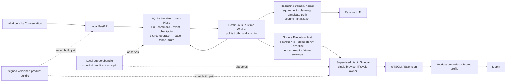
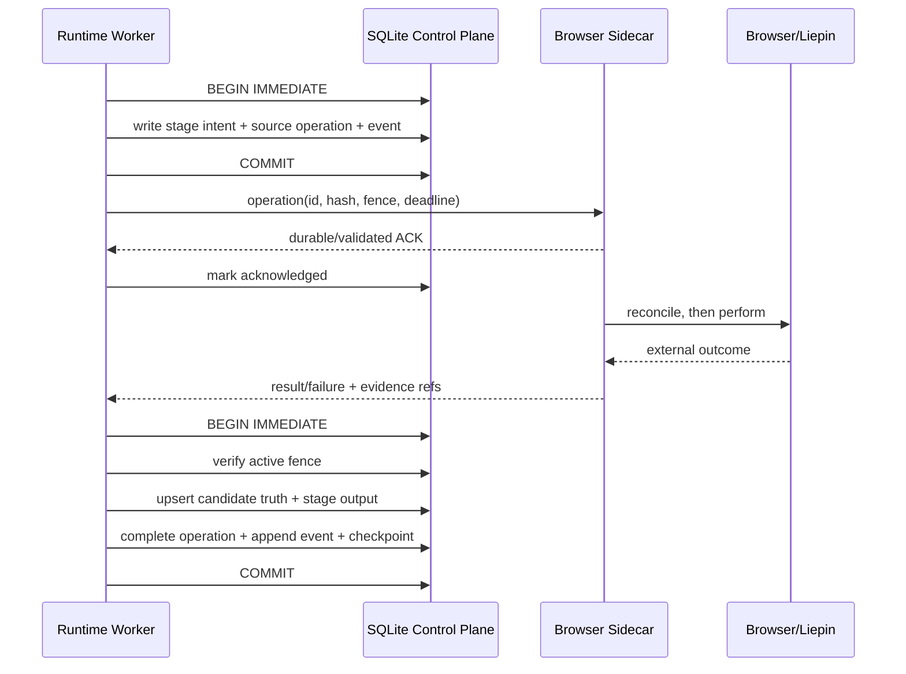

# SeekTalent 本地 Durable Execution 与外部执行平面技术调研

日期：2026-07-17

代码事实基线：Git commit `3a0fe06e`；部分事实同时按调研开始时已存在的未提交工作树改动复核

外部信源访问日期：2026-07-17

研究原则：文档只作为参考；仓库 code、测试、构建脚本和 CI 才是当前实现事实。外部资料只采用官方文档、官方源码仓库、标准或平台规范。

## 0. 执行结论

### 0.1 最终判断

SeekTalent 的根因不能简化为“单体应用不适合分布式系统”。更准确的表述是：

> SeekTalent 已经跨越 Python 进程、SQLite、Node daemon、Chrome 扩展、Chrome profile/tab、猎聘站点和远程 LLM 等独立失败域，但关键链路仍依赖易失唤醒、同步 RPC、隐式机器状态和“整条链一次成功”的完成语义。

因此，正确目的地不是微服务化，也不是把 Temporal 塞进每台用户电脑，而是：

1. 保留一个模块化本地应用，继续承载 UI、领域逻辑和唯一 durable control plane。
2. 把现有 SQLite `runtime_control` 加固为任务事实源：持久命令、outbox、租约、fencing、幂等、checkpoint、启动恢复、stage saga 和 partial success。
3. 只隔离一个真正需要独立生命周期的组件：**Liepin Execution Sidecar**。它唯一拥有 WTSCLI/extension/Chrome session、profile、window、tab、page ref 和 cleanup。
4. 把 `SourceLaneRequest/SourceLaneResult` 演进成稳定的 Source Execution Port；领域代码不得再看到 daemon、端口、selector、tab 或 page ref。
5. 用版本化、签名、可回滚的 product release 原子交付 Python、Node/WTSCLI 与 bridge manifest；若使用产品自有 browser，extension 也纳入同一 release；若使用普通 Chrome，则通过 Chrome Web Store + compatibility-gated 两阶段发布管理 extension。PyPI wheel 不再代表完整产品。
6. 用 exact-artifact、clean-machine、真实扩展进程拓扑测试替代“开发机成功”这一证据。

### 0.2 技术选型一句话

**现在采用：现有 SQLite + 标准库监督进程 + 现有 FastAPI/Pydantic 边界 + Playwright 测试工具链。**

**限时验证：DBOS Python 能否在一个新、隔离的 workflow 上真正替换现有控制面。**

**现在不采用：Temporal、Restate、Prefect、Celery、Dramatiq、Taskiq、Huey、APScheduler 作为主执行引擎。**

### 0.3 交付压力下的 must / optional / reject

| 级别 | 结论 | 原因 |
|---|---|---|
| Must adopt now | 加固现有 `runtime_control`、持续 DB poll worker、启动恢复、source operation outbox、fencing、typed failure、partial success | 直接修复当前确定性丢任务、不可恢复和不可诊断问题；复用现有资产，迁移面最小 |
| Must adopt now | 单一 browser session owner；明确 profile 策略；WTSCLI 独立端口/identity/state/header/token | 机器差异主要集中在浏览器执行域；产品专用 profile 是首选目标，但必须先通过真实账号 spike，不能在验证前把它当成既成支持事实 |
| Must adopt now | 完整平台 bundle、A/B 版本槽、manifest/hash/签名、clean-machine CI | 当前安装路径没有闭合 Python 之外的运行时；这是用户机与开发机事实不同的主要来源 |
| Must adopt now | Playwright 作为 dev/test-only exact-artifact harness；本地 Liepin contract site | 可低成本稳定覆盖 extension、bridge、profile、窗口、DOM 变体和 crash/restart，不要求线上站点每次可用 |
| Optional after redaction | OpenTelemetry traces/metrics，默认只本地或明确 opt-in | 追踪有价值，但 Collector 和远端遥测不是当前根治前置；Python logs 仍处于 development 状态 |
| Time-boxed spike | DBOS Python + SQLite，限定一个全新、无历史依赖的 workflow | 是候选中最贴近单机 Python/SQLite durable execution 的方案；只有能替换、明显删码才值得采用 |
| Optional spike | Native Messaging、Playwright Chromium/CfT 受控浏览器、PyInstaller one-folder | 可能进一步降低端口/Chrome/运行时差异，但都会增加安装、体积或站点兼容风险 |
| Reject now | Temporal / Restate / Prefect | 生产服务、版本管理、存储和额外端点的总复杂度高于本地单用户负载所需；Restate 还缺官方 Windows binary |
| Reject now | Celery / Dramatiq / Taskiq / Huey / APScheduler | 解决任务投递或定时，不提供当前所需的 durable stage history、恢复语义和浏览器 side-effect reconciliation；多会增加 broker/第二套状态 |

## 1. 当前代码事实

### 1.1 已经存在、应保留的可靠性基础

当前实现并非需要推倒重来：

- [`src/seektalent_runtime_control/store.py`](../../src/seektalent_runtime_control/store.py) 已是 schema v7，持有 run、command、checkpoint、executor lease、event、stage output、candidate truth、projection mark、artifact ref 和 final summary 等事实。
- `claim_next_runnable_run()` 已用 `BEGIN IMMEDIATE` 把 runnable 选择、lease 创建、claim event 和 run/snapshot 更新放入同一事务；SQLite 官方说明 `BEGIN IMMEDIATE` 会立即取得写事务，而 SQLite 同一时刻只有一个 writer。这正适合本地单用户控制面。[SQLite transactions](https://www.sqlite.org/lang_transaction.html)
- command 和 event 已有 `(runtime_run_id, idempotency_key)` 唯一约束；run 也已有 `run_intent_id` / `start_idempotency_key`。这说明幂等不是新概念，只是尚未贯穿 source/browser operation。
- [`src/seektalent_runtime_control/worker.py`](../../src/seektalent_runtime_control/worker.py) 已实现 claim、lease heartbeat 和 executor；[`recovery.py`](../../src/seektalent_runtime_control/recovery.py) 已能过期 lease，并在策略允许时从 recoverable checkpoint 恢复。
- [`src/seektalent/source_contracts/contracts.py`](../../src/seektalent/source_contracts/contracts.py) 已有 frozen `SourceLaneRequest/Result`，结果状态支持 `completed/blocked/partial/failed/cancelled`，并携带 candidate updates、reason code、`retryable` 与 `error_ref`。这是新执行端口最好的切口，但不是现成 IPC schema：request 仍含不可序列化 callback，result 仍含领域对象 map 与 private continuation。迁移时必须移除 callback/private continuation，并补 schema version、operation ID、request hash、deadline 和纯数据 payload。
- [`src/seektalent/browser_bridge_manifest.py`](../../src/seektalent/browser_bridge_manifest.py) 已定义 implementation/build/protocol/capability 配对；[`daemon_transport.py`](../../src/seektalent/opencli_browser/daemon_transport.py) 已有 command ID、deadline 和 bridge verification。
- [`src/seektalent/opencli_browser/automation.py`](../../src/seektalent/opencli_browser/automation.py) 已从 daemon control scope 取得 fence，并为 borrowed host window 创建/跟踪 owned inactive tab；browser lifecycle/registry 也已有 reclaim、启动恢复和持久 scope/tab/fence。应保留这些资产。其剩余边界是 registry 仍为 fail-open mirror、extension 才是 authoritative state，且 profile/process 仍没有单一 owner。
- [`src/seektalent_ui/workflow_start_outbox_runner.py`](../../src/seektalent_ui/workflow_start_outbox_runner.py) 已有比 runtime runner 更正确的本地模式：持续 poll、wake event 仅作加速、claim timeout、attempt、backoff、startup/lifespan 管理。这可以直接作为 runtime worker 模板。

结论：已有资产覆盖 durable execution 的大部分“名词”，真正缺少的是一致地组合这些原语，以及把浏览器执行变成一个明确失败域。

### 1.2 当前确定性缺口

1. **runtime wake hint 会丢，而没有持续 poller 兜底。** run 在调用 wake 前已经 durable enqueue；但 [`src/seektalent_workbench_v2/runtime_runner.py`](../../src/seektalent_workbench_v2/runtime_runner.py) 默认 `worker_count=1`，已有线程存活时第二次 wake 不会启动线程，首线程又只处理其 specific run 后返回。结果是第二个 run 可以长期留在 queued，而不是数据没有入库。
2. **启动不恢复 runtime。** [`src/seektalent_ui/server.py`](../../src/seektalent_ui/server.py) lifespan 会启动 workflow-start 与 requirement-extraction outbox runner，但没有启动 runtime queue runner。
3. **现有 runner 主动关闭恢复。** `_drain_queue()` 调用 `recover_start_timeouts(resume_recoverable=False)`，所以即便存在 recoverable checkpoint，也会按策略失败而不是恢复。
4. **SQLite 连接缺少统一、经验证的 durability policy。** `RuntimeControlStore._connect()` 只配置 `busy_timeout`，没有把 journal/synchronous 策略与随产品交付的 SQLite 版本绑定。当前 schema 没有 `FOREIGN KEY`，初始化还显式关闭 foreign-key check，因此单独设置 `PRAGMA foreign_keys=ON` 不会增加完整性；必须先设计、清理并迁移真实约束。仓库其他 store 使用 WAL 只能证明已有模式，不能证明当前用户运行时适合直接切换。
5. **已有 attempt-generation fencing，但尚未成为所有写路径的统一不变量。** executor event、checkpoint、带 executor 的 stage output 已校验 active executor、attempt 和 lease expiry，candidate truth 也随受保护 checkpoint 提交；这部分应保留。缺口是某些 mutation 仍可不带 executor，`save_stage_output()` 的 executor 参数可选，fence 也没有统一落实为每个 canonical write 的条件更新。目标是补齐并证明覆盖，而不是从零重造 fence。
6. **run terminal state 仍是全有或全无。** `TERMINAL_RUN_STATUSES` 只有 `cancelled/completed/failed`；没有 `completed_with_degradation`、`needs_attention`。已抓取候选可被反思、清理或非关键步骤失败整体抹掉。
7. **错误证据在边界处被压扁。** `SourceLaneResult` 只有 flat reason / retryable；底层 daemon、extension、profile、login、risk、tab、DOM、network 等失败最终容易折叠成通用失败。

### 1.3 浏览器与交付事实

- 当前 transport 固定 `127.0.0.1:19825` 和旧 `X-OpenCLI: 1` endpoint identity，这是共享的、可碰撞的机器级资源；status 已另外校验 implementation/build/protocol/capabilities/extension pair，应保留。真实缺口是固定端口、没有 session auth token 和 daemon restart 不能证明进程所有权。
- 当前执行依赖用户已有 Chrome/profile/tab 和登录状态。开发机历史残留会构成隐形 fixture，干净用户机没有相同前提。
- `pyproject.toml` 当前产品版本为 0.7.49、Python `>=3.12`；没有 Temporal、Restate、DBOS、Prefect 或 task queue 依赖。
- macOS/Windows Domi 安装器只在线 `pip install seektalent==version` 并生成 shim；[`opencli_launcher.py`](../../src/seektalent/opencli_launcher.py) 却要求离线 WTSCLI runtime、bridge identity 和 manifest 已经存在，缺失时明确失败。
- Domi 的在线 pip 安装没有使用产品 lock/constraints，而多数生产依赖只有下界；CI 使用 `uv sync --locked`。即使 OS/Python 标签相同，用户与 CI 也可能解析出不同依赖树。
- release workflow 只在 Ubuntu 构建并发布 Python wheel/sdist；完整 runtime/extension/manifest 只出现在手动 macOS Intel offline workflow，而且这条唯一完整路径对当前 0.7.49 已经不可构建：builder 强制查找当前版本 constraints，仓库只有 0.7.46/0.7.47。也没有 Windows x64、macOS ARM64 完整产物门禁。
- 当前 Playwright 只覆盖 Web contract Chromium，不是“已发布 Python + 实际 WTSCLI + 实际 extension + 产品 profile”的完整拓扑。

这些事实形成了“为什么 20 多台开发机通过、5 个用户全失败”的强根因假设：测试覆盖了 OS 标签，却没有消除开发机历史状态、依赖/交付物差异和浏览器生命周期差异。它们尚未被五位用户的同 schema support bundle 证实，不能把推断冒充为已经完成的故障归因。

### 1.4 技术债处理原则

当前大文件确实存在：`runtime/orchestrator.py` 约 5,036 行、`runtime_control/store.py` 约 4,278 行、`liepin_site_adapter.py` 约 3,651 行。它们会降低变更速度，但不应成为根治前的“大扫除”项目。

本次重构采用三类规则：

- **随边界改造必须处理：** runtime runner、source/browser ownership、failure envelope、partial-success state、发布 bundle、真实拓扑门禁。
- **先冻结在新接口后：** `WorkflowRuntime`、`RuntimeControlStore`、conversation/UI/memory 等大文件。先保持现有公开 API，不同步重写数据库和领域流程。
- **切换后立即删除：** 旧 Liepin live path、旧 daemon/tab/page-ref lifecycle、旧端口/配置开关、临时双轨 adapter、只服务旧安装路径的分支。

评价一个重构是否值得的硬指标不是“文件更漂亮”，而是是否建立了新的单一所有权边界，并使旧路径可以删除。

## 2. 目标可靠性语义

### 2.1 不承诺不存在的 exactly-once

SQLite 内部事务可以原子提交；外部浏览器/猎聘 side effect 不能与 SQLite 做分布式事务。因此目标语义应明确为：

- command/outbox：**at-least-once delivery**；
- SQLite state transition：单事务原子；
- source/browser operation：相同 idempotency key 返回相同已知结果，或先 reconcile 再执行；
- candidate truth：按稳定 candidate identity 去重、upsert；
- destructive / externally visible action：默认不自动重试，必须重新读取事实并在必要时请求用户确认；
- UI：读取 durable projection，不把一次 RPC 返回视为业务完成。

### 2.2 必须成立的不变量

1. enqueue run 与写入触发 outbox 在同一 SQLite transaction。
2. wake 只降低延迟；即使所有 wake 丢失，poller 仍会处理任务。
3. 同一 logical operation key + 同一 request hash 只代表一个操作；同 key 不同 hash 是契约冲突。
4. 所有会改变 run/stage/candidate truth 的提交必须携带当前 `fence_token`；旧 lease 的晚结果被拒绝并记录。
5. checkpoint 只在其依赖的 stage outputs 和 artifact refs 已 durable 后写入。
6. 进程重启只会使可恢复 run 进入 `resume_requested`，不会因为“应用重启过”而自动失败。
7. 已取得的 candidate truth 不因 reflection、telemetry、cleanup 或单个 candidate scoring 失败而删除。
8. 用户可见失败必须有稳定 `reason_code`、`retry_class`、`user_action` 和 `correlation_id`，内部 cause 存在本地 `error_ref`。
9. sidecar 是 browser state 的唯一 owner；主应用不能旁路操作 daemon、profile、window、tab 或 page ref。
10. bundle 中 Python、WTSCLI、extension、manifest 的 build ID 必须可验证；版本不匹配时 fail closed，不能“尽量运行”。

### 2.3 建议状态模型

Run terminal state：

- `completed`
- `completed_with_degradation`
- `needs_attention`
- `failed`
- `cancelled`

Source operation state：

- `pending → claimed → acknowledged → running → succeeded`
- `running → retry_wait → pending`
- `running → blocked_user_action`
- `running → failed_terminal`
- 任意非 terminal → `cancelled`

`retryable: bool` 应替换为更窄的枚举：

- `never`
- `same_session_transient`
- `new_session_required`
- `after_user_action`
- `after_product_update`

只有前两类且 operation 可幂等/可 reconcile 时允许自动 retry。

## 3. 候选技术决策矩阵

评分：5 最适合，1 最不适合。分数是针对“离线/本地、Windows x64 + macOS ARM64/x86_64、单用户桌面产品、已有 SQLite control plane”的特定上下文，不是对项目本身的通用评价。

| 候选 | Durable 语义 | 本地/离线 | 跨平台交付 | 与现有代码贴合 | 低新增运维成本 | 许可 | 决策 |
|---|---:|---:|---:|---:|---:|---|---|
| 加固现有 SQLite runtime-control | 4 | 5 | 5 | 5 | 5 | SQLite public domain / stdlib | **采用** |
| DBOS Python + SQLite | 4 | 5 | 5 | 2 | 3 | MIT | **限时 spike；暂不采用** |
| Temporal | 5 | 2 | 2 | 2 | 1 | MIT SDK/server | **不采用** |
| Restate | 5 | 3 | 1 | 2 | 2 | Server BSL 1.1 | **不采用** |
| Prefect | 3 | 3 | 3 | 2 | 1 | Apache 2.0 | **不采用** |
| Celery | 2 | 1 | 1 | 2 | 1 | BSD-3-Clause | **不采用** |
| Dramatiq / Taskiq | 2 | 1 | 2 | 2 | 1 | LGPL-3.0 / MIT | **不采用** |
| Huey SQLite | 2 | 4 | 4 | 2 | 2 | MIT | **不采用** |
| APScheduler | 1 | 5 | 5 | 3 | 4 | MIT | 仅定时器；**不作为执行引擎** |

### 3.1 Temporal：语义教材，不是当前桌面 runtime

Temporal 完整覆盖 event history、workflow/activity、retry、heartbeat、timer、cancellation、message passing、worker versioning 和 replay；Python SDK 也成熟。[Temporal Python SDK guide](https://docs.temporal.io/develop/python)

但官方边界非常清楚：

- `temporal server start-dev` 是单 binary、无外部依赖的**本地开发**服务。[Self-hosted guide](https://docs.temporal.io/self-hosted-guide)
- embedded Go + SQLite 只适合开发/测试，不支持 production；完整 embedded 配置仍包含 frontend/history/matching/worker 四个服务。[Embedded server](https://docs.temporal.io/self-hosted-guide/embedded-server)
- sustained production workload 需要独立 Temporal Service；官方 Docker Compose 示例带 PostgreSQL 与 Elasticsearch，Temporal 被视为类似数据库的关键控制/持久化组件。[Deployment guide](https://docs.temporal.io/self-hosted-guide/deployment)
- 官方 production checklist 明确说自托管需要持续处理可用性、安全、升级、监控、支持和成本，server 还建议顺序升级。[Production checklist](https://docs.temporal.io/self-hosted-guide/production-checklist)

将 dev server 随桌面产品交付等于把官方“不用于生产”的拓扑变成用户数据的事实源；真正 production self-host 又会把每台用户电脑变成数据库 + Temporal 集群运维节点。Temporal Cloud 则破坏 local-first/offline，并新增网络、认证、隐私和费用失败域。

**结论：不采用 Temporal runtime；采用它的设计语义。** 特别借鉴 durable history、activity boundary、workflow code versioning、heartbeat、cancellation、timer、transactional outbox 和 deterministic replay discipline。Temporal server 的 history service 也采用 history/mutable state/history task 原子持久化的思想，可作为 outbox 设计参考。[Temporal history service architecture](https://github.com/temporalio/temporal/blob/main/docs/architecture/history-service.md)

### 3.2 Restate：比 Temporal 轻，但不符合 Windows 本地产品约束

Restate 的优势真实存在：server 是单一 self-contained binary，无外部依赖；durable step 通过 execution log replay，非确定性操作必须用 `ctx.run` 记录；Python service 是 ASGI endpoint。[Installation](https://docs.restate.dev/installation) · [Durable steps](https://docs.restate.dev/develop/python/durable-steps) · [Python serving](https://docs.restate.dev/develop/python/serving)

但它仍然引入 server、Python ASGI service、deployment registration、自己的 durable journal 与版本生命周期。官方默认同时监听 TCP 与 Unix sockets；TCP 默认是 ingress `0.0.0.0:8080`、admin `0.0.0.0:9070`、fabric `0.0.0.0:5122`。这不是“一个 library dependency”，而是需要收口、鉴权和诊断的三个网络 surface。[Restate networking](https://docs.restate.dev/server/networking) 官方存储还包含 Bifrost log、RocksDB materialized partition store、metadata 和 backup/snapshot 语义；单节点也要备份整个 `restate-data` 与有效配置。[Restate snapshots and backups](https://docs.restate.dev/server/snapshots) 官方 immutable deployment 规则要求 ongoing invocation 固定到旧 endpoint，直到 drain；这对每台桌面应用的原子升级是新的双版本运维问题。[Service versioning](https://docs.restate.dev/services/versioning)

更硬的 blocker 是官方 binary 列表只有 macOS x64/arm64 与 Linux x64/arm64，没有 Windows。Server 使用 BSL 1.1，允许 licensee 自己的 production workflow，但不是 OSI open-source，并要求再分发时显著展示 license；产品分发仍需法务确认。[Restate license](https://github.com/restatedev/restate/blob/main/LICENSE)

**结论：现在拒绝。** 如果未来官方提供 Windows/embedded production support，且新 lane 能直接取代 runtime-control 某一完整职责，再重新评估。

### 3.3 DBOS：唯一值得 spike，但只能替换、不能叠加

DBOS Python 是当前最匹配的外部候选：MIT、Python `>=3.10`、纯 Python wheel；当前官方文档默认 SQLite，无需额外服务，支持 workflow/step、queue/concurrency/rate limit、durable sleep、pause/resume/fork 和单机启动恢复。[PyPI metadata](https://pypi.org/project/dbos/) · [Programming guide](https://docs.dbos.dev/python/programming-guide) · [Workflow management](https://docs.dbos.dev/python/tutorials/workflow-management)

其保证也与需求高度相关：process restart 后从最后完成 step 恢复；step 至少执行一次、完成后不再重复；DB transaction exactly once。[Workflow tutorial](https://docs.dbos.dev/python/tutorials/workflow-tutorial) 单机模式会在应用重启时恢复所有 `PENDING` workflow。[Workflow recovery](https://docs.dbos.dev/production/workflow-recovery)

然而，对当前项目直接采用有三个高成本：

1. DBOS 会增加自己的 system DB、queue、workflow/step history、admin server；默认 admin server 端口为 3001，SQLite 没有 LISTEN/NOTIFY 时以 1 秒轮询。[Configuration](https://docs.dbos.dev/python/reference/configuration)
2. 现有 runtime-control 已有 run/event/checkpoint/lease/output/candidate truth。叠加 DBOS 会造成两个 canonical status、两套 recovery 和双写一致性问题。
3. 5,036 行现有 WorkflowRuntime 并不是天然 deterministic workflow；要获得价值，需要把 external/LLM/browser 操作重写成 step，并处理 workflow code upgrade。官方也仍推荐 production 使用 Postgres，SQLite 的桌面场景需要我们自己建立 crash、locking、upgrade 证据。

**Spike gate（最多 5 个工程日，不进主锁文件）：**

- 只选一个全新、隔离的 workflow；不接现有真实 candidate store。
- 在 Windows x64、macOS arm64/x86_64 上验证 SQLite、async workflow、queue concurrency=1、kill -9/TerminateProcess、断电等价 crash、upgrade 中断、100 次恢复。
- 记录最终 wheel/依赖/启动时间/DB 增量和 support bundle 可诊断性。
- 与相同功能的现有 SQLite 实现比较“删除的代码行和状态表”，而不是 demo 开发速度。
- 只有 DBOS 能成为唯一 workflow truth、删除现有对应 run/queue/recovery 代码，并把维护面净减少至少约 30%，才进入采用讨论。

否则，结束 spike，不保留 adapter。DBOS 的 value 不能来自“再包一层 decorator”。

### 3.4 Prefect：适合 data orchestration，不适合当前桌面执行平面

Prefect 提供 flow/task state、retry、timeout、cache、UI 和 self-hosted server，但官方也说明单一大 flow 内任意一行失败会使 flow 从头重试，除非重新切成更细 task；失联的运行可能成为 zombie flow。[Flows](https://docs.prefect.io/v3/concepts/flows)

其 default SQLite 适合 lightweight single-server；完整 self-hosted 架构仍有 API、UI、background services 和 worker，生产扩展路线是 PostgreSQL + Redis。[Server](https://docs.prefect.io/v3/concepts/server) · [Self-hosted scaling](https://docs.prefect.io/v3/advanced/self-hosted) 这会复制 SeekTalent 已有 UI、control DB 和 worker，而不是解决 browser side-effect ownership。

**结论：拒绝。** 如果以后有大量离线数据批处理/定时 ETL，可独立评估；不要把猎聘交互链路包装成 Prefect flow。

### 3.5 Celery / Dramatiq / Taskiq / Huey / APScheduler：task queue 不是 durable workflow

这组工具能让“后台执行一个函数”更快落地，但不能提供跨多个外部 side effect 的 checkpoint、reconcile、fencing 和 partial truth。

- Celery 需要 broker，常见 result backend 也需外部服务；官方明确不支持 Microsoft Windows。ack/re-delivery 仍要求 task 幂等，无法替代 workflow state。[Celery getting started](https://docs.celeryq.dev/en/stable/getting-started/introduction.html) · [Celery FAQ / Windows](https://docs.celeryq.dev/en/stable/faq.html#does-celery-support-windows)
- Dramatiq production broker 是 RabbitMQ 或 Redis，actor message 可能被重复投递，actor 应幂等；它不持久化业务 stage history。[Dramatiq guide](https://dramatiq.io/guide.html)
- Taskiq 的 in-memory broker 只用于测试；ZeroMQ broker 不持久，多个 worker 可能使同一 task 执行多次；durable broker 又回到外部 Redis/RabbitMQ/NATS 等运行时。[Taskiq brokers](https://taskiq-python.github.io/available-components/brokers.html)
- Huey 有 `SqliteHuey`，但官方明确说 consumer 被 SIGTERM、crash 或机器断电时，正在执行的 task 会丢失，不会自动重新入队；这正是当前要根治的问题。[Huey consumer](https://huey.readthedocs.io/en/stable/consumer.html) · [Huey guide](https://huey.readthedocs.io/en/stable/guide.html)
- APScheduler 是 scheduler/data store/job executor；适合持久定时，不保存浏览器操作的业务 checkpoint。当前 4.x 文档仍标为 pre-release，并警告不要用于 production；稳定 3.x 也不是 workflow engine。[APScheduler user guide](https://apscheduler.readthedocs.io/en/master/userguide.html) · [Version history](https://apscheduler.readthedocs.io/en/master/versionhistory.html)

**结论：全部不作为主执行引擎。** runtime poll loop 用现有 thread/Event + SQLite 已足够；不要为了“有 worker 名字”引入第二套 queue。

## 4. 推荐目标拓扑



### 4.1 模块边界

**主应用拥有：**

- user intent、requirement、run/stage/source operation 状态；
- durable queue/outbox、lease/fence、retry policy、checkpoint、candidate truth；
- UI projection、support bundle、release receipt；
- LLM 调用及其业务语义。

**sidecar 唯一拥有：**

- WTSCLI/Node child process；
- extension connection、Chrome profile/window/tab/page ref；
- session readiness：daemon → extension → profile → account → search surface → risk state；
- browser command ack/progress/result、operation reconciliation、cleanup；
- sidecar 自己的短期诊断日志，不成为 candidate truth 的第二事实源。

**领域内核禁止依赖：**

- localhost port、daemon command、Chrome selector、window/tab/page ref；
- 安装路径、extension ID；
- HTTP/IPC transport exception。

### 4.2 Sidecar 不等于微服务

sidecar 与主应用同一产品、同一版本 bundle、同一用户、同一机器；不独立部署、不引入服务发现、容器、Kubernetes 或远程数据库。拆出它的唯一理由是浏览器执行有独立状态与 crash/restart 生命周期。

第一阶段甚至可以先把 sidecar contract 实现在当前 Python process 内，用同一套 contract tests 固化接口；当 contract 稳定后再改为 child process。**进程边界不是价值本身，单一 ownership 与 durable operation contract 才是。**

## 5. 现有 SQLite control plane 的具体加固方案

SQLite 官方保证单个 transaction 在程序、OS crash 或断电时仍具备 ACID；WAL 允许 reader 与 writer 并行，但同一时刻仍只有一个 writer。[SQLite is transactional](https://www.sqlite.org/transactional.html) · [WAL](https://sqlite.org/wal.html) 这正好匹配“本地单用户、少量 worker、控制状态小、读多写少”的负载。

### 5.1 连接级基线与 WAL 准入门

第一阶段在所有连接统一设置：

```sql
PRAGMA synchronous = FULL;
PRAGMA busy_timeout = 5000;
```

`PRAGMA foreign_keys=ON` 只有在 schema v8/v9 真正引入 `FOREIGN KEY`、迁移前清理/隔离旧 orphan row、所有连接统一开启并把 `foreign_key_check` 纳入门禁之后才启用。当前 schema 没有 FK，单开 pragma 是 validation theater。

先保留当前 rollback journal；只有同时满足以下条件，才把 `PRAGMA journal_mode=WAL` 作为一次显式 schema/runtime migration 启用：

1. 产品 bundle 固定 Python 与 SQLite build，并由 doctor 输出 `sqlite3.sqlite_version`；不能继续依赖不同用户 Python 自带的未知 SQLite。
2. SQLite 至少是修复 WAL-reset bug 的版本线：3.51.3+，或官方明确提供修复的 3.50.7 / 3.44.6 backport；不能只按“版本看起来较新”判断。
3. Windows x64、macOS arm64/x86_64 的 exact artifact 已通过多连接 writer/checkpoint、kill/crash、backup/restore 和长 reader 故障注入。
4. migration 验证 `PRAGMA journal_mode=WAL` 的返回值确为 `wal`，失败时 fail closed 或保持原 journal mode，不允许半切换。

SQLite 在 2026-03-03 修复了一个低概率但可能导致 corruption 的 WAL-reset data race：受影响范围是 3.7.0–3.51.2，触发条件包括同一文件存在多个连接并发写入/checkpoint；官方要求应用升级到修复版本。[SQLite WAL-reset bug](https://sqlite.org/wal.html#the_wal_reset_bug) 当前项目只约束 Python `>=3.12`，并未约束 Python runtime 内嵌的 SQLite build，所以“现在直接打开 WAL”会重新引入用户机差异。

准入后启用 WAL 的理由与边界：

- `WAL` 改善 UI projection read 与 worker write 的并发，不会把 SQLite 变成多 writer 数据库。
- control plane 写入量不高，优先用 `synchronous=FULL` 保住断电 durability；如果 profiling 证明成为瓶颈，只能在有 power-loss 测试后把高频、非关键 telemetry 拆到日志，而不是先降低事实表 durability。
- transaction 必须短；browser/LLM/network 调用永远不得持有 write transaction。
- 监测 WAL checkpoint starvation 和文件体积；不要长期持有 read cursor。SQLite 默认约 1,000 pages 自动 checkpoint，但持续 reader 可能阻止 WAL reset。[WAL checkpoint behavior](https://sqlite.org/wal.html)
- backup/support export 使用 Python `Connection.backup()` 或 SQLite Online Backup API，不能只复制 `.sqlite3` 主文件而遗漏 `-wal/-shm`。[Python sqlite3 backup](https://docs.python.org/3/library/sqlite3.html) · [SQLite Backup API](https://www.sqlite.org/backup.html)
- doctor 快速运行 `PRAGMA quick_check`，深度诊断运行 `integrity_check` + `foreign_key_check`。[SQLite pragmas](https://www.sqlite.org/pragma.html)

### 5.2 不新建第二套 workflow database

优先在 schema v8/v9 演进现有表，而不是另建 `workflow.db`：

- `runtime_control_runs`：新增或投影真实 terminal/degradation 状态。
- `runtime_control_executor_leases`：新增 monotonic `fence_token`，或明确以不可复用的 claim generation 作为 fence。
- `runtime_control_commands`：继续承载用户 pause/resume/cancel/amend 等 control command。
- 新增 `runtime_source_operations`：承载 main app → sidecar 的 durable operation/outbox。
- `runtime_control_events`：承载 append-only、compact、可投影业务事件。
- `runtime_control_stage_outputs`：承载可恢复 stage output，不把大 DOM/截图塞进 DB。
- `runtime_control_checkpoints`：只引用 durable output/artifact manifest。

`runtime_source_operations` 最小字段建议：

```text
operation_id
runtime_run_id
source_lane_run_id
operation_kind
logical_key
request_schema_version
request_hash
request_json                 # 只含边界所需数据
status
attempt_no
max_attempts
retry_class
available_at
lease_owner
lease_expires_at
fence_token
acknowledged_at
result_schema_version
result_json
failure_envelope_json
created_at / updated_at / completed_at
UNIQUE(runtime_run_id, logical_key)
```

同一 `logical_key` 再次提交时：

- request hash 相同：返回已有 operation/status/result；
- request hash 不同：记录 `idempotency_key_payload_conflict`，不得覆盖。

### 5.3 原子提交顺序



如果 crash 发生在 external side effect 之后、SQLite commit 之前，下一 attempt 必须先用相同 operation ID/reconcile key 查询页面或 candidate truth，不能盲目重复 action。这是本地 durable execution 里最重要、也是任何框架都不会自动替应用完成的部分。

### 5.4 Lease 与 fencing

现有 heartbeat/lease 保留，但加一条硬规则：

> Lease 只证明“这个 executor 当前可能活着”；fence 才决定“这个 executor 的结果是否仍有提交权”。

每次 claim 生成严格递增或不可复用的 `fence_token`。所有以下写入都必须在 SQL `WHERE active_fence_token = ?` 条件下完成，并检查 affected row count：

- stage transition；
- source operation ack/result；
- checkpoint；
- candidate truth merge；
- finalization。

过期 worker 的晚结果进入 diagnostic event，不改变 canonical state。不得依赖“我们通常会 cancel old task”来维持正确性。

### 5.5 Startup recovery

替换 `WorkbenchV2RuntimeQueueRunner` 的 spawn-on-wake 模式：

- lifespan 启动一个持续 worker thread/task；
- 启动先 expire leases、reconcile interrupted operations、以 `resume_recoverable=True` 恢复 safe checkpoint；
- 之后循环 `claim → run → poll`；无任务时 `Event.wait(poll_interval)`；
- enqueue 后 `wake_event.set()` 只减少等待；
- graceful shutdown 停止新 claim，给当前 safe boundary 有限时间，之后释放/过期 lease；
- 同一 browser account/profile 默认 source concurrency=1。

现有 `_BaseOutboxRunner` 已体现这一形状，应该抽取有限的共享 polling primitive，或直接复制其简单结构；不要为了复用创建通用“Manager Framework”。

### 5.6 Stage saga 与 partial success

建议把一次猎聘 run 切成以下 durable boundary：

1. `requirement_approved`
2. `source_session_ready`
3. `search_submitted`
4. `candidate_cards_collected`
5. `candidate_details_collected`（每个 candidate 单独 truth/upsert）
6. `candidate_scored`（每个 candidate 独立）
7. `reflection_applied`（可降级）
8. `result_finalized`
9. `cleanup_attempted`（不推翻业务结果）

补偿不是“把猎聘页面恢复到以前的样子”，而是业务语义补偿：关闭产品拥有的 tab、释放 session lease、标记未完成 candidate、保留已完成 truth、允许用户 resume/skip/retry failed item。

关键完成规则：

| 失败位置 | Run 结果 | 保留内容 | 下一动作 |
|---|---|---|---|
| session/login/risk 前 | `needs_attention` | requirement、plan | 用户完成登录/验证后 resume |
| search 无法建立 | `failed` 或 `needs_attention` | requirement、failure evidence | 按原因决定 update/user action |
| 部分 card/detail | `completed_with_degradation` 或 resume | 已抓候选和 source evidence | 重试缺失项，不重抓已完成项 |
| 单候选 scoring | `completed_with_degradation` | 原始/normalized candidate | 可单项重跑 scoring |
| reflection | `completed_with_degradation` | 全部 candidate/scoring truth | 跳过或后续重跑 |
| cleanup/telemetry | 保持原完成状态 | 全部业务结果 | 记录 warning，后台再清理 |

## 6. Sidecar、IPC 与进程监督

### 6.1 推荐 IPC 分层

不要用一个 transport 同时解决所有边界：

1. **主应用 ↔ Python sidecar：** 严格 parent-child 时，优先 length-prefixed JSON over stdin/stdout；日志只走 stderr。它没有端口冲突、CORS、Host 或本地认证问题。每个 message 用 Pydantic 做 schema/version/size validation。
2. **sidecar ↔ WTSCLI Node child：** 可先复用现有 CLI/loopback command，但必须由 sidecar 创建并持有 `Popen` handle；不允许按未知 PID/固定端口猜测并 kill。
3. **Chrome extension ↔ native runtime：** 目标方案优先评估 Chrome Native Messaging；交付过渡期可保留加固后的 product-specific loopback。

Python 官方建议 `subprocess` 使用参数列表、明确 executable、`shell=False`；若用 PIPE 必须持续 drain，否则可能 deadlock。[Python subprocess](https://docs.python.org/3/library/subprocess.html)

### 6.2 最小监督协议

sidecar lifecycle：

```text
starting → ready → busy → draining → stopped
          ↘ degraded / crashed ↗
```

启动 receipt 至少包含：

- product build ID、protocol version、capabilities；
- parent PID + parent session nonce；
- sidecar PID/start token；
- Node/WTSCLI/extension/Chrome versions；
- profile ID/path hash（不泄露用户名）；
- endpoint/port 与一次性 capability token 的引用；
- started_at、last_heartbeat、restart_count、last_exit_code/reason。

监督规则：

- POSIX 使用独立 session/process group；Windows 使用 `CREATE_NEW_PROCESS_GROUP`。
- pipe EOF 表示 parent 已消失，sidecar 应 drain/exit；sidecar 再负责结束它创建的 Node/Chrome 子进程。
- 正常关闭先发 cooperative shutdown；超时后只终止当前 `Popen` ownership tree。
- Windows 若必须保证完整后代树随 supervisor 关闭，使用 Job Object 的 `JOB_OBJECT_LIMIT_KILL_ON_JOB_CLOSE`；不要用任意 PID 递归 kill。[Microsoft Job Objects](https://learn.microsoft.com/en-us/windows/win32/procthread/job-objects)
- restart 采用 bounded crash loop：例如 10 分钟内最多 3 次；超限进入 `needs_attention`，而不是无限隐藏重启。
- heartbeat 不代表 operation 完成；完成只来自 durable result transition。

不建议新增 gRPC、ZeroMQ 或 service mesh。当前消息量和单机拓扑不需要它们。

### 6.3 Native Messaging 与 loopback 的决策

Chrome Native Messaging 让 extension 通过注册的 host manifest 启动本地进程，并用 length-prefixed JSON over stdio 通信；`allowed_origins` 必须列精确 extension ID，不允许 wildcard。Windows 使用 registry，macOS 使用规定的 manifest 目录。[Chrome Native Messaging](https://developer.chrome.com/docs/extensions/develop/concepts/native-messaging)

它能消除 extension ↔ daemon 的固定端口碰撞，并让 Chrome 提供 extension identity，但不能抵御已拥有同用户本地代码执行权限的攻击者。它还会增加 Windows registry、macOS manifest、native host binary 与 Chrome Web Store extension 的安装协调。

因此建议：

- **0–30 天：** 先把现有 loopback 变为 WTSCLI 专用端口/状态目录/header/package identity；精确校验 extension Origin/ID、Host、method、content type、body size；每次启动高熵 token；未知 owner 只报错，不 restart/kill。
- **30–60 天：** 用 production extension ID 做 Native Messaging spike，验证 Windows/macOS 安装、Chrome 企业策略和 service-worker restart。
- **通过后：** Native Messaging 成为 extension bridge；loopback 只保留 dev harness，并在 hard cut 后删除 production path。

如果继续 loopback，不要假设 `127.0.0.1` 就等于认证。token、Origin/Host validation 与 input schema 缺一不可；content script 必须视为不可信。[Chrome extension messaging security](https://developer.chrome.com/docs/extensions/develop/concepts/messaging)

## 7. Browser automation 与 extension 策略

### 7.1 默认 profile：产品控制，不接管用户日常 profile

生产默认应是 SeekTalent 专用 Chrome profile/window，用户首次登录猎聘一次，之后由 sidecar 唯一控制。用户日常 Chrome/profile 只作为短期 compatibility mode，并明确降低支持等级。

官方依据：

- Playwright persistent context 会把 cookie/local storage 保存到指定 `user_data_dir`，同一目录不能同时启动多个 browser instance；官方明确警告不要自动化 Chrome default user profile，应使用单独目录。[Playwright BrowserType](https://playwright.dev/python/docs/api/class-browsertype)
- Chrome 136 起，`--remote-debugging-port/pipe` 对 default data directory 不再生效，必须配合非标准 `--user-data-dir`；Chrome 也明确推荐用自定义 data dir 隔离真实 profile。[Chrome remote debugging changes](https://developer.chrome.com/blog/remote-debugging-port)
- Playwright `connect_over_cdp` 仅支持 Chromium 且比 Playwright protocol 显著 lower fidelity，不应作为接管任意现有 Chrome 的可靠性基础。[Playwright BrowserType](https://playwright.dev/python/docs/api/class-browsertype)

专用 profile 不是无头 bot：应运行 headed window，让用户能看到登录、验证码/风控、人工确认和异常页面。

### 7.2 生产执行：暂不直接用 Playwright 替换 WTSCLI

当前 WTSCLI/extension 已包含现有站点适配与 bridge 能力。直接换 Playwright 会同时改变 browser runtime、selector/DOM 执行、profile/extension、anti-bot 表现和打包体积，风险过大。

推荐顺序：

1. 保留 WTSCLI/extension 作为 production engine；先收敛 ownership、readiness、operation contract。
2. 把 site adapter 的每个纵向操作迁入 Source Execution Port：`verify_session → search → cards → details → cleanup`。
3. Playwright 先只做 exact-artifact test harness。
4. 单独 spike Playwright-controlled Chromium/Chrome for Testing + dedicated profile 在真实猎聘上的登录、风控、下载、长会话稳定性；只有证据明显优于 extension path 才讨论替换。

### 7.3 Playwright 测试拓扑

Playwright 官方说明 extension 只在 persistent Chromium context 中工作；Google Chrome/Edge 已移除测试所需的 side-load flags，因此 extension test 应使用 Playwright 自带 Chromium。[Playwright Chrome extensions](https://playwright.dev/docs/chrome-extensions)

建立两层测试：

**A. 每个 PR 的本地 contract site（确定性）：**

- 仓库内启动受控的“Liepin contract site”，只模拟被产品依赖的页面/DOM/URL/状态契约，不复制真实站点内容。
- 运行发布候选 extension + WTSCLI + sidecar + product profile。
- 场景包括：未登录、已登录、风险页、多窗口、无 focused window、stale tab/page ref、DOM 节点缺失/重复/延迟、分页、部分 detail、daemon crash、extension service worker restart、主应用 crash after side effect before commit。
- 失败时保存 Playwright trace；trace 可包含 screenshot、DOM snapshot 和 network，因此只用于合成 contract site，默认不能对真实用户数据自动打包。[Playwright tracing](https://playwright.dev/docs/api/class-tracing)

**B. nightly/manual real-site canary（非确定性）：**

- 使用专用测试账号与最小、合规动作；
- 不把一次站点失败当成代码回归；按 stage/capability 分类；
- 记录 selector/readiness drift，不保存敏感 DOM/cookie；
- release gate 要求近期 canary 成功，但不能替代 contract suite。

### 7.4 Extension 分发的硬限制

Chrome 官方只认可 Chrome Web Store，或企业受管环境下的 self-hosting；unpacked extension 只用于 trusted development。Windows/macOS 普通用户不能由安装器从本地 CRX/path 静默安装。[Chrome extension distribution](https://developer.chrome.com/docs/extensions/how-to/distribute) · [Alternative installation](https://developer.chrome.com/docs/extensions/how-to/distribute/install-extensions)

所以有两个可交付选择：

1. **普通 Chrome：** extension 发布为 Chrome Web Store unlisted/private listing；desktop 与 extension 无法真正原子升级，必须用 protocol/capability compatibility window 和两阶段发布：先发布向后兼容 extension，再发布 desktop；rollback 发布更高版本的兼容修复，不假设能把 Chrome extension 降级。
2. **产品自有 browser/profile：** bundle 自己的 Chromium/extension，可实现真正原子配对和回滚，但要承担 browser 安全更新、体积、签名与猎聘兼容性。这必须先 spike，不应凭架构偏好直接采用。

当前“手工 Load unpacked”只能是内部测试流程，不是稳定用户交付方案。

## 8. 可观测性与 support bundle

### 8.1 首先做 typed event，不先部署 telemetry platform

每个边界传递同一组 identifiers：

```text
correlation_id
runtime_run_id
source_lane_run_id
operation_id
command_id
attempt_no
fence_token
product_build_id
sidecar_session_id
```

最小 `FailureEnvelope`：

```json
{
  "schemaVersion": "seektalent.failure/v1",
  "stage": "candidate_details",
  "component": "chrome_extension",
  "reasonCode": "extension_disconnected",
  "retryClass": "new_session_required",
  "userAction": "reopen_controlled_browser",
  "correlationId": "...",
  "operationId": "...",
  "attemptNo": 2,
  "safeSummary": "...",
  "evidenceRefs": ["..."],
  "causeRef": "local-error-ref"
}
```

公开字段全部 allowlist；raw exception、stack、DOM、request/response body 只保存在本地受限 evidence，并受 size/retention 限制。

### 8.2 本地日志

直接使用标准库：

- 单一 listener/writer；worker/sidecar 日志通过 queue 或 IPC 汇聚；
- JSON lines；
- `RotatingFileHandler(maxBytes, backupCount)`；
- Windows 不使用 `WatchedFileHandler`；
- log record 自动注入上述 correlation fields。

Python 官方指出多进程直接写同一个 log file 不受支持，推荐 socket 或 `QueueHandler/QueueListener`；标准库也原生支持 size/time rotation。[Logging cookbook](https://docs.python.org/3/howto/logging-cookbook.html#logging-to-a-single-file-from-multiple-processes) · [logging.handlers](https://docs.python.org/3/library/logging.handlers.html)

### 8.3 OpenTelemetry

OpenTelemetry Python 当前 traces/metrics 为 stable，logs 仍是 development。[OTel Python status](https://opentelemetry.io/docs/languages/python/)

决策：

- v1 不运行 Collector，不默认远端 exporter；
- 可在进程内手工创建少量 workflow/stage/source-operation span，优先复用已传递的 correlation IDs；
- 只有 support/engineering 明确需要后，才把 `opentelemetry-api/sdk` 声明为 direct optional dependency；
- remote telemetry 必须 opt-in，先 allowlist/redact，再 export。

OTel 官方明确：框架无法判断特定业务中的敏感数据，数据最小化、用户同意、instrumentation 审查和删除/转换责任在实现者；低熵 ID 即使 hash 也未必匿名。[Handling sensitive data](https://opentelemetry.io/docs/security/handling-sensitive-data/)

### 8.4 Support bundle

用户主动生成 ZIP；生成前说明内容，生成后可预览，默认不上传。

包含：

- product/release/bridge/extension/Chrome/Python/Node build receipts；
- OS、arch、locale/timezone、关键路径可写性（路径用户名做替换）；
- doctor capability matrix；
- 最近有限数量 rotated JSONL；
- sanitized run/stage/operation/attempt timeline 与 failure envelopes；
- process exit/heartbeat/restart 原因；
- SQLite schema version、quick_check 结果、WAL size，不包含整个业务 DB；
- redaction report 与 bundle manifest/hash。

默认排除：

- 简历/JD/候选正文、LLM prompt/response；
- cookie、session/token/API key/Authorization；
- full DOM、真实站点 screenshot/HAR；
- 浏览历史、下载文件；
- 绝对路径中的用户名和企业目录信息。

必须先做五位失败用户的 support bundle schema，再继续扩大测试人数；否则新用户只会继续产生不可比较的口述失败。

## 9. 原子跨平台交付、签名、升级与回滚

### 9.1 发布单元

只做三个 native artifact：

- Windows x64
- macOS arm64
- macOS x86_64

不要首发 universal2，也不要跨 OS cross-package。PyInstaller 官方明确它不是 cross-compiler；macOS universal2 要求 Python 和每个收集到的 binary 都是 compatible multi-arch。[PyInstaller manual](https://pyinstaller.org/en/stable/) · [Usage](https://pyinstaller.org/en/stable/usage.html)

推荐 release layout：

```text
~/.seektalent/product/
  releases/
    <release-id>/
      app/                  # Python onedir
      runtime/              # pinned Node + WTSCLI
      browser-bridge/       # protocol/build manifest
      extension-receipt/    # expected CWS identity/capabilities OR bundled extension
      product-manifest.json
  current.json              # atomic pointer
  previous.json
  data/                     # 永远不放 release root
  logs/
  profiles/
```

安装流程：

1. 下载/打开一个完整 platform artifact。
2. 验证 OS signature、manifest signature/hash、platform/arch。
3. 解压到新的 immutable staging release directory。
4. 验证所有 nested components、bridge compatibility 和依赖 receipt。
5. 在 clean HOME/profile 执行 offline doctor + launch/exit smoke。
6. 用 `os.replace()` 原子切换一个小的 `current.json` 指针；Python 官方说明同 filesystem 成功 replace 是原子操作。[Python os.replace](https://docs.python.org/3/library/os.html)
7. 保留 previous；启动失败达到阈值时回到 last-known-good app/runtime，但绝不无提示回滚已迁移用户数据。

Windows 运行中的 exe 难以原位覆盖，versioned directory + pointer 正好避免这一问题。用户数据 schema migration 必须先备份、前向兼容，或提供明确 restore；“二进制回滚”不等于“数据回滚”。

### 9.2 Python 与 Node 形态

**PyInstaller 选择 `onedir`，不选 `onefile`。** 官方说明 onefile 每次启动解压到临时目录；macOS `--onefile --windowed` 不推荐，并与 sandboxed signed/notarized app 不兼容。[Operating mode](https://pyinstaller.org/en/stable/operating-mode.html)

首个可靠版本可以先沿用 Domi Python/Node，但 platform bundle 必须：

- 固定支持的 Python/Node version/arch；
- 内含按 platform materialize 的 wheelhouse 与完整 WTSCLI runtime；
- 用户机不在线解析 Python/npm dependency；
- `uv pip sync --offline --no-index --find-links ...` 或等价方式在真实断网下验证；
- 最终用户不运行 `npm install`。

随后再用 PyInstaller onedir 把 Python runtime 收进 release root，消除 Domi Python ABI 差异。Node SEA 当前仍是 Active development，且 macOS x64 不在常规 CI 支持范围，不应成为本轮依赖。[Node SEA](https://nodejs.org/api/single-executable-applications.html)

`uv.lock` 是 universal resolution，不代表所有 platform wheel 已存在；uv 可能在缺 wheel 时从 sdist build。应分别 materialize wheelhouse，并设置 required environments。[uv resolution](https://docs.astral.sh/uv/concepts/resolution/) · [uv CLI](https://docs.astral.sh/uv/reference/cli/)

### 9.3 签名

**macOS：**

- Developer ID Application；若产出 PKG，再用 Developer ID Installer；
- hardened runtime + secure timestamp；
- nested code 从内向外签；签名后 bundle 只读；
- 使用 `notarytool` 提交，成功后 staple；
- 验证 `codesign --verify --deep --strict`、`spctl -a -t exec`、staple 与干净机首次启动。

官方信源：[Developer ID](https://developer.apple.com/help/account/certificates/create-developer-id-certificates/) · [Notarization](https://developer.apple.com/documentation/security/notarizing-macos-software-before-distribution) · [TN3147 notarytool](https://developer.apple.com/documentation/technotes/tn3147-migrating-to-the-latest-notarization-tool) · [TN2206 code signing](https://developer.apple.com/library/archive/technotes/tn2206/)

**Windows：**

- 所有 exe/dll 以及最终 installer 做 Authenticode；
- SHA-256 file digest + RFC 3161 timestamp；
- `signtool verify /pa`；
- 持续使用同一可信 publisher identity；新文件即使已签名仍可能需要积累 SmartScreen reputation。

官方信源：[SignTool](https://learn.microsoft.com/en-us/windows/win32/seccrypto/signtool) · [SmartScreen](https://learn.microsoft.com/en-us/windows/apps/package-and-deploy/smartscreen-reputation)

### 9.4 更新框架

首版不要同时引入 Sparkle、WinSparkle、TUF 和自研自动更新器。先把“完整 artifact + OS signature + composite manifest + manual/explicit updater + A/B pointer”做正确。

- TUF 能防 rollback/freeze/mix-and-match 和任意安装攻击，但不负责本地文件替换、health check 或数据 rollback。[TUF specification](https://theupdateframework.github.io/specification/latest/)
- Sparkle 支持 macOS 安全/原子 app update；WinSparkle 支持 Windows appcast/Ed25519。它们适合第二阶段整体 app 更新，仍不能自动解决 Chrome Web Store extension 配对。[Sparkle](https://github.com/sparkle-project/Sparkle) · [WinSparkle](https://github.com/vslavik/winsparkle)

坏版本的“回退”优先发布一个版本号更高的修复版本，而不是破坏 updater/extension 的 anti-rollback 语义。

### 9.5 CI release matrix

固定 runner labels，而不是漂移的 `latest`：

- `windows-2025` 或 `windows-2022`
- `macos-15`（ARM64）
- `macos-15-intel`

[GitHub-hosted runners](https://docs.github.com/en/actions/reference/runners/github-hosted-runners)

每个平台执行：

1. build frontend/Python/Node/extension receipt；
2. materialize offline dependencies；
3. assemble one release root + composite manifest；
4. exact-artifact unit/contract/browser tests；
5. clean non-admin HOME、空 cache、空 profile、含空格/中文路径 smoke；
6. 端口占用、旧 OpenCLI 共存、企业 proxy/CA、missing Chrome、crash/restart fault injection；
7. sign/notarize；
8. 从 CI artifact 重新下载后执行 install → upgrade → failed-upgrade → rollback；
9. 再 publish。

签名凭证只在 protected tag/environment job 中可用；可后置 GitHub artifact attestation/OIDC，不阻塞第一版可靠交付。[GitHub environments](https://docs.github.com/en/actions/reference/workflows-and-actions/deployments-and-environments) · [Artifact attestations](https://docs.github.com/en/actions/how-tos/secure-your-work/use-artifact-attestations/use-artifact-attestations)

## 10. 依赖与工具建议

### 10.1 运行时依赖

| 依赖/工具 | 分类 | 建议 | 说明 |
|---|---|---|---|
| Python `sqlite3` | 已有 / must | 保留并加固 | 单用户本地 control plane 足够；不引入 ORM |
| FastAPI + Pydantic | 已有 / must | 保留 | 用于 UI API、Source Execution Port 与 FailureEnvelope schema |
| stdlib `threading/asyncio/subprocess/logging` | 已有 / must | 保留 | 足以实现 poller、parent-child supervision、structured local logs |
| WTSCLI/extension | 已有 / must | 收敛为 sidecar 内唯一 browser engine | 必须重命名/隔离 identity、端口、state、process ownership |
| OpenTelemetry API/SDK | optional | 后置、opt-in | 只做少量 trace/metric；不默认 Collector/remote upload |
| `psutil` | optional spike | 默认不加 | 诊断 process tree 有帮助，但 native wheel/ownership race 增加交付面；优先 Popen handle + pipe EOF + Windows Job Object |
| DBOS | spike only | 不进主依赖/lock | 在临时隔离环境做 5 日 gate；失败即删除 |
| Temporal/Restate/Prefect/Celery 等 | reject | 不加 | 会增加 service/broker/DB/state/port/升级面 |
| SQLAlchemy/Alembic | reject now | 不为 control plane 引入 | 当前直接 SQL 已可读、迁移机制已存在；ORM 不解决 durability |
| `tenacity` 等 generic retry | reject | 不加 | retry 必须由 durable operation state + reason taxonomy 驱动，不能藏在调用栈内 |
| `structlog` | reject now | 不加 | 标准库 JSON formatter + context 足够，避免为日志再加框架 |

### 10.2 开发/测试依赖

| 依赖/工具 | 分类 | 建议 | 价值 |
|---|---|---|---|
| Playwright | **must dev-only** | 锁定版本和 browser revision | exact extension/bridge/profile contract E2E、trace、fault scenario |
| Hypothesis | strong optional dev-only | 在状态模型稳定后加入 | rule-based state machine 生成 claim/expire/retry/cancel/resume/crash 序列，发现手写 case 漏洞。[Hypothesis stateful testing](https://hypothesis.readthedocs.io/en/latest/stateful.html) |
| Tach | 已有 / must | 扩展现有 `tach.toml`，不另建边界工具 | 把 control plane → execution port → provider/sidecar 的依赖方向固化；只新增真实模块边界，不为文件拆分制造模块 |
| Ruff | 已有 / must | 只对新文件/触达职责加复杂度 ratchet | 用 `C901`、`PLR0912`、`PLR0915` 阻止新 giant function 回流；先建立 touched-code baseline，不把全仓历史债变成本次 gate。[Ruff rules](https://docs.astral.sh/ruff/rules/) |
| PyInstaller | packaging must after spike | 使用 onedir | 三个原生 platform artifact；不作为业务 runtime dependency |
| uv | 已有 / must | 固定版本、offline wheelhouse | 可复现 Python build/install；不要把 cache 当发布物 |
| npm `ci` | 已有 / must build-only | 最终用户不运行 npm | 使用 lockfile 构建 WTSCLI/extension。[npm ci](https://docs.npmjs.com/cli/commands/npm-ci/) |
| Briefcase | reject this train | 后续评估 installer wrapper | 现在迁移不会解决 Node/extension/Chrome 复合一致性 |
| TUF/Sparkle/WinSparkle | optional later | 稳定发布服务后再加 | 安全自动更新；不替代本地 atomic switch/rollback |

## 11. 验证策略：测试失败域，不测试 OS 名称

### 11.1 SQLite state-machine tests

对每个 transition 做 model/invariant test：

- duplicate enqueue；
- claim 两 worker 竞争；
- heartbeat before/after expiry；
- old fence late result；
- cancel 与 complete 竞争；
- crash before commit / after commit；
- crash after browser side effect before result commit；
- checkpoint schema old/new；
- partial candidate truth merge；
- retry exhaustion → user action / terminal failure；
- DB busy、disk full、corruption diagnostic。

Hypothesis `RuleBasedStateMachine` 会随机组合 action 并缩小到最小失败序列，适合现有“总有没想到的边缘情况”的核心状态机问题。[Hypothesis API](https://hypothesis.readthedocs.io/en/latest/reference/api.html)

### 11.2 Process topology tests

- main app dies，sidecar 看到 pipe EOF；
- sidecar dies，main app 记录 exit/lease 并恢复；
- Node dies，sidecar restart bounded；
- extension disconnect/reconnect；
- Chrome/profile lock；
- 同一产品启动两次；
- unknown process owns expected port；
- old OpenCLI 与 WTSCLI 并存；
- Windows child tree 与 macOS process group cleanup；
- upgrade 时旧 sidecar 正在执行。

### 11.3 Clean-machine dimensions

不是 20 台随意开发机，而是可重复矩阵：

- empty HOME/cache/profile；
- non-admin；
- path 含空格、中文、长路径；
- Windows x64、macOS arm64/x86_64；
- Chrome absent/old/current/enterprise-managed；
- proxy/CA/DNS/TLS；
- antivirus/SmartScreen/Gatekeeper；
- offline install、slow disk、disk full；
- previous product/OpenCLI remnants；
- CWS extension missing/disabled/wrong version；
- login expired、risk/verification page、多 window/focus state。

每个失败输出同一个 support bundle schema，才能把五位用户失败聚成真实 failure clusters。

## 12. 30 / 60 / 90 天迁移顺序

以下顺序优先降低用户失败率和交付不确定性，不以全仓清洁度排序。

### 0–30 天：先停止确定性丢任务与假绿灯

1. 建立五位失败用户的 privacy-safe support bundle/capability receipt，获得可比较基线。
2. 用持续 poller 替换 runtime spawn-on-wake；lifespan startup recovery；wake 降为 hint；修复 `resume_recoverable=False`。
3. runtime-control 统一 `FULL`/`busy_timeout`；若引入真实 FK，配套完成旧数据清理、schema migration、所有连接设置与 `foreign_key_check`，不单开 pragma；固定并诊断 SQLite build，通过 WAL 安全版本与三平台 crash gate 后再显式迁移到 WAL；补齐现有 fence coverage 和 source operation/outbox 最小 schema。
4. 定义 `FailureEnvelope v1` 和 run/source operation 状态；完成 partial-success policy。
5. 建立 browser readiness state machine，不再用“有 Liepin tab”代表 ready。
6. WTSCLI 与旧 OpenCLI 完成 port/header/state/package/process ownership 隔离；未知 owner fail closed。
7. 发布 `doctor --product --json`，任务开始前验证完整 product/browser/login capability；UI 仍可启动并给修复动作。
8. 建第一个本地 Liepin contract site + exact extension/WTSCLI Playwright smoke。
9. 停止把 PyPI 安装描述成完整产品；先让缺 component 的安装明确 fail closed。

退出条件：连续 crash/restart 测试不丢 queued run；旧 fence 无法提交；五位用户至少能产出同 schema evidence；最小 contract E2E 在三目标平台运行。

### 31–60 天：建立 execution port 与完整产品 release

1. 固化 Source Execution Port：operation/ack/progress/result/failure/idempotency/deadline/fence。
2. sidecar contract 先在进程内实现，随后切 child process；sidecar 成为唯一 browser lifecycle owner。
3. 把 `verify_session → search → cards` 三个纵向操作迁移到新 port；每完成一个 hard cut 删除对应旧路径。
4. 若真实账号 spike 通过，默认使用 SeekTalent 专用 profile/window；否则先保留受单一 owner 约束的 user-profile compatibility mode，并把剩余风险显式化。
5. 建 Windows x64、macOS arm64/x86_64 native release root、offline wheelhouse、A/B pointer、sign/notarize、clean-machine installer CI。
6. Chrome Web Store unlisted/private 路线与 product-owned browser spike 二选一形成证据；如果走 CWS，实施 protocol compatibility two-phase release。
7. Native Messaging spike：真实 production extension ID、Windows registry、macOS manifest、service worker restart。
8. DBOS 独立 5 日 spike；按删除代码/状态净减少 gate 决定，不进入主迁移关键路径。

退出条件：三个 artifact 从上传后重新下载可离线安装；Python/WTSCLI/manifest exact pair 可验证；search/cards 在新 port 上，旧实现已删；失败安装不切 current。

### 61–90 天：完成 source hard cut 与可靠发布门禁

1. 迁移 details、candidate-level scoring handoff、cleanup；删除旧 Liepin live execution path 和临时 adapter。
2. 支持 stage/candidate resume、completed-with-degradation、needs-attention UI。
3. 若 Native Messaging spike 通过，切 production bridge 并删除 loopback production path；否则保留加固 loopback，并记录明确的剩余风险。
4. release gate 加 install → upgrade → crash-mid-upgrade → rollback、端口/旧进程、企业 proxy/CA、Chrome policy、real-site canary。
5. 对阻碍新边界的大文件按责任拆分：先拆 `LiepinSiteAdapter`；`WorkflowRuntime/RuntimeControlStore` 只在新 contract 使职责自然可切时拆。
6. 建 failure cluster dashboard：按 product build/platform/stage/component/reason/retry class 聚类，不采集业务正文。
7. 决定 DBOS spike：通过则只为下一条 greenfield workflow 制定 replacement ADR；不通过则永久关闭，不维护双 adapter。

退出条件：正式路径只有一个 browser execution owner；旧 live path 删除；三个平台 exact artifact + clean-machine + topology E2E 全绿；已取得候选不会因非关键步骤失败被抹掉。

## 13. 成本、风险与待验证项

### 13.1 相对工程成本

| 工作 | 估计 | 风险 | 说明 |
|---|---|---|---|
| 修 runtime poll/startup recovery/SQLite durability policy | 3–5 工程日 | 低–中 | 已有 outbox 模板与 store 原语；WAL 另受版本与 crash gate 约束 |
| source operation + fence + failure envelope | 1.5–3 工程周 | 中 | 需要迁移现有 event/result write path |
| browser readiness + ownership isolation | 2–4 工程周 | 高 | 真正的机器差异中心；需 WTSCLI/extension 协同 |
| exact-artifact Playwright contract harness | 1.5–3 工程周 | 中 | 初始 contract site 成本，之后显著减少回归排查 |
| 三平台完整 bundle/signing/CI | 2–5 工程周 | 高 | 证书、CWS、Windows/macOS runner 与 native deps |
| Native Messaging production migration | 1–3 工程周 | 中–高 | registry/manifest/CWS/service worker 生命周期 |
| DBOS spike | 最多 5 工程日 | 有上限 | 不得侵入主线；超过即停止 |
| Temporal/Restate adoption | 6–12+ 工程周且持续运维 | 很高 | 仍不能替代 browser reconciliation/packaging |

这些不是承诺工期，而是相对决策尺度。真正优先项是前两周内消除 dropped wake、startup non-recovery 和无证据失败。

### 13.2 主要风险

1. **Chrome Web Store 更新不与 desktop 原子。** 用 compatibility window/two-phase release；若必须严格原子，产品自有 browser 是唯一清晰路线。
2. **专用 profile 可能改变猎聘风控表现。** 必须真实账号 spike；不通过时保留明确标注的 user-profile compatibility mode，同时继续 single owner。
3. **SQLite WAL 有版本与并发风险，也不消除 single writer。** 在产品尚未固定 SQLite build 前保持 rollback journal；满足 WAL-reset 修复版本和三平台故障门禁后再迁移。无论哪种 journal，控制事务都要短小，telemetry 不与 truth 争抢 writer。
4. **长期 workflow code upgrade。** checkpoint/output schema version 必须显式；不保证旧代码的任意 Python frame replay。恢复只发生在命名 safe boundary。
5. **外部 side effect 无法 exactly once。** 每类 operation 必须定义 idempotency/reconcile；无法安全 retry 的动作必须停给用户。
6. **sidecar 变成第二个单体。** 它只拥有 browser session 与 source adapter；不得复制 requirement/scoring/candidate truth。
7. **support evidence 泄露隐私。** allowlist-first、本机生成、用户预览、默认不上传；真实 Playwright trace 不进入默认 bundle。
8. **大规模重构拖住交付。** 以纵向 operation hard cut，每切一个就删除旧路径；禁止永久 dual stack。

### 13.3 必须先做的小型 spike

| Spike | 时间盒 | 成功标准 | 失败后动作 |
|---|---:|---|---|
| DBOS SQLite | 5 天 | 三平台 crash/recovery、upgrade、async/queue 可用；能替换并删码 | 删除 spike，不进 lock |
| Product-controlled profile | 3–5 天 | 登录、风控、搜索、长会话在真实 Liepin 可接受 | 保留 compatibility mode，继续 extension owner |
| Native Messaging | 5 天 | CWS production ID、Win/mac install、service worker restart、parent recovery | 使用加固 loopback，记录 residual risk |
| PyInstaller onedir | 3–5 天 | 三平台启动、native wheels、Node child、signing smoke | 延用离线 wheelhouse + Domi，但完整 bundle 不退让 |
| Extension release compatibility | 3 天 | N/N-1 desktop-extension 组合全部 fail closed 或工作 | 暂停 CWS rollout，不能发布 exact-equality 协议 |

## 14. 需要删除的现有路径

重构没有删除就不算完成。对应 operation hard cut 后，应删除：

- `WorkbenchV2RuntimeQueueRunner` 的 spawn-on-wake/thread-list 行为及其“第二次 wake 被忽略”测试期望；
- 所有 production code 中固定 OpenCLI 19825、旧 endpoint/header identity 与未知 owner restart/kill 路径；保留并演进已有 build/protocol/capability/extension-pair verification；
- 主应用旁路 sidecar 直接操作 daemon/tab/page ref 的调用；
- 旧 Liepin session readiness（仅看 URL/tab/focus）的分支；
- 旧 SourceLane ↔ browser exception flattening adapter；
- sidecar migration 的 feature flag/dual execution 分支；
- PyPI-only 被描述为完整产品的 installer/README 路径；
- 分别升级 Python/WTSCLI/extension/manifest 的非原子 product path；
- 只在开发环境借 site-packages、fake exe 或 preloaded profile 才通过的“发布门禁”测试。

不应为本轮顺手删除：与新边界无关的 archive/docs、所有大文件、所有重复 helper、所有历史兼容数据。它们进入独立 debt backlog，不阻塞可靠执行面。

## 15. 最终 ADR 建议

**Decision：** SeekTalent External Execution Plane v1 采用“SQLite durable control plane + continuous local worker + one supervised browser sidecar + validated single-owner profile strategy + versioned product bundle”；产品专用 profile 是首选目标，但以真实账号 spike 为准。

**Why：**

- 直接建立当前缺失的 durable/ownership/diagnostic 契约；
- 复用已存在的 run/event/lease/checkpoint/source contract/bridge manifest；
- 在本地/offline/Windows/macOS 上没有新 server/broker；
- 能以纵向 operation 迁移，不要求先拆完 5k 行文件；
- 允许逐步删除旧执行路径；
- 将最难的浏览器失败域集中到可监督、可替换的边界。

**Rejected alternatives：**

- Temporal：生产拓扑不适合每用户桌面；只借语义。
- Restate：无官方 Windows binary、双 journal/version endpoint/BSL 分发成本。
- DBOS：暂不采用，因为会与现有 control plane 双写；保留 replacement-only spike。
- Prefect/task queues/scheduler：解决问题层级不匹配。
- 全量重写：同时改变 control DB、领域流程、browser engine、packaging，会失去可验证切换点。

**Revisit trigger：**

- workflow 数量/类型显著增长，维护自建 control plane 的年成本超过外部 engine；
- DBOS spike 证明能取代而非共存，并在三平台发布物上通过 crash/upgrade matrix；
- Restate/Temporal 提供明确支持 Windows/macOS 的 embedded production topology；
- 产品从 local-first 转为有可靠 backend control plane，可集中托管 workflow service。

## 16. 一手信源索引

所有外部信源访问于 2026-07-17；正文中的代码事实来自本仓库当前工作树。

### Durable execution / orchestrators

1. [Temporal self-hosted guide](https://docs.temporal.io/self-hosted-guide)
2. [Temporal deployment guide](https://docs.temporal.io/self-hosted-guide/deployment)
3. [Temporal production checklist](https://docs.temporal.io/self-hosted-guide/production-checklist)
4. [Temporal embedded server](https://docs.temporal.io/self-hosted-guide/embedded-server)
5. [Temporal Python SDK guide](https://docs.temporal.io/develop/python)
6. [Temporal history service architecture](https://github.com/temporalio/temporal/blob/main/docs/architecture/history-service.md)
7. [Restate installation](https://docs.restate.dev/installation)
8. [Restate Python durable steps](https://docs.restate.dev/develop/python/durable-steps)
9. [Restate Python serving](https://docs.restate.dev/develop/python/serving)
10. [Restate service versioning](https://docs.restate.dev/services/versioning)
11. [Restate server license](https://github.com/restatedev/restate/blob/main/LICENSE)
12. [Restate networking](https://docs.restate.dev/server/networking)
13. [Restate snapshots and backups](https://docs.restate.dev/server/snapshots)
14. [DBOS Python programming guide](https://docs.dbos.dev/python/programming-guide)
15. [DBOS workflow tutorial](https://docs.dbos.dev/python/tutorials/workflow-tutorial)
16. [DBOS workflow recovery](https://docs.dbos.dev/production/workflow-recovery)
17. [DBOS workflow management](https://docs.dbos.dev/python/tutorials/workflow-management)
18. [DBOS queue tutorial](https://docs.dbos.dev/python/tutorials/queue-tutorial)
19. [DBOS configuration](https://docs.dbos.dev/python/reference/configuration)
20. [DBOS PyPI metadata](https://pypi.org/project/dbos/)
21. [DBOS Python license](https://github.com/dbos-inc/dbos-transact-py/blob/main/LICENSE)
22. [Prefect flows](https://docs.prefect.io/v3/concepts/flows)
23. [Prefect server](https://docs.prefect.io/v3/concepts/server)
24. [Prefect self-hosted scaling](https://docs.prefect.io/v3/advanced/self-hosted)

### Task queues / schedulers

23. [Celery introduction](https://docs.celeryq.dev/en/stable/getting-started/introduction.html)
24. [Celery brokers and backends](https://docs.celeryq.dev/en/latest/getting-started/backends-and-brokers/index.html)
25. [Celery tasks and acknowledgement](https://docs.celeryq.dev/en/latest/userguide/tasks.html)
26. [Celery FAQ / Windows](https://docs.celeryq.dev/en/stable/faq.html#does-celery-support-windows)
27. [Dramatiq guide](https://dramatiq.io/guide.html)
28. [Dramatiq advanced topics](https://dramatiq.io/advanced.html)
29. [Taskiq architecture](https://taskiq-python.github.io/guide/architecture-overview.html)
30. [Taskiq brokers](https://taskiq-python.github.io/available-components/brokers.html)
31. [Huey consumer](https://huey.readthedocs.io/en/stable/consumer.html)
32. [Huey guide](https://huey.readthedocs.io/en/stable/guide.html)
33. [APScheduler 3.x user guide](https://apscheduler.readthedocs.io/en/3.x/userguide.html)
34. [APScheduler FAQ](https://apscheduler.readthedocs.io/en/latest/faq.html)
35. [APScheduler source repository](https://github.com/agronholm/apscheduler)

### SQLite / Python process and logging

36. [SQLite transactions](https://www.sqlite.org/lang_transaction.html)
37. [SQLite WAL](https://sqlite.org/wal.html)
38. [SQLite isolation](https://www.sqlite.org/isolation.html)
39. [SQLite transactional guarantees](https://www.sqlite.org/transactional.html)
40. [SQLite pragmas](https://www.sqlite.org/pragma.html)
41. [SQLite Online Backup API](https://www.sqlite.org/backup.html)
42. [Python sqlite3](https://docs.python.org/3/library/sqlite3.html)
43. [Python subprocess](https://docs.python.org/3/library/subprocess.html)
44. [Python os.replace](https://docs.python.org/3/library/os.html)
45. [Python logging cookbook](https://docs.python.org/3/howto/logging-cookbook.html)
46. [Python logging.handlers](https://docs.python.org/3/library/logging.handlers.html)
47. [Microsoft Job Objects](https://learn.microsoft.com/en-us/windows/win32/procthread/job-objects)

### Chrome / browser / test

48. [Playwright Python BrowserType](https://playwright.dev/python/docs/api/class-browsertype)
49. [Playwright Chrome extensions](https://playwright.dev/docs/chrome-extensions)
50. [Playwright tracing](https://playwright.dev/docs/api/class-tracing)
51. [Chrome 136 remote debugging changes](https://developer.chrome.com/blog/remote-debugging-port)
52. [Chrome Native Messaging](https://developer.chrome.com/docs/extensions/develop/concepts/native-messaging)
53. [Chrome extension messaging security](https://developer.chrome.com/docs/extensions/develop/concepts/messaging)
54. [Chrome debugger API](https://developer.chrome.com/docs/extensions/reference/api/debugger)
55. [Chrome extension distribution](https://developer.chrome.com/docs/extensions/how-to/distribute)
56. [Chrome alternative installation methods](https://developer.chrome.com/docs/extensions/how-to/distribute/install-extensions)

### Observability / testing

57. [OpenTelemetry Python](https://opentelemetry.io/docs/languages/python/)
58. [OpenTelemetry sensitive-data guidance](https://opentelemetry.io/docs/security/handling-sensitive-data/)
59. [OpenTelemetry Collector deployment](https://opentelemetry.io/docs/collector/deploy/)
60. [Hypothesis stateful testing](https://hypothesis.readthedocs.io/en/latest/stateful.html)
61. [Hypothesis API](https://hypothesis.readthedocs.io/en/latest/reference/api.html)

### Packaging / signing / update / CI

62. [PyInstaller manual](https://pyinstaller.org/en/stable/)
63. [PyInstaller operating modes](https://pyinstaller.org/en/stable/operating-mode.html)
64. [PyInstaller usage and macOS targets](https://pyinstaller.org/en/stable/usage.html)
65. [uv resolution](https://docs.astral.sh/uv/concepts/resolution/)
66. [uv CLI](https://docs.astral.sh/uv/reference/cli/)
67. [npm ci](https://docs.npmjs.com/cli/commands/npm-ci/)
68. [Node single executable applications](https://nodejs.org/api/single-executable-applications.html)
69. [Apple Developer ID certificates](https://developer.apple.com/help/account/certificates/create-developer-id-certificates/)
70. [Apple notarization](https://developer.apple.com/documentation/security/notarizing-macos-software-before-distribution)
71. [Apple TN3147 / notarytool](https://developer.apple.com/documentation/technotes/tn3147-migrating-to-the-latest-notarization-tool)
72. [Apple TN2206 / code signing](https://developer.apple.com/library/archive/technotes/tn2206/)
73. [Microsoft SignTool](https://learn.microsoft.com/en-us/windows/win32/seccrypto/signtool)
74. [Microsoft SmartScreen reputation](https://learn.microsoft.com/en-us/windows/apps/package-and-deploy/smartscreen-reputation)
75. [TUF specification](https://theupdateframework.github.io/specification/latest/)
76. [Sparkle](https://github.com/sparkle-project/Sparkle)
77. [WinSparkle](https://github.com/vslavik/winsparkle)
78. [GitHub-hosted runners](https://docs.github.com/en/actions/reference/runners/github-hosted-runners)
79. [GitHub deployment environments](https://docs.github.com/en/actions/reference/workflows-and-actions/deployments-and-environments)
80. [GitHub artifact attestations](https://docs.github.com/en/actions/how-tos/secure-your-work/use-artifact-attestations/use-artifact-attestations)

## 17. 研究边界

- 本报告没有安装任何候选依赖，也没有修改 `pyproject.toml` / `uv.lock`。
- 没有通过 demo 推断 production compatibility；DBOS、Native Messaging、PyInstaller、专用 browser profile 均明确列为需要 spike 的未知项。
- 没有假设某个 workflow framework 会自动解决 external side-effect idempotency、Chrome 分发、用户登录/风控或产品签名更新。
- 工时仅用于方案排序，必须由拆票后的代码/CI spike 重新估算。
- 当前工作树在研究开始前已有未提交改动；代码事实以读取时的工作树为准，不能视为某个 Git commit 的不可变快照。
